# Verl 异步强化学习：技术演进与生态实践

**Author:** `https://github.com/meituan-search`

Last updated: 05/12/2026.

## 概述

本文档系统梳理了 verl 框架中异步强化学习（Async RL）技术的演进历程，从最初的 co-locate 同步训练到完全异步的流式训练（Fully
Async Policy），涵盖每个关键 PR 的设计动机、技术决策和架构影响。

### 技术演进的驱动力

在传统的 verl co-locate 训练模式下，训练（Trainer）和推理（Rollout）共享 GPU 资源，采用同步的 step-by-step 执行模式：


**传统同步模式**: Step N: `Rollout → Compute Advantages → Update Actor`

这种模式存在两个核心瓶颈：

1. **长尾效应（Long-tail Problem）**：Rollout 阶段必须等待最长序列生成完成才能进入训练阶段。在长候选场景（如数学推理 20K+
   tokens），短序列完成后 GPU 空闲等待，资源利用率严重下降。
2. **资源耦合**：Trainer 和 Rollout 共享资源池，无法独立扩展，资源分配不灵活。

> 在 DAPO 32B 训练中，Rollout 阶段约占总时间的 70%，且增加 Rollout 资源无法有效缩短该阶段耗时。

为解决这些问题，verl 社区参考 AReaL、Magistral、StreamRL、AsyncFlow 等前沿工作，逐步构建了完整的异步强化学习技术栈。

---

## 技术演进时间线

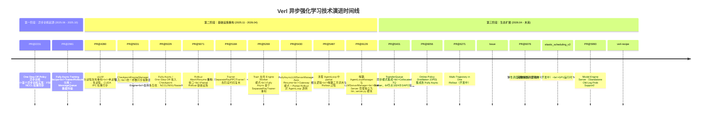


```
═══════════════════════════════════════════════════════════════════════
                     第一阶段：异步训练的起源 (2025.06 - 2025.10)
═══════════════════════════════════════════════════════════════════════

2025-06  PR #2231  ──► One Step Off Policy 异步训练 Recipe
   │                    （首个异步训练实现：FSDP+vLLM, NCCL 权重同步）
   │
2025-08  PR #2981  ──► Fully Async Training Recipe
                        （Trainer/Rollouter 分离 + MessageQueue 数据传输）

═══════════════════════════════════════════════════════════════════════
                   第二阶段：基础设施重构 (2025.11 - 2026.04)
═══════════════════════════════════════════════════════════════════════

2025-11  PR #4280  ──► vLLM 分进程架构重构
   │                    （单进程 → 多进程，CUDA IPC 权重同步）
   │
2026-01  PR #5031  ──► CheckpointEngineManager 引入
   │                    （统一参数同步抽象层）
   │
2026-01  PR #5029 ──► Fully Async / One-Step-Off 接入 Checkpoint Engine
   │                    （支持多后端：NCCL/NIXL/Naive/HCCL/Mooncake）
   │
2026-01  PR #5071  ──► Rollout Abort/Resume 接口
   │                    （Partial Rollout 基础设施）
   │
2026-02  PR #5184  ──► Trainer 重构（SeparateRayPPOTrainer）
   │                    （fit 各阶段代码复用）
   │
2026-02  PR #5269  ──► Train 支持 Engine Worker 模式
   │                    （Fully Async 基于 SeparateRayTrainer 重构）
   │
2026-02  PR #5430  ──► FullyAsyncLLMServerManager Auto Resume
   │                    （Gateway 模式 + Partial Rollout 对 AgentLoop 透明）
   │
2026-03  PR #5487  ──► 清理 AgentLoop 中 partial 相关逻辑
   │                    （解耦工具调用与 Rollout 过程）
   │
2026-04  PR #6129  ──► 解耦 AgentLoopManager 与 LLMServerManager
                        （LLM Server 管理独立为 llm_server.py 模块）
                        （支持第三方 Agent 框架接入）

═══════════════════════════════════════════════════════════════════════
                      第三阶段：生态扩展 (2026.04 - 未来)
═══════════════════════════════════════════════════════════════════════

2026-04  PR #5401  ──► TransferQueue 同步模式集成: main_ppo_sync.py + tqbridge
   │                    （Collocated TQ Trainer，64 节点 1024 卡 DAPO 验证）
   │
2026-04  PR #6056  ──► Online Policy Distillation (OPD) 集成到 Fully Async
   │                    （异步训练中支持在线策略蒸馏）
   │
2026-05  PR #6271  ──► Multi-Trajectory in One Rollout（开发中）
   │                    （Agent Loop 单次 rollout 支持多轨迹输出）
   │
         Issue #5790 ──► [RFC] Agent Gateway（规划中）
           │              （Agent 抽象 + Trajectory Gateway 子系统）
           │
         PR #6076  ──► 弹性调度基础设施（开发中）
   │                    （Hybrid Replica + LB Handle Registry + Validation）
   │
    elastic_scheduling_v2 → 完整弹性调度系统（开发中）
                          （GPU 运行时 Train/Rollout 动态切换）
                          （DP Rebuild + 双路参数同步 + EMA 调度）

2026-05  PR #5990  ──► Model Engine Server（Standalone Old Log Prob Support）
   │                    （独立 log_prob 计算服务器，解耦 rollout 推理与概率计算）
   │

2026-05  verl-recipe #96 ──► Colocate Partial Rollout（APRIL 风格同步训练）
                         （跨 step 中断+续跑缓解长尾，2×3090 验证 −29% gen time）

```
---

# 第一阶段：异步训练的起源 (2025.06 - 2025.10)

## PR #2231: One Step Off Policy 异步训练（2025-06）

**PR 标题**: `[trainer, fsdp, vllm, recipe] feat: one step off async training recipe`
**状态**: Merged (2025-07-17) | [+2981/-2] | 20 files

这是 verl 异步强化学习的**首个实现**，奠定了后续所有异步训练工作的基础。

### 核心设计

One Step Off Policy 的核心思想是**生成与训练并行化**——使用上一步生成的样本进行当前步的训练，同时异步生成下一步所需的样本。

**传统同步模式 vs One Step Off:**

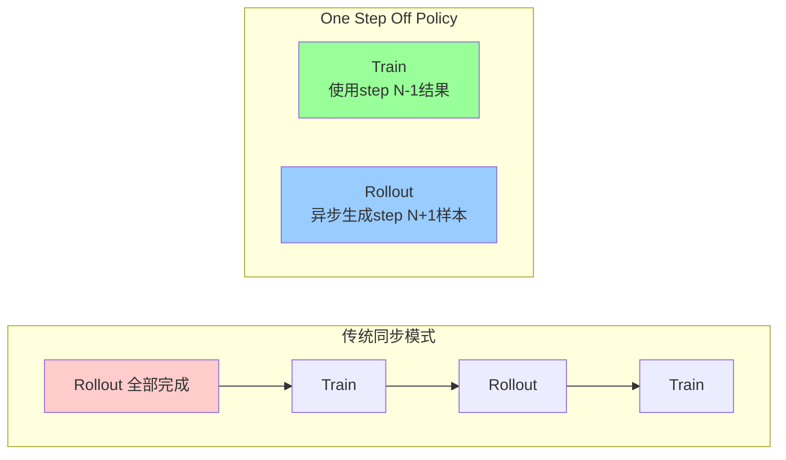

### 关键实现

1. **资源隔离**: 通过 `hybrid_engine=False` 关闭 co-locate 模式，Trainer 和 Rollout 使用独立 GPU 资源
2. **NCCL 参数同步**: 基于 `torch.distributed.nccl` 的 broadcast 实现权重从 Trainer 到 Rollout 的传输，延迟通常 < 300ms
3. **连续迭代器 (`_create_continuous_iterator`)**: 跨 epoch 连续读取数据，支持一步超前预取

```python
# 核心循环逻辑
def _create_continuous_iterator(self):
    for epoch in range(total_epochs):
        iterator = iter(train_dataloader)
        for batch_dict in iterator:
            yield epoch, batch_dict


# 首先启动一次 rollout（实现 one-step-off）
batch_data_future = self._async_gen_next_batch(continuous_iterator)

while batch_data_future is not None:
    # 等待上一步的 rollout 完成
    batch = batch_data_future.get()
    # 立即异步启动下一次 rollout
    batch_data_future = self._async_gen_next_batch(continuous_iterator)
    # 使用上一步的结果进行训练
    critic.compute_values(batch)
    actor.update_actor(batch)
```

### 实验结果（Qwen2.5-3B, 8×A100）

| Training Mode | Engine        | Total Time | vs Baseline |
|---------------|---------------|------------|-------------|
| Colocate Sync | VLLM+FSDP2    | 19h18m     | 1.0x        |
| One-Step-Off  | VLLM+FSDP2    | 15h34m     | **+23%**    |
| Colocate Sync | VLLM+Megatron | 18h21m     | 1.0x        |
| One-Step-Off  | VLLM+Megatron | 13h06m     | **+40%**    |

> NCCL 权重同步延迟大部分时间 < 300ms，对 RLHF 训练可忽略不计。

---

## PR #2981: Fully Async Training Recipe（2025-08）

**PR 标题**: `[trainer, recipe] feat: fully async training recipe`
**状态**: Merged (2025-10-17) | [+6292/-35] | 39 files

在 PR #2231 的 One Step Off 基础上，进一步将训练过程拆分为完全独立的 **Trainer** 和 **Rollouter**，通过 **MessageQueue**
进行数据传输。

### 从 One-Step-Off 到 Fully Async 的演进

| 维度   | One-Step-Off (#2231) | Fully Async (#2981)              |
|------|----------------------|----------------------------------|
| 架构   | 单体 Trainer 内部异步      | Trainer / Rollouter 独立 Ray Actor |
| 数据传递 | Future 直接传递          | MessageQueue 缓冲队列                |
| 异步粒度 | 固定 1-step off        | 支持 0.x-step 到多步异步                |
| 资源分配 | 固定比例                 | 动态可配置                            |
| 流式生成 | 批量生成                 | 逐样本流式生成 (`gen_batch_size=1`)     |

### 核心架构

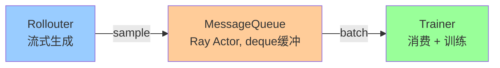

这是 verl 异步训练从"概念验证"走向"生产级架构"的关键一步。后续的所有基础设施重构（CheckpointEngine、分进程 vLLM、Partial
Rollout 等）都是在此基础上进行的。

---

# 第二阶段：基础设施重构 (2025.11 - 2026.04)

本阶段的核心目标是构建生产级异步训练所需的基础设施：分进程架构解耦、统一参数同步层、Partial Rollout 中断恢复机制、Trainer
代码复用重构，以及 LLM Server 管理解耦。这些工作为第三阶段的生态扩展奠定了坚实基础。

## 2.1 vLLM 分进程架构重构（PR #4280）

**PR 标题**:
`[BREAKING][worker, rollout, vllm] feat: implement vLLM colocated training-inference rollout with process separation`
**状态**: Merged (2026-01-23) | [+527/-520] | 37 files

### 动机

在原始的 `AsyncActorRolloutRefWorker` 中，训练引擎和推理引擎运行在同一进程中。这导致：

- 资源无法隔离，无法独立扩展 Trainer 和 Rollout
- 无法接入外部 Checkpoint Engine 进行跨进程参数同步
- vLLM 推理引擎直接通过参数传递接收权重更新，耦合度高

### 架构转换：Single-Process → Multi-Process

**Before（单进程架构）：**

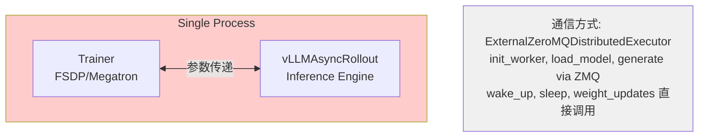

**After（多进程架构）：**

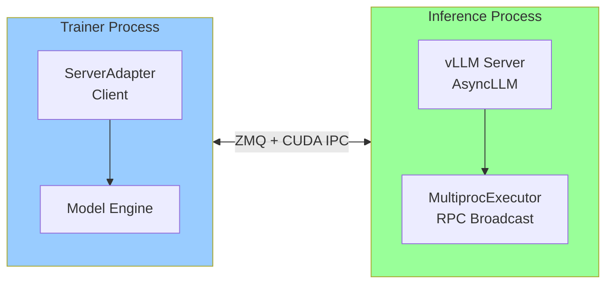

### 关键组件变更

| 组件    | Before                              | After                                     |
|-------|-------------------------------------|-------------------------------------------|
| 推理客户端 | `vLLMAsyncRollout`                  | `ServerAdapter`（纯客户端适配器）                  |
| 通信后端  | `ExternalZeroMQDistributedExecutor` | `MultiprocExecutor`（vLLM 内置）              |
| 权重同步  | 进程内参数传递                             | ZeroMQ + CUDA IPC（BucketedWeightTransfer） |

### CUDA IPC 权重同步机制

```python
# BucketedWeightSender - Trainer 侧
class BucketedWeightSender:
    """通过 ZMQ + CUDA IPC 分桶发送权重"""

    async def async_send_weights(self, weights):
        for tensor_meta, chunk in split_weight_chunks(weights, self.bucket_size):
            send_buf[offset:offset + size] = chunk  # 填入通信缓冲区
            broadcast_op = BroadcastOperation(rank, group_name, bucket=send_buf, ...)
            await broadcast_op.wait_for_complete()  # 异步广播


# BucketedWeightReceiver - Rollout 侧
class BucketedWeightReceiver:
    """接收权重并通过回调加载到模型"""

    def receive_weights(self, on_bucket_received):
        while True:
            metadata = self.socket.recv_pyobj()
            for name, meta in metadata["bucket_meta"].items:
                if handle is not None:
                    tensor = rebuild_ipc(handle, device)  # CUDA IPC 重建
                else:
                    tensor = buffer[offset:offset + size].view(dtype).view(shape)
            on_bucket_received(weights)
```

### 性能数据

| Model                  | #GPU         | Parallelism | Sync Time |
|------------------------|--------------|-------------|-----------|
| Qwen3-VL-30B-A3B       | TP2,EP8      | 4×8 H100    | ~5s       |
| DeepSeek-V3.1-Terminus | TP8,PP16,EP8 | 16×8        | ~120s     |
| DeepSeek-V3.1-Terminus | TP16,PP16    | 32×8        | ~80s      |

*测试环境: H100, ConnectX-7 400Gbps InfiniBand, CUDA IPC bucket_size=2GB*

---

## 2.2 CheckpointEngineManager 统一参数同步层（PR #5031）

**PR 标题**: `[ckpt] feat: add CheckpointEngineManager`
**状态**: Merged (2026-01-27) | [+1117/-649] | 43 files

### 动机

PR #4280 的分进程重构破坏了 `one-step-off-policy` 和 `fully-async` 的参数同步路径。需要一个统一的抽象层来协调 Trainer 和多个
Rollout Replica 之间的权重同步，并支持多种通信后端。

### 架构设计

> **抽象层：用于同步训练和推理后端之间的权重**

CheckpointEngine 是一个可插拔的权重同步抽象层，提供统一的 API 来协调 Trainer 和多个 Rollout Replica 之间的参数传输，屏蔽底层通信细节。

**核心特性：**

- **统一 API**：
  - `send_weights` — 从 Trainer 流式发送权重
  - `receive_weights` — 在 Rollout 侧流式接收权重
  - `get_weights` — 从本地缓存获取（如共享内存）

- **可扩展的传输后端**：
  - **集合通信（Collective）**：NCCL、HCCL、UCCL — 适合固定集群的高吞吐广播
  - **点对点（P2P）**：NIXL、Mooncake — 支持弹性调度和故障容错
  - **本地缓存（Local Cache）**：共享内存、本地磁盘 — 零网络开销，适合 colocated 场景

```python
class CheckpointEngine(ABC):
    async def send_weights(self, weights)  # 从 Trainer 流式发送权重

        async def receive_weights() -> Generator  # 在 Rollout 侧流式接收权重

        def get_weights() -> Generator  # 从本地缓存获取（如共享内存）
```

#### 拓扑结构

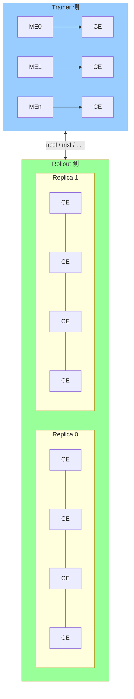

- **ME** (Model Engine): FSDP, Megatron, VeOmni 等，导出 `get_per_tensor_param()` 全张量生成器
- **CE** (Checkpoint Engine): NCCL, NIXL, HCCL, Naive 等通信后端
- Trainer 侧 ME 和 CE 同进程；Rollout 侧 CE 和推理 worker 通过 CUDA IPC 跨进程通信

#### 支持的后端对比

|                      | Comm Library       | Topology             | Hardware                    | Elastic   | Use Case                   |
|----------------------|--------------------|----------------------|-----------------------------|-----------|----------------------------|
| **naive**            | torch.distributed  | all_gather           | NVIDIA/AMD/Ascend           | Very High | On-policy, colocated       |
| **nccl**             | NCCL               | all_gather+broadcast | NVIDIA GPU                  | Low       | Off-policy, fixed clusters |
| **hccl**             | HCCL               | all_gather+broadcast | Ascend NPU                  | Low       | Off-policy, Ascend         |
| **nixl**             | NIXL               | all_gather+ring p2p  | Various (UCX/UCCL/Mooncake) | High      | Elastic, fault tolerance   |
| **kimi_ckpt_engine** | Mooncake+NCCL/HCCL | p2p+broadcast        | NVIDIA/Ascend               | Low       | Save checkpoint each sync  |
| **mooncake**         | Mooncake TE        | all_gather+ring p2p  | NVIDIA/Ascend               | High      | Fixed clusters             |

#### CheckpointEngineManager 核心流程

```python
class CheckpointEngineManager:
    async def update_weights(self, global_steps=None):
        # 1. naive 后端：colocated 直接更新
        if self.backend == "naive":
            ray.get(self.trainer.update_weights())
            return

        # 2. 中断所有进行中的请求（Partial Rollout）
        await asyncio.gather(*[r.abort_all_requests() for r in self.replicas])

        # 3. 构建临时 worker group
        workers = [w for r in self.replicas for w in r.workers]
        rollout = RayWorkerGroup(worker_handles=workers)

        # 4. sleep replicas 释放 KV Cache（如果启用 free_cache_engine）
        await self.sleep_replicas()

        # 5. 构建 NCCL process group
        self.build_process_group(rollout)

        # 6. 并行执行 trainer.send + rollout.receive
        ray.get(trainer.update_weights() + rollout.update_weights())

        # 7. finalize 所有 worker
        ray.get(trainer.execute_checkpoint_engine(["finalize"]) +
                rollout.execute_checkpoint_engine(["finalize"]))

        # 8. wake up replicas 恢复 KV Cache
        await self.wake_up_replicas()

        # 9. 恢复被中断的请求（Partial Rollout）
        await asyncio.gather(*[r.resume_generation() for r in self.replicas])
```

---

## 2.3 Fully Async 接入多后端 Checkpoint Engine（PR #5029）

**PR 标题**:
`[fsdp, megatron] feat: refactor fully-async and one-step-off training to support multiple checkpoint engine backends`
**状态**: Merged (2026-02-26) | [+510/-2393] | 71 files

### 动机

将 fully-async 和 one-step-off-policy 从硬编码的 NCCL 参数同步迁移到 CheckpointEngineManager 统一管理，支持多种通信后端的灵活切换。

### 关键变更

- 移除 `-2393` 行旧代码，大幅简化参数同步逻辑
- Fully Async 和 One-Step-Off 共享同一套 CheckpointEngineManager 基础设施
- 支持配置切换：`checkpoint_engine.backend = "nccl"|"nixl"|"naive"|"hccl"|...`

### 实验验证

在 1×A2 (H20) 上使用 gsm8k + qwen3-0.6B + expandable memory 测试：

- **Fully-async**: 正常收敛 ✓
- **One-step-off**: 正常收敛 ✓
- **Rollout Correction TIS**: 两种模式均正常 ✓

---

## 2.4 Rollout Abort/Resume 接口（PR #5071）

**PR 标题**: `[rollout] feat: automatically resume generation on abort`
**状态**: Merged (2026-01-29) | [+380/-168] | 23 files

### 动机

为 Partial Rollout 功能提供基础设施。当参数同步发生时，需要能够中断正在进行的生成任务，并在同步完成后恢复。

### 设计理念

> Make AgentLoop agnostic to the rollout interruption.

核心原则是让 AgentLoop 对 Rollout 中断透明——AgentLoop 不需要知道它的生成请求曾被中断过。

### 接口设计

```python
class RolloutReplica(ABC):
    async def abort_all_requests(self):
        """中断所有进行中的请求，保存中间状态"""

    async def resume_generation(self):
        """恢复之前被中断的生成任务"""
```

---

## 2.5 Trainer 重构与 Engine Worker 模式（PR #5184 + #5269）

### PR #5184: Trainer 重构改善 fit 复用

**PR 标题**: `[recipe] refactor: refactor ray trainer for separate recipe use`
**状态**: Merged (2026-02-06) | [+1553/-1432] | 37 files

引入 `SeparateRayPPOTrainer` 基类，将 fit 的各阶段逻辑（init_workers, create_dataloader, compute_advantages,
update_actor等）抽取为可复用的方法，同时修复 fully-async / one-step-off 的 CI 问题。

### PR #5269: Train 支持 Engine Worker 模式

**PR 标题**: `[fsdp, megatron] refactor: Refactor Fully Async Implementation via Engine Workers`
**状态**: Merged (2026-02-11) | [+482/-31] | 4 files

将 Fully Async Worker 重构为基于 `SeparateRayPPOTrainer` 的 Engine Worker 模式，使 fully_async 能够复用 trainer
的核心训练逻辑，减少代码重复。

---

## 2.6 Gateway 模式与 Partial Rollout 透明化（PR #5430 + #5487 + #6129）

这一组 PR 围绕 **Server 管理与 Agent 调度的解耦** 展开，最终实现了 LLM Server 生命周期管理的独立模块化。

### PR #5430: FullyAsyncLLMServerManager Auto Resume

**PR 标题**: `[rollout] feat: support auto resume on abort in FullyAsyncLLMServerManager`
**状态**: Merged (2026-03-04) | [+355/-86] | 19 files

- 将 Trainer 的 `global_steps` 传递给 Rollout（用于追踪参数版本）
- `FullyAsyncLLMServerManager` 支持 auto resume：partial rollout 时自动恢复被中断的生成
- 对 AgentLoop 来说，rollout 中断是完全透明的

### PR #5487: 清理 AgentLoop Partial 逻辑

**PR 标题**: `[fully_async, one_step_off] feat: support auto resume on abort when using fully_async`
**状态**: Merged (2026-03-10) | [+759/-2559] | 56 files

基于 PR #5430 进一步重构：

- 支持 Gateway 模式
- 解耦工具调用（Tool Invocation）和 Rollout 过程中的 Partial 逻辑
- 清理 AgentLoop 中与 partial 相关的冗余代码（移除 2559 行）
- `use_trainer_do_validate` 功能预留（后续 PR 完善）

### PR #6129: 解耦 AgentLoopManager 与 LLMServerManager

**PR 标题**: `[BREAKING][rollout] refactor: move LLMServerManager out of AgentLoopManager`
**状态**: Merged (2026-04-29) | [+676/-754] | 26 files

#### 动机

`AgentLoopManager` 是 verl 中一种特定的 Agent 框架实现，设计上应可被其他 Agent 框架完全替代：

| 目标 Agent 框架           | 关联 Issue/PR                                               | 状态              |
|-----------------------|-----------------------------------------------------------|-----------------|
| NVIDIA NeMo-Gym       | [#5787](https://github.com/verl-project/verl/pull/5787)   | 已集成             |
| AWS Bedrock AgentCore | [#4216](https://github.com/verl-project/verl/pull/4216)   | RFC             |
| RemoteAgentLoop       | [#5737](https://github.com/verl-project/verl/issues/5737) | Feature Request |
| SWE-agent             | -                                                         | 规划中             |
| 任意黑盒 Agent 框架         | [#5790](https://github.com/verl-project/verl/issues/5790) | RFC             |

**重构前的问题**：LLM Server 的生命周期管理（启动/销毁/负载均衡/Profiling/KV-Cache 清理）由 `AgentLoopManager` 持有，导致每个替代
Agent 框架必须：

- 要么继承 `AgentLoopManager`（引入大量无关依赖）
- 要么重新实现 Rollout Server 的管理逻辑（重复代码）

**核心矛盾**：Server 生命周期与 Agent 调度逻辑被不必要地耦合在一起。

#### 架构变更

**Before（耦合架构）**：

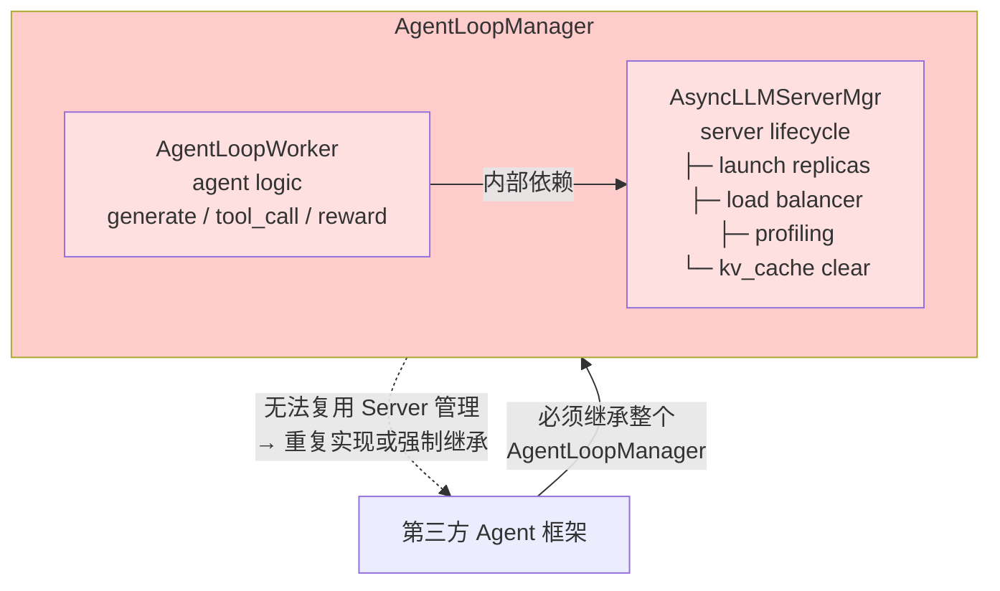

**After（解耦架构）**：

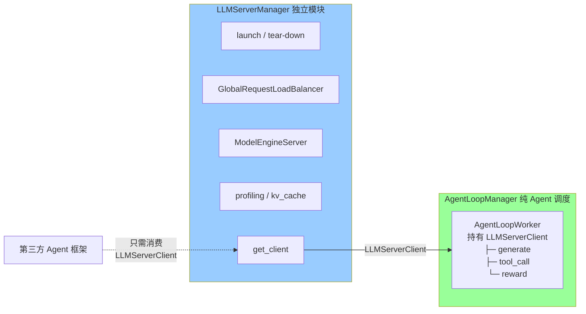

#### 五大核心类

新模块位于 `verl/workers/rollout/llm_server.py`（~464 行），包含以下核心类：

| 类名                              | 角色         | 说明                                                             |
|---------------------------------|------------|----------------------------------------------------------------|
| **`GlobalRequestLoadBalancer`** | Ray Actor  | 全局粘性会话 + 最小负载均衡器                                               |
| **`LLMServerClient`**           | 客户端代理      | 向 AgentLoopWorker 提供统一的 `generate()` 接口                        |
| **`FullyLLMServerClient`**      | 客户端代理（增强版） | 继承 `LLMServerClient`，支持 Partial Rollout 自动恢复 + MES log_prob 计算 |
| **`LLMServerManager`**          | 服务端管理器     | 负责 Replica 启动/销毁、Load Balancer 创建、MES 初始化                      |

##### GlobalRequestLoadBalancer

```python
@ray.remote
class GlobalRequestLoadBalancer:
    """全局 sticky-session + in-flight 负载均衡器，所有 AgentLoopWorker 共享。"""

    def __init__(self, servers: dict[str, ray.actor.ActorHandle], max_cache_size: int = 10000):
        self._server = servers  # server_id → ActorHandle
        self._inflight_requests: dict[str, int] = ...  # server_id → 进行中请求数
        self._request_id_to_server: LRUCache = ...  # request_id → server_id (sticky)

    def acquire_server(self, request_id: str) -> str:
        """获取 server：优先 sticky 命中，否则最小负载路由"""
        if request_id in self._request_id_to_server:
            return self._request_id_to_server[request_id]  # sticky hit
        server_id = min(self._inflight_requests, key=self._inflight_requests.get)  # least loaded
        self._request_id_to_server[request_id] = server_id
        return server_id

    def release_server(self, server_id: str) -> None:
        """释放 server：递减 inflight 计数"""
```

**关键特性**：

- **Sticky Session**：同一 `request_id`（多轮对话）始终路由到同一个 Server，利用 Prefix Caching 加速
- **Least In-Flight Load Balancing**：新请求分配到当前负载最轻的 Server
- **LRU Cache**：路由缓存自动淘汰，防止内存泄漏

##### LLMServerClient

```python
class LLMServerClient:
    """
    多 Server OpenAI 兼容 LLM 客户端代理。
    提供：
    - 负载均衡：通过全局协调的最小 inflight 请求路由
    - 粘性会话：多轮 chat completion 发送到同一 server
    """

    async def generate(
            self,
            request_id,
            *,
            prompt_ids: list[int],
            sampling_params: dict[str, Any],
            image_data=None,
            video_data=None,
            **kwargs,
    ) -> TokenOutput:
        """从 prompt_ids 生成 tokens"""
        server_id, server = await self._acquire_server(request_id)
        try:
            output = await server.generate.remote(
                request_id=uuid4().hex,
                prompt_ids=prompt_ids,
                sampling_params=sampling_params,
                ...
            )
            return output
        finally:
            self._release_server(server_id)  # fire-and-forget release
```

##### FullyLLMServerClient（Partial Rollout 支持）

```python
class FullyLLMServerClient(LLMServerClient):
    """支持 Partial Rollout 自动恢复，对 AgentLoop 透明。"""

    async def generate(self, request_id, *, prompt_ids, sampling_params, **kwargs) -> TokenOutput:
        final_output = TokenOutput(token_ids=[], log_probs=[], num_preempted=0)
        while True:
            # 1. 生成 tokens
            output = await super().generate(
                request_id=request_id,
                prompt_ids=prompt_ids + final_output.token_ids,
                sampling_params=sampling_params,
            )
            # 2. 计算 old_log_probs via ModelEngineServer
            output = await self._compute_log_probs(output, context_prompt_ids, temperature)
            # 3. 合并输出
            final_output.token_ids.extend(output.token_ids)
            # 4. 检查是否需要 resume（abort 时自动重试）
            if output.stop_reason not in ("aborted", "abort") or not partial_rollout:
                break
        return final_output
```

##### LLMServerManager

```python
class LLMServerManager:
    """负责：
    - 启动/销毁 Server Replicas
    - 创建全局 Load Balancer
    - 弹性扩缩容（预留接口）
    - ModelEngineServer 初始化
    """

    @classmethod
    @auto_await
    async def create(cls, config, worker_group=None, rollout_resource_pool=None):
        instance = cls(config, worker_group, rollout_resource_pool)
        await instance._initialize_llm_servers()  # init hybrid / standalone / trtllm
        await instance._init_global_load_balancer()
        if model_engine_server.enabled:
            await instance._init_model_engine_replica()
        return instance

    def get_client(self, fully_async: bool = False) -> LLMServerClient:
        """获取 LLMServerClient，供 AgentLoopManager 使用"""
        if fully_async:
            return FullyLLMServerClient(..., model_engine_server_manager=self.model_engine_server_manager)
        return LLMServerClient(...)

    def get_engine_replicas_for_weight_sync(self) -> list:
        """返回参与 CheckpointEngine 权重同步的 MES Replica"""

    async def clear_kv_cache(self):
        ...

    async def start_profile(self):
        ...

    async def stop_profile(self):
        ...
```

#### 数据流变化

**FullyAsyncTrainer 初始化流程（重构后）**：

```python
# Step 1: 创建 LLMServerManager（独立于 AgentLoop）
self.llm_server_manager = await LLMServerManager.create(
    config=self.config,
    worker_group=self.actor_rollout_wg,  # hybrid mode: 复用 trainer worker group
)

# Step 2: 从 Manager 获取 Client，注入到 AgentLoopManager
self.async_rollout_manager = await AgentLoopManager.create(
    config=self.config,
    llm_client=self.llm_server_manager.get_client(fully_async=True),  # ← 注入点
    reward_loop_worker_handles=reward_loop_worker_handles,
)
```

**FullyAsyncRollouter 初始化流程（Standalone 模式）**：

```python
# Step 1: Standalone 模式下无 worker_group
self.llm_server_manager = await LLMServerManager.create(config=self.config)

# Step 2: 获取 FullyLLMServerClient
self.async_rollout_manager = await FullyAsyncAgentLoopManager.create(
    config=self.config,
    llm_client=self.llm_server_manager.get_client(fully_async=True),
)
```

**运行时请求路径**：

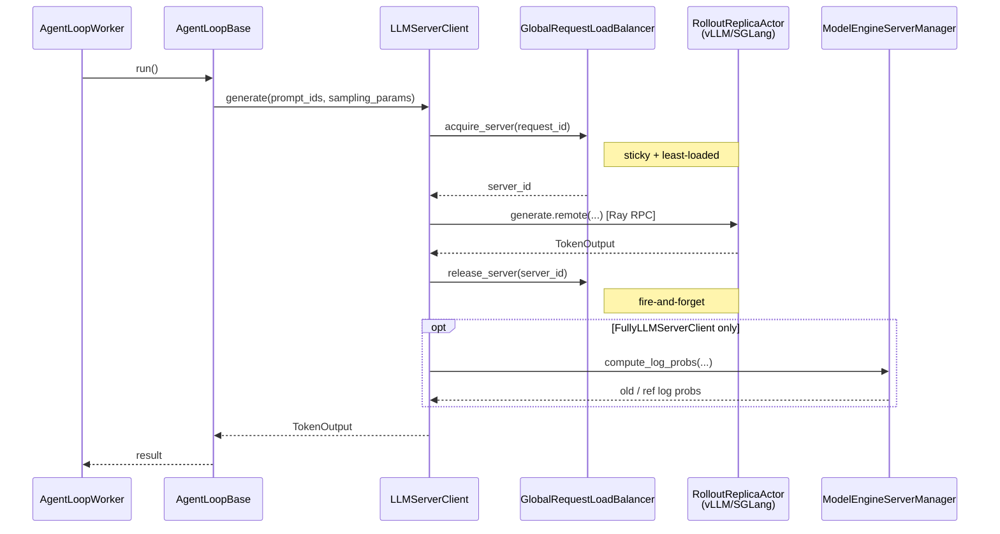

#### 对各组件的影响

| 组件                        | 变化                                                                    |
|---------------------------|-----------------------------------------------------------------------|
| **`AgentLoopBase`**       | `__init__` 参数名 `server_manager` 不变（类型为 `LLMServerClient`），**无破坏性变更**  |
| **`AgentLoopWorker`**     | 构造函数接收 `llm_client: LLMServerClient`（而非之前的内部创建）                       |
| **`AgentLoopManager`**    | 构造函数接收 `llm_client: LLMServerClient`，不再持有任何 Server 生命周期逻辑             |
| **`FullyAsyncTrainer`**   | 先创建 `LLMServerManager`，再将其 `get_client()` 结果传入 `AgentLoopManager`     |
| **`FullyAsyncRollouter`** | 同上，standalone 模式下 `LLMServerManager.create(config)` 无需 `worker_group` |

#### Breaking Change & 迁移指南

> ⚠️ **Breaking Change** for out-of-tree agent frameworks

| 旧导入路径                                                     | 新导入路径                                                  | 新名称                    |
|-----------------------------------------------------------|--------------------------------------------------------|------------------------|
| `verl.experimental.agent_loop.AsyncLLMServerManager`      | `verl.workers.rollout.llm_server.LLMServerManager`     | `LLMServerManager`     |
| `verl.experimental.agent_loop.FullyAsyncLLMServerManager` | `verl.workers.rollout.llm_server.FullyLLMServerClient` | `FullyLLMServerClient` |
| `AgentLoopManager.create(...)` 内部创建 Server                | `AgentLoopManager.create(llm_client=...)` 外部注入 Client  | —                      |

**迁移示例**：

```python
# === Before (PR #6129 前) ===
from verl.experimental.agent_loop import AgentLoopManager

agent_loop_mgr = await AgentLoopManager.create(
    config=config,
    # Server 在内部自动创建
)

# === After (PR #6129 后) ===
from verl.experimental.agent_loop import AgentLoopManager
from verl.workers.rollout.llm_server import LLMServerManager

# 1. 先独立创建 Server Manager
llm_server_mgr = await LLMServerManager.create(
    config=config,
    worker_group=worker_group,  # hybrid mode; standalone 可省略
)

# 2. 将 Client 注入 AgentLoopManager
agent_loop_mgr = await AgentLoopManager.create(
    config=config,
    llm_client=llm_server_mgr.get_client(fully_async=True),
)
```

#### 设计意义

本次解耦是 **Issue #5790 (Agent Gateway RFC)** 的关键前置步骤：

1. **Server 管理与 Agent 调度彻底分离**：任何第三方 Agent 框架（NeMo-Gym、Bedrock、SWE-agent）只需消费 `LLMServerClient` 即可使用
   verl 的推理基础设施
2. **为 AgentGateway 铺路**：未来 Gateway 模式下，`LLMServerManager` 可以直接服务于外部 Agent 进程，无需经过
   `AgentLoopManager`
3. **弹性调度兼容**：`LLMServerManager` 的 `add_replica()` / `remove_replica()` 预留接口可直接对接 Elastic Scheduling v2

---

## 2.7 verl-recipe #96: Colocate Partial Rollout（APRIL 风格同步训练）

**PR 标题**: `feat: add partial_rollout recipe (PRv3, current main-compatible)`
**仓库**: [verl-project/verl-recipe#96](https://github.com/verl-project/verl-recipe/pull/96)
**状态**: Open (2026-05-06) | 基于 verl#6129 (LLMServerManager 解耦) + upstream main
**关联**: 前身 [verl-recipe#58](https://github.com/verl-project/verl-recipe/pull/58)（腾讯 APR 方案）

> 本节虽属于生态扩展范畴，但因深度依赖第二阶段 PR #6129 的 LLMServerManager 解耦基础，故在此详述。

### 动机与背景

在 **Colocate 同步训练**模式下，rollout 和 train 串行执行：

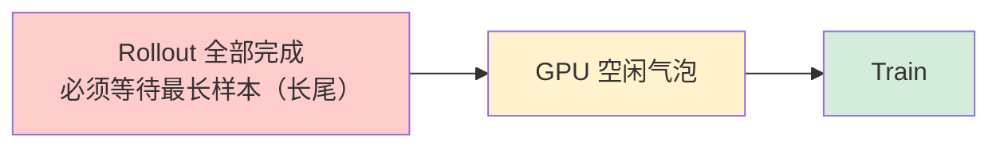

当数据集存在**长尾响应长度分布**时（少量超长样本拖慢整批 step），GPU 利用率严重下降。Fully Async 框架通过 Trainer/Rollout
解耦解决了这个问题，但引入了较高的架构复杂度。

**verl-recipe #96 提出了一种轻量级替代方案**：在同步训练框架内，对长尾样本做 **跨 step 中断+续跑（Partial Rollout）**，以
APRIL（[paper](https://arxiv.org/pdf/2509.18521)）风格回收 GPU 气泡。

> ⚠️ **不要与 Fully Async 的 Partial Rollout 混淆**：本方案仍走同步循环「rollout → 等 batch 齐 → train」，只是允许中断长尾样本跨
> step 续跑。Trainer 与 Rollout 之间是串行的。Fully Async 的 Partial Rollout 则是在 Trainer/Rollout 完全异步并行环境下的中断恢复机制。

### 核心思想：SSIM（Sample Supplementation + Interruption Mechanism）

```mermaid
gantt
    title 传统同步 Step vs Partial Rollout Step（横轴：token 生成进度）
    dateFormat X
    axisFormat %s

    section 传统同步 Step
        prompt_1 (1000 tokens, 短): done, p1, 0, 1000
        prompt_2 (4000 tokens, 长尾): crit, p2, 0, 4000
        prompt_3 (1200 tokens): done, p3, 0, 1200
        GPU bubble (等长尾): crit, bub, 1200, 4000
        Train: active, tr, 4000, 4500

    section Partial Rollout Step N
        prompt_1 done → batch: done, q1, 0, 1000
        prompt_2 abort@1500 (暂存): active, q2, 0, 1500
        prompt_3 done → batch: done, q3, 0, 1200
        Train (短样本先训): active, tr1, 1500, 2000

    section Partial Rollout Step N+1
        prompt_2 resume@1500 → done: done, r2, 2000, 4500
        new prompt_4: done, r4, 2000, 3000
        new prompt_5: done, r5, 2000, 3200
        Train: active, tr2, 4500, 5000
```

> 传统同步模式中，长尾 prompt_2 造成大量 GPU bubble；Partial Rollout 在 Step N 中断 prompt_2，让短样本先训练，长尾在 Step
> N+1 从第 1500 个 token 续跑，有效回收气泡。

### 架构设计

```mermaid
flowchart TB
    Trainer[PRv3RayPPOTrainer]
subgraph Mgr["RolloutPromptManager (Ray Actor)"]
direction LR
Pending[("pending queue<br/>等待 rollout")]
Ongoing[("ongoing<br/>generating")]
Done[("done<br/>output")]
Pending -->|pull_prompts|Ongoing
Ongoing -->|done|Done
Ongoing -.->|aborted (appendleft )|Pending
end
Trainer -->|push_batch / pull_batch|Mgr
Done -->|pull_batch|Trainer

Mgr -->|pull_prompts|Workers[PRv3AgentLoopWorker ×N]
Workers -->|push_results|Mgr
Workers <-->|HTTP generate / cancel / resume|Servers[PRv3vLLMHttpServer ×replicas]

style Pending fill: #fff2cc
style Ongoing fill: #cfe2ff
style Done fill: #d4edda
style Mgr fill: #f5f5f5
```

#### 三队列调度模型

`RolloutPromptManager` 是核心调度器（Ray Actor），维护三个队列：

| 队列          | 状态            | 说明                             |
|-------------|---------------|--------------------------------|
| **pending** | 等待 rollout    | 新 prompt 或被 abort 后需续跑的 prompt |
| **ongoing** | 正在生成中         | 已发给 vLLM Server，等待返回           |
| **done**    | 生成完成（含 abort） | 可被 Trainer pull 的完整/部分结果       |

**状态转换规则**：

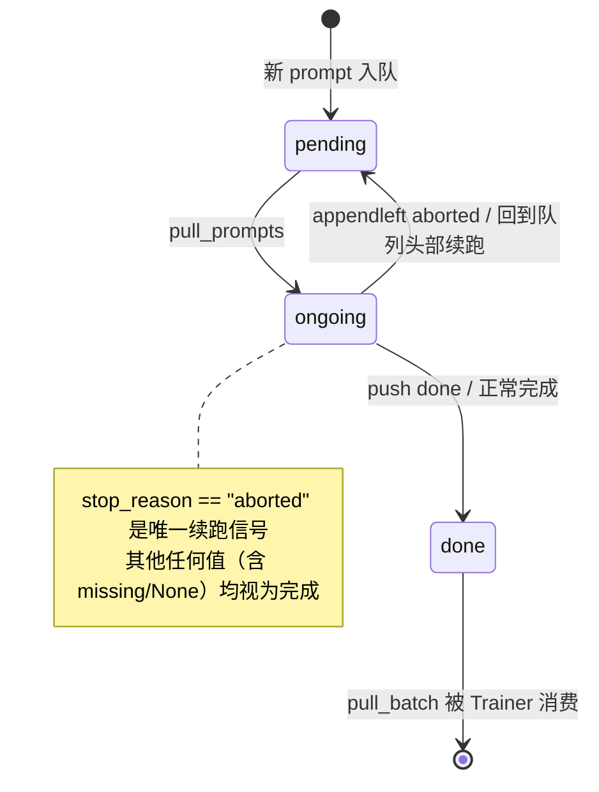

#### 六大核心组件

| 组件                              | 文件                                     | 角色                                                                                  |
|---------------------------------|----------------------------------------|-------------------------------------------------------------------------------------|
| **PRv3RayPPOTrainer**           | `ray_trainer.py`                       | 主训练循环。`_fit_generate` 将 prompt 推入 Manager，异步等待一批结果后执行 log_prob / advantage / update |
| **RolloutPromptManager**        | `prompt_manager.py`                    | Ray Actor，持有 pending/ongoing/done 三队列。`pull_batch` 基于 `asyncio.Event` 驱动（无忙轮询）      |
| **PRv3AgentLoopManager/Worker** | `agent_loop/agent_loop.py`             | 调度和驱动 vLLM cancel/resume；Worker 按 trajectory 预算（非 prompt 数）消费 prompt                |
| **PRv3SingleTurnAgentLoop**     | `agent_loop/single_turn_agent_loop.py` | 检查 `last_agent_loop_output`：已完成则透传，aborted 则从断点续跑                                   |
| **PRv3ToolAgentLoop**           | `agent_loop/tool_agent_loop.py`        | 多轮 tool-call 场景的 partial-rollout 版本                                                 |
| **PRv3vLLMHttpServer**          | `vllm_rollout/vllm_async_server.py`    | 扩展上游 vLLM HTTP Server，新增 `cancel()` / `resume()` + `paused` 门控                      |

#### vLLM Cancel/Resume 机制

```python
class PRv3vLLMHttpServer:
    """扩展上游 vLLM Server，支持引擎级批量中断。"""

    async def cancel(self):
        """中断所有进行中的请求：
        1. 设置 paused=True（阻止新请求进入引擎）
        2. 调用 vLLM abort_all_requests()（引擎级批量 abort）
        3. 等待 inflight drain 到 0
        → 每个 in-flight generate() 自然返回 stop_reason="aborted" 的 TokenOutput
        """
        self.paused = True
        await self.engine.abort_all_requests()  # 单次引擎调用，非逐请求 cancel
        while self.inflight_count > 0:
            await asyncio.sleep(0)

    async def resume(self):
        """恢复接收新请求"""
        self.paused = False
```

**对比原始 APR (#58) 方案**：

| 维度            | verl-recipe#58 (APR)                      | PR #96 (PRv3)                              | 原因                                |
|---------------|-------------------------------------------|--------------------------------------------|-----------------------------------|
| vLLM cancel   | per-request `asyncio.Event` dict + `Lock` | 引擎级 `paused` flag + `abort_all_requests()` | 单次引擎调用 vs 逐请求 fan-out，避免 Actor 争用 |
| Inflight 预算单位 | prompt 数                                  | **trajectory 数**                           | 部分完成的 prompt 只消耗剩余 traj 预算，非完整 n  |
| Worker 补给计算   | `len(done) × n`                           | `sum(consumed_traj for done)`              | 匹配 traj-count 预算                  |
| 数据流           | Manager 持有 StatefulDataLoader             | Trainer 持有 dataloader，push batch 进 Manager | Manager 无需复制 epoch/iter 游标逻辑      |
| 调度优先级         | 多维度排序 (unfinished/length/staleness)       | FIFO + aborted prompt `appendleft`（缓存局部性）  | 续跑时 KV cache 可能仍在 Server 上        |

#### 关键不变量

1. **Prompt 所有权互斥**：任意时刻一个 prompt 只存在于 pending/ongoing/done 之一
2. **`stop_reason == "aborted"` 是唯一续跑信号**：其他值（含 `missing`/`None`）均视为完成
3. **Inflight 上限按 trajectory 计数**：`pull_prompts(traj_count)` 按 unfinished traj 累计预算
4. **PRv3 Agent Loop 通过 kwargs 续跑**：训练路径注入 `last_agent_loop_output`；验证路径不注入
5. **Stateful dataloader 自动续跑**：`PRv3RayPPOTrainer.fit()` 通过 stateful dataloader 自动恢复

### 实验验证

**实验环境**：2× RTX 3090, Qwen3-0.6B, GSM8K, GRPO + token-level rollout-IS, `max_response_length=4096`, batch=8, TP=1,
934 steps/epoch

| 指标                              | Baseline (vanilla GRPO) | Partial Rollout (PR #96) | 提升         |
|---------------------------------|-------------------------|--------------------------|------------|
| **timing_s/gen (avg)**          | 26.1s                   | **18.5s**                | **−29%**   |
| **perf/throughput (tok/s/GPU)** | 851                     | **1060**                 | **+24%**   |
| **timing_s/step (avg)**         | ~45s                    | ~35s                     | −16%       |
| critic/rewards/mean             | ~0.7–0.9 (收敛)           | ~0.7–0.9 (收敛)            | **无偏移** ✓  |
| response_length/mean            | ~1100                   | ~1142                    | 噪声范围内 ✓    |
| actor/entropy                   | 0.4 → 0.15              | 0.4 → 0.15               | **轨迹重合** ✓ |

**结论**：

- ✅ **持续加速**：gen time 差距从 step 5 出现并持续 900+ steps 非 warmup 效应
- ✅ **每步 PR ≤ baseline**：`timing_s/gen` 曲线几乎不交叉（除共享 validation spike）
- ✅ **学习曲线像素级重合**：speedup 不是来自"偷工减料"，而是真正回收了 long-tail bubble

### 与 Fully Async Partial Rollout 的对比

| 维度                | Colocate PR (#96)              | Fully Async (PR #5071/#5430)            |
|-------------------|--------------------------------|-----------------------------------------|
| **训练模式**          | 同步（rollout → wait → train）     | 异步（rollout ∥ train 并行）                  |
| **中断触发**          | Step 边界时间到                     | CheckpointEngine 参数同步                   |
| **架构复杂度**         | 低（三队列 + Ray Actor 调度器）         | 高（CheckpointEngine + Abort/Resume 接口链）  |
| **适用场景**          | 少量 GPU、不想引入 Fully Async 复杂度    | 大规模集群、需要最大化利用率                          |
| **Off-policy 程度** | 中等（跨 1-N 步）                    | 可配置（staleness_threshold 控制）             |
| **依赖**            | PR #6129 (LLMServerManager 解耦) | PR #5029 (CE) + PR #5071 (Abort/Resume) |
| **IS 修正**         | 必须（token-level 推荐）             | 可选（MES 可精确计算 old log prob）              |

### 使用方式

```bash
# Single-turn partial rollout
bash recipe/partial_rollout/run_qwen3-0.6b_gsm8k_grpo.sh

# Multi-turn tool-call (需先生成数据集)
python3 examples/data_preprocess/gsm8k_multiturn_w_tool.py --local_save_dir $HOME/data/gsm8k_tool
bash recipe/partial_rollout/run_qwen3-0.6b_gsm8k_grpo_tool.sh

# Baseline 对比（vanilla GRPO）
bash recipe/partial_rollout/run_qwen3-0.6b_gsm8k_grpo_baseline.sh
```

**关键 Hydra 配置**：

| 配置项                                                  | 推荐值                                          | 说明                              |
|------------------------------------------------------|----------------------------------------------|---------------------------------|
| `actor_rollout_ref.rollout.agent.default_agent_loop` | `prv3_single_turn_agent` / `prv3_tool_agent` | 必须使用 `prv3_` 前缀 agent loop      |
| `algorithm.rollout_correction.rollout_is`            | `token` (推荐) / `sequence`                    | Token-level IS 避免 exp(±20) 安全钳位 |
| `algorithm.rollout_correction.rollout_is_threshold`  | `2.0`                                        | IS 上界                           |

---

## 2.8 当前架构总览

经过第二阶段所有 PR 的迭代，verl 异步强化学习的最终架构如下：

### 四大核心组件

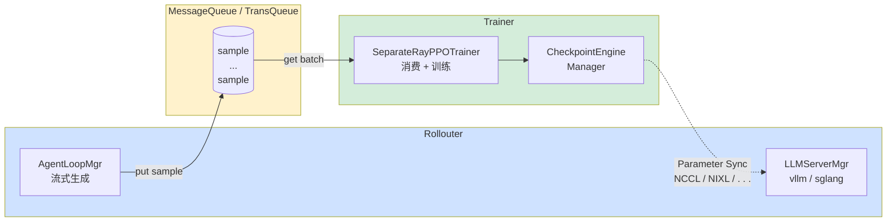

### 数据流

1. **Rollouter** 通过 `AgentLoopManager` 以流式方式逐样本生成序列（`gen_batch_size=1`），生成速度受新鲜度控制
2. **MessageQueue**（基于 Ray Actor 的 deque）暂存生成的 sample，作为 TransQueue 缓冲生产-消费速率差
3. **Trainer** 从 MessageQueue 逐样本获取，累积到 `require_batches * ppo_mini_batch_size` 后执行训练
4. 每 `trigger_parameter_sync_step` 轮训练后，通过 **CheckpointEngineManager** 触发一次参数同步
5. 若启用 **Partial Rollout**，同步时中断进行中的生成任务，完成后恢复

### RateLimiter 数据流控

在 Reward Loop 层面，实现了三层限速机制（`RateLimitedRewardManager`）：

| 层级           | 机制                       | 用途            |
|--------------|--------------------------|---------------|
| Concurrency  | `asyncio.Semaphore`      | 限制并行 API 请求数  |
| Request Rate | `AsyncTokenBucket` (RPM) | 限制每分钟请求数      |
| Token Rate   | `AsyncTokenBucket` (TPM) | 限制每分钟 token 数 |

```python
class AsyncTokenBucket:
    async def acquire(self, num_tokens=1.0):
        """令牌桶算法，支持高精度限速"""
        elapsed = now - self.last_update
        new_tokens = elapsed * self.rate_limit
        self.tokens = min(self.max_tokens, self.tokens + new_tokens)
        if self.tokens >= num_tokens:
            self.tokens -= num_tokens
            return
        # 不足则等待
        wait_time = (num_tokens - self.tokens) / self.rate_limit
        await asyncio.sleep(wait_time)
```

### 支持的训练模式

通过调整关键参数，Fully Async 架构支持四种递进模式：

#### Mode 1: On-Policy Pipeline

```
参数: trigger_parameter_sync_step=1, staleness_threshold=0
流程: [Rollout N samples] → [Train] → [Sync] → [Rollout N samples] → ...
特点: 严格 on-policy，但存在长尾空闲问题
```

#### Mode 2: Stream Off-Policy Pipeline

```
参数: trigger_parameter_sync_step>1, staleness_threshold=0
流程: [Rollout N*M samples] → [Train N] → [Train N] → ... → [Sync] → [Rollout N*M] → ...
特点: 同步流式，减少但未消除气泡
```

#### Mode 3: Async Stream with Staleness Samples

```
参数: trigger_parameter_sync_step>=1, staleness_threshold>0, partial_rollout=False
流程: Rollout 持续生产 → Train 持续消费 → 允许使用 stale samples → Sync 时等待活跃任务完成
特点: 消除首次等待，仍有 active task 等待
```

#### Mode 4: Async Stream with Partial Rollout ⭐

```
参数: trigger_parameter_sync_step>=1, staleness_threshold>0, partial_rollout=True
流程: Rollout 持续生产 → Train 持续消费 → Sync 时中断活跃任务 → Sync 后恢复生成
特点: 最小化所有气泡，近似 AReaL's Decoupled PPO
```

### 性能收益总结

#### 7B 模型（Qwen2.5-Math-7B, DAPO, H20）

| Training Mode   | Resource  | 400-step Total Time | Speedup   | Accuracy (mean@1) |
|-----------------|-----------|---------------------|-----------|-------------------|
| Colocate Sync   | 128 GPU   | 3d 17h 5m           | 1.0x      | 0.2958            |
| **Fully Async** | **64:64** | **1d 9h 26m**       | **2.35x** | **0.3094**        |

#### 30B 模型（Qwen3-30B-A3B, GRPO, H20）

| Training Mode   | Resource  | 400-step Total Time | Speedup   |
|-----------------|-----------|---------------------|-----------|
| Colocate Sync   | 128 GPU   | 2d 11h 39m          | 1.0x      |
| **Fully Async** | **96:32** | **1d 10h 41m**      | **1.72x** |

#### Checkpoint Engine 加速效果

| Model           | Rank | w/o CE | w/ CE  | 加速比      |
|-----------------|------|--------|--------|----------|
| Qwen2.5-Math-7B | 4    | 0.12s  | 0.02s  | **6x**   |
| Qwen3-30B-A3B   | 16   | 15.76s | 4.38s  | **3.6x** |
| Qwen3-235B-A22B | 64   | 58.57s | 23.70s | **2.5x** |

#### 各模式消融（128 GPU, 7B）

| Mode                       | Total Time (400 step) | vs Colocate |
|----------------------------|-----------------------|-------------|
| Colocate Sync              | 1d 16h 48m            | 1.0x        |
| Stream Off-Policy (+async) | 1d 1h 53m             | 1.42x       |
| + Staleness (0.5)          | 17h 22m               | 1.79x       |
| **+ Partial Rollout**      | **1d 9h 26m**         | **2.35x**   |

---

# 第三阶段：生态扩展 (2026.04 - 未来)

第二阶段完成了基础设施的重构与解耦，第三阶段的目标是在此基础上扩展生态边界：高性能数据传输层（TransferQueue）、在线策略蒸馏（OPD）、多轨迹输出（Multi-Trajectory）、独立概率计算服务（Model
Engine Server）、弹性调度系统，以及面向未来的 Agent Gateway。

## 3.1 TransferQueue: 高性能数据传输层（已集成）

TransferQueue 是一个高性能异步流式数据管理和传输模块，作为 MessageQueue 的升级替代方案，已在 **64 节点 1024 卡** 上通过
DAPO 训练验证。

> 详细设计文档：`docs/advance/tq.md` |
> 外部项目：[github.com/Ascend/TransferQueue](https://github.com/Ascend/TransferQueue)

### 为什么需要 TransferQueue

当前的 `MessageQueue`（基于 Ray Actor + deque）存在以下限制：

- 单 Controller 瓶颈：所有 DataProto 必须经过单一 Ray Actor 路由
- 缺乏细粒度数据可见性：无法独立跟踪每个 sample 各字段的生产/消费状态
- 存储后端不可插拔：仅支持内存存储
- 序列化开销大：完整 pickle 序列化/反序列化

> TQ 由 AsyncFlow 论文作者团队（华为 Ascend）贡献，核心思想是**解耦控制流与数据流**——元数据走 Control Plane，Tensor 数据走
> Data Plane 零拷贝传输。

### TransferQueue 架构

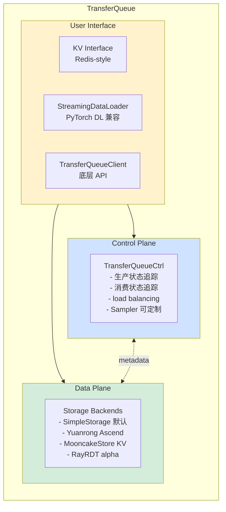

### TQ 在同步训练中的角色：零拷贝数据通道

当前 TQ 的主要生产路径是 `main_ppo_sync.py`——**Collocated 同步 PPO Trainer** 中用 TQ 替代了传统的 DataProto 直接传递：

**传统同步训练 (`main_ppo.py`) 数据流**：

```
Dataloader → DataProto → compute_old_log_prob(DataProto) → compute_ref_log_prob(DataProto)
             → compute_values(DataProto) → compute_advantage(DataProto) → update_actor(DataProto)
             ↑ 每一步都在内存中传递完整 DataProto (含所有 tensor 副本)
```

**TQ 同步训练 (`main_ppo_sync.py`) 数据流**：

```
Dataloader → AgentLoopWorkerTQ (fire-and-forget)
              ↓
         AgentLoop → tq.async_kv_batch_put(response, tags={status: success})
              ↓
         ReplayBuffer (后台 poll tq.kv_list(), 等待 global_steps 完成)
              ↓
         PPOTrainer.step():
           replay_buffer.sample() → KVBatchMeta
           _compute_old_log_prob(KVBatchMeta):  ← @tqbridge 自动 kv_batch_get / put
           _compute_ref_log_prob(KVBatchMeta):    ← @tqbridge 自动 kv_batch_get / put
           _compute_values(KVBatchMeta):          ← @tqbridge 自动 kv_batch_get / put
           _compute_advantage(TensorDict):        ← 纯 CPU 计算
           update_actor(TensorDict):
           kv_clear()
```

**关键差异**：

| 维度         | 传统同步 (`main_ppo.py`) | TQ 同步 (`main_ppo_sync.py`) |
|------------|----------------------|----------------------------|
| 数据传递       | 函数间直接传 DataProto     | 通过 TQ 存储，Meta 引用传递         |
| Rollout 执行 | 同步等待完成               | Fire-and-forget 后台执行       |
| 中间结果       | 内存中持有完整副本            | 按需 `kv_batch_get` 字段级读取    |
| 多轨迹支持      | 固定 batch 对齐          | 逐样本写入，padding 动态补齐         |
| Bridge 机制  | 无                    | `@tqbridge` 装饰器透明桥接        |

**tqbridge 透明桥接**（`verl/utils/transferqueue_utils.py`）使得 Single Controller 的 `register` 装饰器链函数无需修改内部逻辑即可使用
TQ：函数接收的是普通 `TensorDict`，读写由装饰器自动处理。

### TQ 在异步训练中的角色与规划

在 Fully Async 架构中，TQ 的定位从「数据传递优化」升级为**去中心化的分布式数据中枢**：

**当前状态 — Path A: Collocated TQ（已实现）**

`main_ppo_sync.py` 本质上仍是 Collocated 架构（Trainer/Rollout 共享进程），TQ 替代了 MessageQueue 但未改变部署拓扑。这是 TQ
验证正确性的第一阶段。

**目标架构 — Path B: Distributed TQ Fully Async（开发中）**

详细设计见 `docs/advance/tq.md`，核心变化：

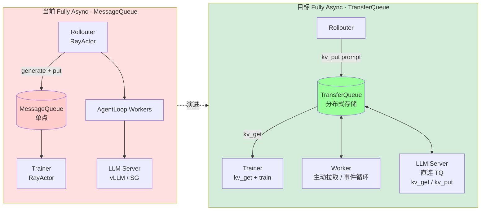

**关键变化**：

| 维度   | 当前 Fully Async (MessageQueue) | 目标 Fully Async (TransferQueue) |
|------|-------------------------------|--------------------------------|
| 存储   | ❌ MessageQueue 单点             | ✅ TQ 分布式存储                     |
| 数据路径 | ❌ Rollouter 中转全部数据            | ✅ Server 直连 TQ                 |
| 调度   | ❌ Worker 被动调度                 | ✅ Worker 主动拉取（事件循环）            |
| 流控   | ❌ 全局 staleness 计数             | ✅ Slot 背压机制                    |

**Path B 与现有异步组件的协同规划**：

| 组件                              | 与 TQ 的关系                                                | 规划                      |
|---------------------------------|---------------------------------------------------------|-------------------------|
| **CheckpointEngine**            | 参数同步路径不变，TQ 仅负责数据                                       | 已兼容                     |
| **Model Engine Server (#5990)** | `engine_server_logprobs` 写入 TQ 字段，Trainer 消费            | MES 输出经 TQ 传递，无需改 MQ 逻辑 |
| **Elastic Scheduling v2**       | TQ `kv_list()` 作为队列利用率监控数据源；partition 支持弹性分区            | TQ 成为调度决策的数据基础          |
| **OPD (#6056)**                 | Teacher `logprobs` 经 TQ 独立字段传递                          | 已在 Path A 中验证           |
| **Agent Gateway (#5790)**       | External Agent 轨迹直写 TQ，Trainer 消费带 token-truth mask 的数据 | 实现「任意 Agent 接入」的关键      |

### 关键优势

| 特性    | MessageQueue | TransferQueue                |
|-------|--------------|------------------------------|
| 序列化开销 | pickle 全量序列化 | **零拷贝** (TensorDict 直传)      |
| 数据粒度  | Batch 级别     | **Sub-sample 级别** (KV key)   |
| 字段可见性 | 无            | **每个字段独立追踪**                 |
| 存储后端  | 仅内存          | **可插拔（内存/KV/SSD）**           |
| 消费模式  | FIFO         | **可定制 Sampler**              |
| 单点瓶颈  | 是            | **去中心化 StreamingDataLoader** |
| 规模验证  | 百卡级          | **千卡级 (64 node × 16 GPU)**   |

### 关键文件

| 文件                                         | 说明                                         |
|--------------------------------------------|--------------------------------------------|
| `verl/trainer/main_ppo_sync.py`            | Collocated TQ PPO Trainer (~1731 行)，当前生产路径 |
| `verl/utils/transferqueue_utils.py`        | tqbridge 装饰器 + Meta 转换 + Mock (~431 行)     |
| `verl/trainer/ppo/padding_utils.py`        | 多轨迹 batch padding 工具                       |
| `verl/experimental/fully_async_policy_tq/` | Distributed TQ Fully Async（目标架构，开发中）       |

---

## 3.2 PR #6056: Online Policy Distillation 集成到 Fully Async（2026-04）

**PR 标题**: `[fully_async, rollout] feat: enable online policy distillation in fully async training`
**状态**: Merged (2026-05-06) | [+438/-1] | 6 files

将在线策略蒸馏（Online Policy Distillation, OPD）能力集成到 Fully Async 训练模式中，使异步训练流水线支持 Teacher-Student
知识迁移。

### 核心变更

- 在 `FullyAsyncRollouter` 中集成 `TeacherModelManager`，支持多 Teacher 模型同时服务
- Rollouter 同时管理 Student（Rollout）和 Teacher 的资源池
- 蒸馏损失与 RL 目标联合优化：`actor_loss = rl_loss + α * distill_loss`

### 实验验证

- **Student**: Qwen3-VL-2B-Instruct
- **Teachers**: Qwen3-4B-Instruct (GSM8K, text-only) + Qwen3-VL-4B-Instruct (Geo3K, vision)
- **GPUs**: 6×H100 (2 rollout + 2 training + 2 teachers)
- **Algorithm**: GRPO + k1 distillation loss with policy gradient

训练过程中 critic/score 稳定上升，distillation loss 正常收敛，GPU 利用率均衡。

---

## 3.3 PR #6271: Multi-Trajectory in One Rollout（开发中）

**PR 标题**:
`[trainer, fully_async] feat: add support for multi-trajectory in one rollout in agent loop in fully-async pipeline`
**状态**: Open | [+2690/-181] | 16 files

支持在 Agent Loop 的一次 rollout 中输出多条轨迹（multi-trajectory），替代传统的 `rollout.n` 方式。

### 动机

当前 verl 中 `rollout.n` 的实现方式是对同一个 prompt 重复调用 `n` 次 LLM 推理。PR #6271 将其改为在 Agent Loop 内部一次
rollout 生成多条轨迹，减少 LLM 调用开销并支持更灵活的轨迹生成策略。

### 关联 Issue

- [#5443](https://github.com/verl-project/verl/pull/5443): Multi-trajectory 前置工作
- [#1147](https://github.com/verl-project/verl/issues/1147): 原始需求追踪

---

## 3.4 Issue #5790: [RFC] Agent Gateway 与 Trajectory Gateway（规划中）

**标题**: `[RFC] Agent Abstractions and Trajectory Gateway for VERL`
**状态**: Open

这是 verl Agent 系统的重大架构升级提案，旨在解决当前 `AgentLoopManager` 与具体 Agent 实现紧耦合的问题。

### 核心设计：两层抽象

**1. AgentFramework — Agent 生命周期管理抽象**

```python
class AgentFramework(ABC):
    @abstractmethod
    async def generate_sequences(self, prompts: DataProto) -> DataProto:
        """处理 trainer batch 并返回训练数据"""
```

统一的 Agent 接口，内部实现可以是 coroutine、subprocess 或远程调用。框架层只关心 `generate_sequences` 的输入输出，不关心
Agent 内部执行结构。

**2. AgentGateway — Serving 侧 Trajectory 收集子系统**

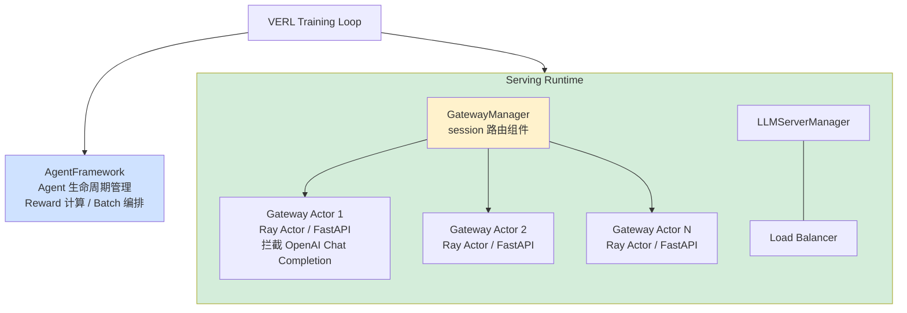

AgentGateway 作为 serving 层的子系统，拦截 Agent 的 OpenAI Chat Completions API 调用：

1. 执行 canonical tokenization（标准化 token 化）
2. 检查 prefix 一致性
3. 路由到推理后端
4. 记录 token 级别的交互轨迹
5. 返回标准 OpenAI Response（对 Agent 透明）

### 设计目标

- **任何 OpenAI 兼容的 Agent 系统**可无缝接入 verl 训练循环，无需修改 Agent 代码
- 产生连续的多轮 trajectory 数据，附带严格 token-truth 保证的 loss mask
- 多个 Gateway Actor 作为 Ray Actor 运行，避免单点瓶颈

---

## 3.5 PR #5990: Model Engine Server — 独立 Old Log Prob 计算（开发中）

**分支**: `standalone_old_log_prob_support`
**状态**: 开发中

Model Engine Server 是 verl 异步训练中的关键基础设施组件，解决了一个核心问题：**如何准确计算 old log probability（旧策略概率）
**。

### 背景与动机

在 PPO/GRPO 等 on-policy 或 near-policy 算法中，需要计算两个 log prob：

| Log Prob 类型           | 含义                                   | 计算方式                          |
|-----------------------|--------------------------------------|-------------------------------|
| **rollout_log_probs** | 当前 rollout 模型（可能已 stale）生成的 token 概率 | vLLM/SGLang 推理时返回的 `logprobs` |
| **old_log_probs**     | 上一步参数更新前的模型对生成序列的概率                  | 需要用**旧参数**重新前向传播              |

问题在于：vLLM 推理引擎返回的是**当前模型参数**下的 log probs（即 `rollout_log_probs`），而非训练步开始时的参数。在异步训练中，rollout
可能使用 stale 参数（`staleness_threshold > 0`），导致两者不一致。

> **解决方案**：引入独立的 Model Engine Server，使用与 Trainer 相同的训练引擎（FSDP/Megatron）精确计算 old log
> probabilities。

### 架构设计

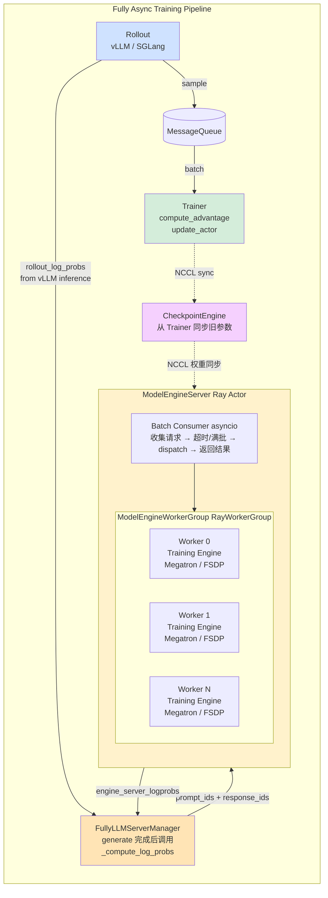

### 五大核心类

| 类名                             | 角色                | 说明                                                                  |
|--------------------------------|-------------------|---------------------------------------------------------------------|
| **`ModelEngineServerAdapter`** | BaseRollout 适配器   | 包装 `TrainingWorker`，提供 `compute_log_prob()` 和 `update_weights()` 接口 |
| **`ModelEngineWorker`**        | Ray Worker        | 继承 `CheckpointEngineWorker` + `DistProfilerExtension`，持有训练引擎实例      |
| **`ModelEngineServer`**        | Ray Actor 服务端     | 异步批量消费请求（timeout/batch_size 控制），dispatch 到 WorkerGroup              |
| **`ModelEngineReplica`**       | RolloutReplica 实现 | 管理 Standalone 模式的资源分配、WorkerGroup 创建、Server 启动                      |
| **`ModelEngineServerManager`** | 统一管理器             | 支持 `old_mode` + `ref_mode` 双实例并行计算                                  |

### 工作流程

**1. 请求入队与批量消费**

```python
# FullyLLMServerClient.generate() 完成后:
output = await self._compute_log_probs(output, prompt_ids + token_ids, temperature)

# _compute_log_probs 内部:
results = await self.model_engine_server_manager.compute_log_probs(
    prompt_ids, response_ids, temperature
)
# → {"old_log_probs": [...], "old_entropys": [...]}
```

`ModelEngineServer._batch_consumer()` 的批量策略：

- 等待 `_serving` gate 开放（非 drain 状态）
- 在 `timeout` 窗口内收集最多 `batch_size` 个请求
- 超时或满批立即 dispatch
- 若 mid-collection 触发 drain，将已收集的请求放回队列

**2. 权重同步协议**

```
Trainer 更新参数后:
  ① CheckpointEngine NCCL broadcast 新权重到所有 Replica
     ├─ Standalone Rollout Replica (Path A: NCCL)
     └─ ModelEngineReplica (Path A: NCCL, 仅 old_instance)

ModelEngineServer.sleep() 流程:
  ① _serving.clear() — 停止接受新请求
  ② await _infer_lock — 等待当前推理完成
  ③ flush 队列中已有请求（用旧权重计算完）
  ④ 权重通过 CheckpointEngine 写入

ModelEngineServer.wake_up() 流程:
  ① _serving.set() — 重新开放请求门
```

**3. 双模式支持**

```yaml
model_engine_server:
  enable: True
  enable_old_mode: True    # 计算 old_log_probs (旧 actor 参数)
  enable_ref_mode: False   # 计算 ref_log_probs (ref model 参数)
  nnodes: 1               # 独立 GPU 节点数
  n_gpus_per_node: 8       # 每个 node 的 GPU 数
  strategy: megatron       # 引擎类型 (megatron / fsdp)
  batch_size: 64           # 批量大小
  timeout: 5.0             # 批量收集超时(秒)
```

- **old_mode**: 用上一步 actor 参数计算 `engine_server_logprobs` → 替代 vLLM 返回的 `rollout_log_probs`
- **ref_mode**: 用 ref model 参数计算 `ref_logprobs` → 用于 KL 散度惩罚项

**4. 数据流**

```
AgentLoopWorker.generate()
  → vLLM/SGLang 推理 → token_ids + rollout_log_probs(vLLM返回值)
  → FullyLLMServerClient._compute_log_probs(prompt+tokens)
    → ModelEngineServer.compute_log_prob()
      → ModelEngineServerAdapter.compute_log_prob() [TrainingWorker.infer_batch]
    → engine_server_logprobs (精确的旧参数概率)
    → engine_server_entropys (熵值)
  → output.extra_fields["engine_server_logprobs"] = [...]
  → AgentLoopOutput.response_logprobs = output.log_probs (vLLM)
  → as_dict(): optional_outputs["rollout_log_probs"] = response_logprobs
  → optional_outputs["engine_server_logprobs"] = engine_server_logprobs
```

Trainer 端通过 `use_rollout_log_probs: True` 选择使用哪种 log_prob：

- `use_rollout_log_probs=True`: 使用 vLLM 返回的 `rollout_log_probs`（stale 但快速）
- 使用 `engine_server_logprobs`: 使用 MES 精确计算的旧参数概率（精确但额外开销）

### 关键配置

```yaml
# fully_async_ppo_megatron_trainer.yaml
defaults:
  - ppo_megatron_trainer
  - model_engine_server@model_engine_server: megatron_model_engine_server

actor_rollout_ref:
  rollout:
    calculate_log_probs: True    # vLLM 推理时返回 logprobs
  actor:
    use_rollout_log_probs: True # 训练使用 rollout log probs (或 engine_server_logprobs)

  # Shell 脚本中启用:
  model_engine_server.enable=True
  model_engine_server.enable_old_mode=True
  model_engine_server.nnodes=${NNODES_LOG_PROB}    # 独立节点
  model_engine_server.n_gpus_per_node=${NGPUS}
  model_engine_server.megatron.tensor_model_parallel_size=1
  model_engine_server.batch_size=64
```

### 与现有组件的关系

| 组件                       | 关系                                                                   |
|--------------------------|----------------------------------------------------------------------|
| **CheckpointEngine**     | MES 的 `ModelEngineReplica` 注册到 CE 的 replica 列表，参与 NCCL 权重同步          |
| **FullyLLMServerClient** | `generate()` 完成后自动调用 `_compute_log_probs()`，对 AgentLoop 透明           |
| **AgentLoop**            | 通过 `extra_fields["engine_server_logprobs"]` 传递结果，无需修改 AgentLoop 核心逻辑 |
| **MessageQueue**         | log_prob 数据随正常 DataProto 一起进入 MQ，无额外传输开销                             |

### 文件结构

```
verl/workers/rollout/model_engine_server/
├── __init__.py                        # 导出 5 大核心类
├── model_engine_server.py              # 全部实现 (~690 行)
│   ├── ModelEngineServerAdapter        # BaseRollout 适配器
│   ├── ModelEngineWorker               # Ray Worker (CheckpointEngineWorker)
│   ├── ModelEngineServer               # Ray Actor (批量消费 + dispatch)
│   ├── ModelEngineReplica              # RolloutReplica (Standalone 模式)
│   └── ModelEngineServerManager        # 统一管理器 (old + ref 双实例)

verl/trainer/config/model_engine_server/
├── model_engine_server.yaml            # 基础配置 (fsdp)
└── megatron_model_engine_server.yaml   # Megatron 配置 (继承基础 + TP/PP)
```

---

## 3.6 弹性调度基础设施与 Elastic Scheduling v2（开发中）

### PR #6076: 弹性调度基础设施

**PR 标题**: `[fully_async] feat: reuse trainer worker group for hybrid rollout to do validation`
**状态**: Open | [+915/-512] | 17 files

这是弹性调度的**前置基础设施 PR**，为后续完整弹性调度系统奠定基础。核心贡献包括：

1. **Handle Registry 合入 GlobalRequestLoadBalancer**：将原来分散在各 Client 的本地 server handle 缓存集中到 LB，使
   elastic add/remove 只需 **一次 Ray RPC**，无需广播通知所有 client/worker
2. **FullyAsyncLLMServerManager 两阶段初始化 + 弹性生命周期**：支持 Hybrid Replica（trainer GPU 上运行）+ Standalone
   Replica（专用 rollout GPU），运行时动态 `add_replica()` / `remove_replica()`
3. **Trainer 侧 Validation (`use_trainer_do_validate=True`)**：通过三阶段验证循环在 fully-async 模式下复用 trainer GPU 做
   validation
4. **KV-Cache-Only 权重同步优化**：vLLM `sleep(level=1)` 模式下只释放 kv_cache 保留 weights，减少内存压力
5. **Abort 状态追踪**：vLLM/SGLang server 追踪 `_is_aborted` flag，防止 post-abort 处理错误

### Elastic Scheduling v2: 完整弹性调度系统（开发中）

> 详细设计文档：`docs/advance/弹性调度系统.md`
> 分支：`elastic_scheduling_v2`

弹性调度系统是 verl 异步强化学习的**下一代架构演进**，实现 GPU 资源在 Train 和 Rollout 之间的**运行时动态切换**。

#### 核心问题

当前 Fully Async 训练中，Trainer 和 Rollout 的资源配比是**静态配置的**。但实际训练过程中：

- Rollout 阶段长尾严重时 → 生产跟不上消费 → 队列空 → Trainer 空等
- Rollout 阶段短尾为主时 → 生产过剩 → 队列满 → 样本堆积浪费显存

弹性调度让同一批 GPU 在 **Train** 和 **Rollout** 两种角色之间按需切换，最大化集群利用率。

#### 整体架构

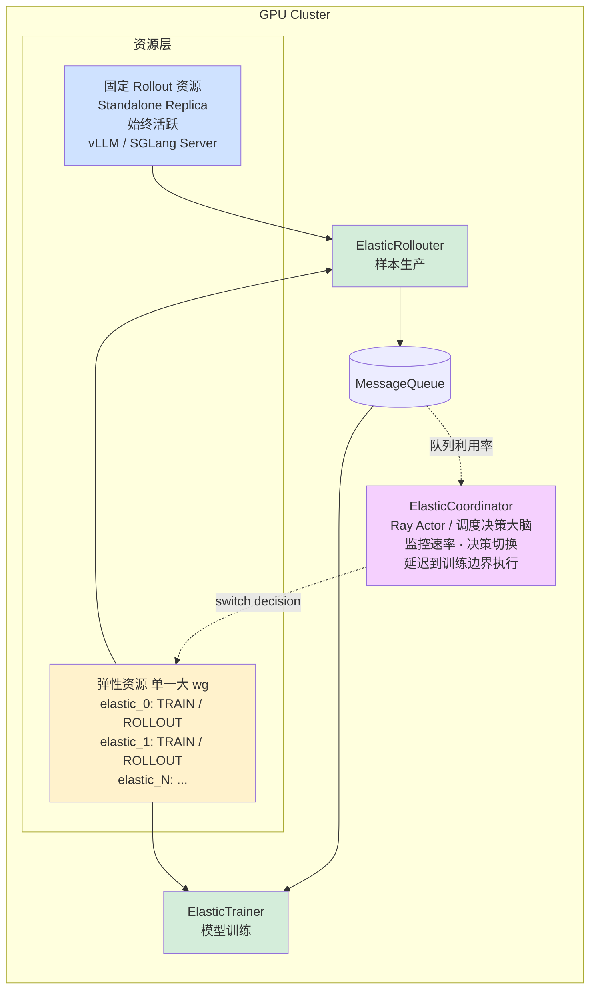

#### 资源划分模型

| 资源类型                   | 说明                                     | 角色可变性        |
|------------------------|----------------------------------------|--------------|
| **Standalone Replica** | 固定分配给 Rollout 的 GPU，始终由 vLLM/SGLang 持有 | ❌ 固定 Rollout |
| **Elastic Unit**       | 可在 Train/Rollout 间切换的 GPU 组            | ✅ 动态切换       |

> 没有"固定 Train 资源"——所有训练算力均来自弹性资源。可通过 `min_train_resources` 保证至少 N 个单元始终处于 Train 模式。

#### 弹性双模式设计

每个 Elastic Unit 同时持有 **Actor Engine**（训练）和 **Rollout Engine**（推理），互斥使用同一份 GPU 显存：

```mermaid
stateDiagram-v2
    [*] --> INIT
    INIT --> TRAIN: 初始化进入训练
    TRAIN --> ROLLOUT: switch_elastic_to_rollout()
    ROLLOUT --> TRAIN: switch_elastic_to_train()
    note left of TRAIN
        Actor Engine 在 GPU
        Rollout Engine 休眠
        (kv_cache + weights 已释放)
    end note
    note right of ROLLOUT
        Rollout Engine 在 GPU
        Actor Engine 在 CPU (offload)
    end note
```

**Train → Rollout 切换步骤**：

```mermaid
flowchart LR
    A[① remove_elastic_actor<br/>DP rebuild 排除此 ranks] --> B[② worker.switch_to_rollout<br/>actor.offload_to_cpu 释放 GPU]
B --> C[③ rollouter.add_elastic_replica<br/>wake_up + 加入 LB 池]
style A fill:#ffe0e0
style B fill: #fff2cc
style C fill: #d4edda
```

**Rollout → Train 切换步骤**：

```mermaid
flowchart LR
    A[① rollouter.remove_elastic_replica<br/>sleep + abort in-flight] --> B[② worker.switch_to_train<br/>actor.load_to_gpu]
B --> C[③ add_elastic_actor<br/>DP rebuild 纳入此 ranks]
style A fill: #ffe0e0
style B fill: #fff2cc
style C fill: #d4edda
```

#### 五大核心组件

| 组件                | 类名                               | 职责                                                                                 |
|-------------------|----------------------------------|------------------------------------------------------------------------------------|
| **Coordinator**   | `ElasticCoordinator` (Ray Actor) | 后台轮询队列利用率/生产/消费速率，EMA 平滑后决策切换方向，仅写 `_pending_action` flag                          |
| **Trainer**       | `ElasticTrainer`                 | 继承 FullyAsyncTrainer，拥有完整角色切换序列执行权，DP Rebuild 管理                                   |
| **Worker**        | `ElasticActorWorker`             | 继承 ActorRolloutRefWorker，管理训练引擎状态；Engine 通过 `_patch_engine_to_elastic()` 动态注入弹性能力  |
| **Rollouter**     | `ElasticRollouter`               | 继承 FullyAsyncRollouter，通过 ElasticAgentLoopManager 管理弹性服务器池                         |
| **CheckpointMgr** | `ElasticCheckpointManager`       | 双路参数同步：Path A(NCCL) for Standalone+Awake Hybrid, Path B(Naive) for Sleeping Hybrid |

#### fit_step 时序（5 个 Phase）

```
Phase 1: _elastic_on_before_fit_step()  ← 弹性切换(GPU空闲,在拉数据之前)
Phase 2: _apply_pending_dp_changes()    ← DP rebuild + required_samples更新
Phase 3: _fit_generate()                 ← 按新required_samples拉取样本
Phase 4: 训练计算(GPU繁忙)               ← compute_reward / update_actor
Phase 5: _fit_update_weights()           ← 参数同步(Path A NCCL + Path B Naive)
```

> **为什么切换必须在拉数据之前**：切换改变 DP size → `required_samples` 和 `mini_batch_size` 随之变化。先拉数据再切换会导致
> batch 大小与新 DP size 不整除。

#### DP Rebuild（Megatron & FSDP2 支持）

所有弹性 GPU 构成**唯一一个 RayWorkerGroup**，共享同一个 `dist.init_process_group` world。

**Megatron DP 重建流程**：

```mermaid
sequenceDiagram
    participant All as 所有 ranks
    participant Old as 老成员 ranks
    participant New as 新成员 ranks
    participant Excl as 被排除 ranks
    Note over All: Step 1: capture_state_to_cpu()<br/>每个 rank 独立快照到 CPU<br/>（零网络通信）
    Note over All: Step 2: _destroy_parallel_groups()<br/>销毁旧 TP / PP / DP 通信组
    All ->> All: Step 3: dist.new_group(new_ranks)<br/>所有 rank 必须参与（含被排除者，防死锁）
    All ->> All: Step 4: dist.barrier()
    Excl -->> Excl: Step 5: 新成员之外的被排除 ranks return 退出
    Old ->> Old: Step 6: _restore_state_from_cpu()<br/>老成员从 CPU 恢复
    Old ->> New: Step 7: _sync_params_to_new_members()<br/>broadcast(src=rank0) 覆盖新成员权重
    Old ->> New: Step 8: dist.barrier()
```

**FSDP2 DP 重建流程**：类似，但需先 `unwrap FSDP → to_local() → CPU拷贝`，再重新包装 FSDP2（新 device_mesh）。

#### AgentLoop Server 安全并发增删

**增加顺序**（消除竞态）：

```
① replica.wake_up()                          ← 恢复kv_cache+weights
② notify_workers_server_added(addr,handle)[await] ← 所有worker确认持有句柄
③ LB.add_server(server_id=addr)               ← 开放路由
```

**删除顺序**（三层保障）：

```
① LB.remove_server(addr)                    ← 标记_removed_servers,新请求不路由
② notify_workers_server_removed(addr)[await]  ← handle删除完成
③ abort_all_requests()                     ← stop_reason="aborted"
④ cleanup_removed_server(addr)              ← 彻底删除
⑤ replica.sleep()                           ← 释放显存归还Training
```

#### 调度策略

```
监控循环(check_interval秒):
  ├─ 队列利用率 > high_watermark(0.8) → scale_train(弹性→Train)
  ├─ 队列利用率 < low_watermark(0.3) → scale_rollout(弹性→Rollout)
  └─ 水位正常 → stable,不切换

约束条件:
  ├── min_rollout_resources: 至少保留N个弹性Rollout
  ├── min_train_resources: 至少保留N个弹性Train
  └─ cooldown_seconds(30s): 两次切换最小间隔,防抖动
```

#### 关键指标

| 指标                                | 含义                     |
|-----------------------------------|------------------------|
| `elastic/total_switch_to_rollout` | 累计 Train→Rollout 切换次数  |
| `elastic/total_switch_to_train`   | 累计 Rollout→Train 切换次数  |
| `elastic/last_switch_latency_s`   | 最近一次切换耗时               |
| `elastic/current_dp_size`         | 当前训练 DP 并行度（随弹性切换动态变化） |
| `elastic/num_rollout_replicas`    | 当前活跃 rollout replica 数 |
| `elastic/num_train_actors`        | 当前参与训练的 actor 数        |

#### 文件结构

```
verl/experimental/elastic_scheduling/
├── main.py                            # ElasticSchedulingTaskRunner 主入口
├── coordinator.py                     # ElasticCoordinator (Ray Actor, 调度决策)
├── elastic_trainer.py                 # ElasticTrainer (完整切换序列执行)
├── elastic_rollouter.py               # ElasticRollouter (样本生产, 弹性副本管理)
├── elastic_engine_workers.py          # ElasticActorWorker (训练引擎弹性切换)
├── elastic_checkpoint_engine.py       # ElasticCheckpointManager (双路参数同步)
├── agent_loop/
│   └── elastic_agent_loop.py          # ElasticAgentLoopManager + LB + Worker
├── engine/
│   ├── fsdp/elastic_transformer_impl.py   # ElasticFSDPMixin
│   └── megatron/elastic_transformer_impl.py# ElasticMegatronMixin
├── config/
│   ├── elastic_ppo_trainer.yaml
│   └── elastic_ppo_trainer_single_node.yaml
└── test/
    ├── test_fsdp_dp_rebuild_real_model.py
    ├── test_megatron_dp_rebuild_real_model.py
    ├── test_elastic_scheduling.py
    └── test_elastic_scheduling_ray.py
```

---

## 未来路线图总结

```mermaid
timeline
    title verl 异步强化学习路线图

    section 现在 (2026.05)
        Fully Async 2.35x 加速: Trainer / Rollout 完全异步并行
        OPD 集成 (PR@6056) : Online Policy Distillation 接入 Fully Async
        Model Engine Server (PR@5990) : 独立 old / ref log prob 计算
        弹性调度基础 (PR@6076) : Handle Registry / 两阶段初始化
        TQ Path A ✓: Collocated TransferQueue 落地
        1024 卡验证: 64 节点 DAPO 训练规模化

    section 近期 (2026 H1)
        Multi-Trajectory (PR@6271) : Agent Loop 一次 rollout 多轨迹
        TQ 生产化深化: Server 直连 TQ
        Elastic TQ 调度: TQ partition 支持弹性分区
        TQ + MES 协同: MES 输出经 TQ 字段传递

    section 中远期 (2026 H2+)
        Agent Gateway (RFC#5790) : AgentFramework 抽象 + Trajectory Gateway / 任意 Agent 接入
        Elastic Scheduling v2: GPU 动态 Train / Rollout 切换
        DP Rebuild + 双路同步: Megatron / FSDP2 弹性 DP
        TQ 作为调度数据源: kv_list 作为利用率信号
```

---

## 参考工作

| 工作                                                                   | 核心 Idea                    | 与 verl 的关系                             |
|----------------------------------------------------------------------|----------------------------|----------------------------------------|
| [AReaL](https://arxiv.org/abs/2505.24298)                            | Decoupled PPO, 异步 RL 系统    | One-Step-Off Policy 的主要参考              |
| [Magistral](https://arxiv.org/abs/2506.10910)                        | 大规模异步 RL                   | 多步异步策略参考                               |
| [StreamRL](https://arxiv.org/abs/2504.15930)                         | 流式生成 + disaggregated       | Stream pipeline 设计参考                   |
| [AsyncFlow](https://arxiv.org/abs/2507.01663)                        | 异步流式 RL 框架 + TransferQueue | Partial Rollout + staleness 参考；TQ 作者贡献 |
| [Checkpoint Engine](https://github.com/MoonshotAI/checkpoint-engine) | 高效参数同步                     | NCCL CheckpointEngine 的参考实现            |
| [TransferQueue](https://github.com/Ascend/TransferQueue)             | 高性能异步流式数据系统                | MessageQueue 的升级替代方案                   |

---

## 关键文件索引

### 核心模块

| 模块                    | 路径                                                            | 说明                                   |
|-----------------------|---------------------------------------------------------------|--------------------------------------|
| Fully Async Main      | `verl/experimental/fully_async_policy/fully_async_main.py`    | 入口，组装 Rollouter/Trainer/MessageQueue |
| Fully Async Rollouter | `verl/experimental/fully_async_policy/fully_async_rollout.py` | 异步样本生成器（Ray Actor）                   |
| Fully Async Trainer   | `verl/experimental/fully_async_policy/fully_async_trainer.py` | 异步训练器（Ray Actor）                     |
| MessageQueue          | `verl/experimental/fully_async_policy/message_queue.py`       | Ray Actor 实现的异步消息队列                  |
| Config                | `verl/experimental/fully_async_policy/config/*.yaml`          | 配置文件模板                               |

### 基础设施

| 模块                    | 路径                                                        | 说明                                            |
|-----------------------|-----------------------------------------------------------|-----------------------------------------------|
| CheckpointEngine      | `verl/checkpoint_engine/base.py`                          | CheckpointEngine 抽象基类 + Manager               |
| NCCL Engine           | `verl/checkpoint_engine/nccl_checkpoint_engine.py`        | NCCL 后端实现                                     |
| AgentLoop             | `verl/experimental/agent_loop/agent_loop.py`              | Agent 循环框架（SingleTurn/Tool）                   |
| AgentLoop Manager     | `verl/experimental/agent_loop/agent_loop.py`              | 管理 AgentLoop Worker 并行执行                      |
| Separate Ray Trainer  | `verl/experimental/separation/ray_trainer.py`             | 分离式 Ray Trainer 基类                            |
| Rate Limiter          | `verl/experimental/reward_loop/reward_manager/limited.py` | 三层限速机制                                        |
| TransferQueue Utils   | `verl/utils/transferqueue_utils.py`                       | tqbridge 装饰器 + Meta 转换 + Mock                 |
| TQ Collocated Trainer | `verl/trainer/main_ppo_sync.py`                           | PPOTrainer + ReplayBuffer + AgentLoopWorkerTQ |
| TQ Padding Utils      | `verl/trainer/ppo/padding_utils.py`                       | 多轨迹 batch padding 工具                          |

### Rollout 相关

| 模块                  | 路径                                                              | 说明                                                  |
|---------------------|-----------------------------------------------------------------|-----------------------------------------------------|
| **LLM Server**      | **`verl/workers/rollout/llm_server.py`**                        | **LLM Server 管理器 + Client 代理 + 全局 LB（PR #6129 抽取）** |
| vLLM Async Server   | `verl/workers/rollout/vllm_rollout/vllm_async_server.py`        | vLLM 异步服务端                                          |
| vLLM Rollout        | `verl/workers/rollout/vllm_rollout/vllm_rollout.py`             | vLLM Rollout 适配器（含 weight update）                   |
| Bucketed Transfer   | `verl/workers/rollout/vllm_rollout/bucketed_weight_transfer.py` | ZMQ + CUDA IPC 分桶传输                                 |
| SGLang Async Server | `verl/workers/rollout/sglang_rollout/async_sglang_server.py`    | SGLang 异步服务端                                        |
| Rollout Replica     | `verl/workers/rollout/replica.py`                               | Rollout Replica 抽象（abort/resume）                    |

````