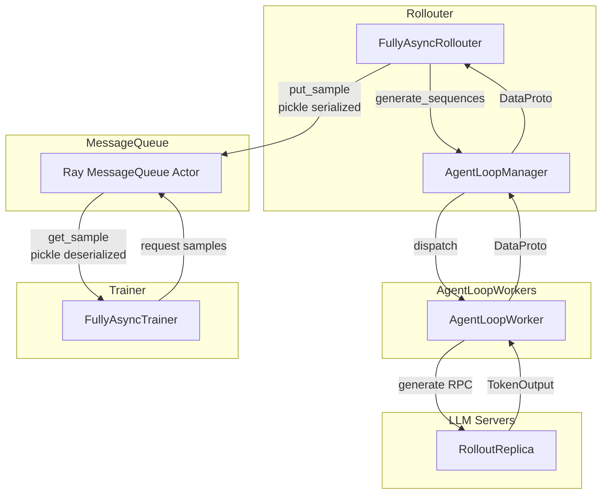
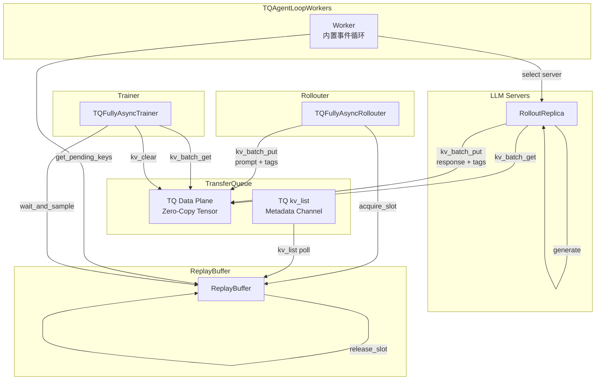
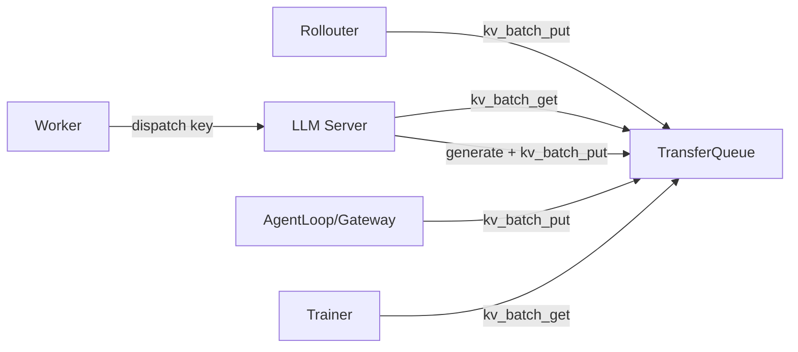
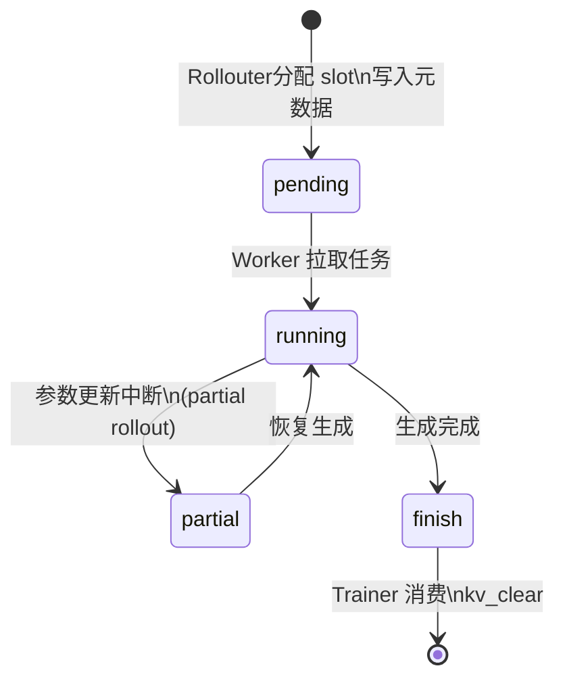
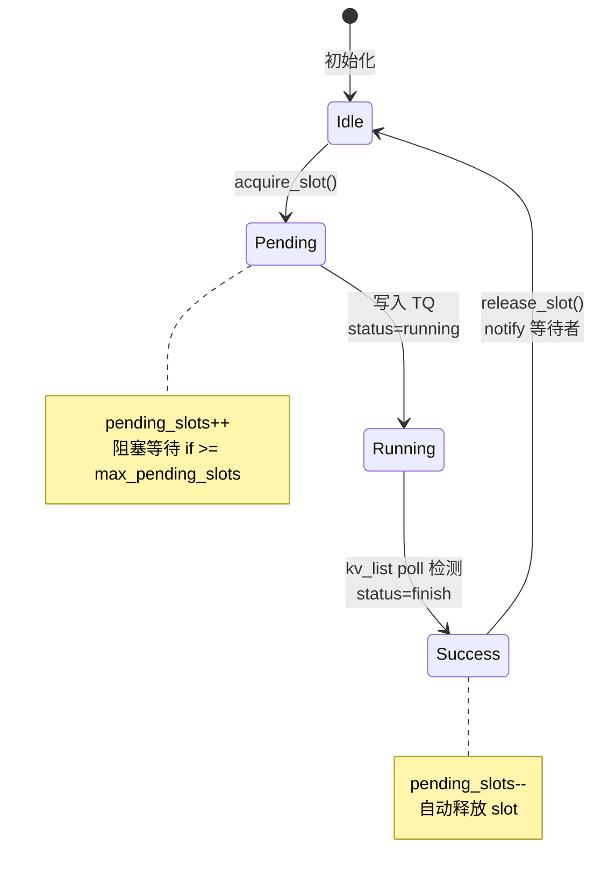
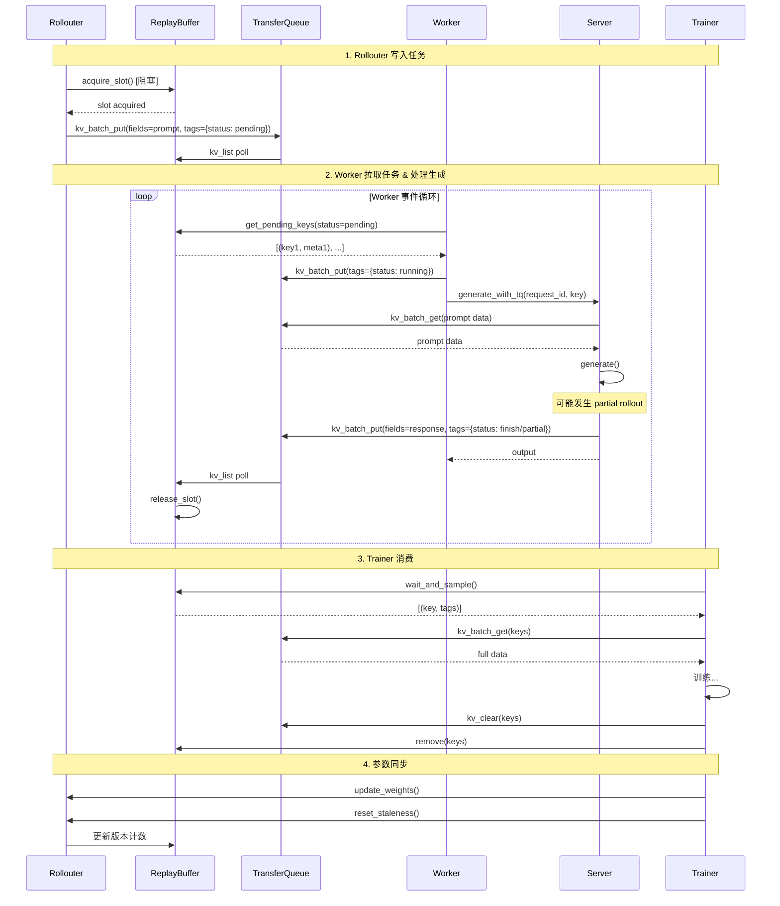
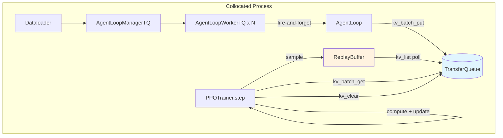
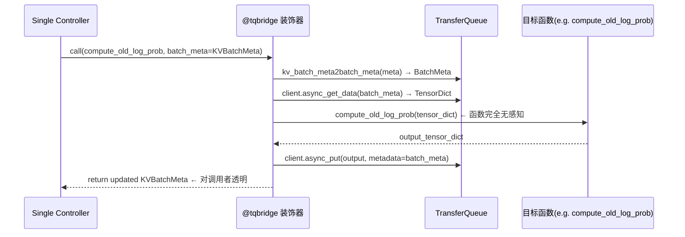

# Fully Async Policy with TransferQueue

## 概述

Last updated: 05/12/2026.

本方案旨在将 `fully_async_policy` 的数据传输通道从 Ray MessageQueue 迁移到 TransferQueue (TQ)，实现零拷贝、高性能的异步
PPO 训练。


### 核心目标

1. **零拷贝传输**: 使用 TQ 替代 MessageQueue，避免数据序列化开销
2. **元数据与数据分离**: Tensor 数据走 TQ 数据平面，元数据走 TQ kv_list 元数据通道
3. **背压控制**: 通过 slot 机制限制 in-flight 请求数量
4. **完全异步**: Rollouter 和 Trainer 完全解耦，独立运行

## 架构对比

### 现有架构 (MessageQueue)



**核心流程**:

1. **Rollouter** 从 dataloader 读取数据
2. **Rollouter** 调用 `AgentLoopManager.generate_sequences()`
3. **AgentLoopManager** 分发任务到 **AgentLoopWorker**
4. **AgentLoopWorker** 调用 **LLM Server** 执行生成
5. **LLM Server** 返回 `TokenOutput` 给 Worker
6. **Worker** 返回 `DataProto` 给 AgentLoopManager
7. **AgentLoopManager** 返回 `DataProto` 给 Rollouter
8. **Rollouter** 将样本序列化后写入 **MessageQueue**
9. **Trainer** 从 MessageQueue 获取样本，执行训练

**问题**:

- 数据完整序列化/反序列化开销大
- Ray Actor 单点瓶颈

### 新架构 (TransferQueue)



**核心流程**:

1. **Rollouter** 从 dataloader 读取数据，获取 slot，写入 prompt 到 **TQ**
2. **Worker** 从 **ReplayBuffer** 拉取 pending 任务
3. **Worker** 选择 **LLM Server**，调用 `generate_with_tq`
4. **Server** 从 TQ 获取 prompt，执行生成，将 response 写回 TQ
5. **Trainer** 从 ReplayBuffer 获取 finish 样本，从 TQ 获取完整数据

Server 直接从 TQ 获取数据



**关键变化**:

| 现有架构                                    | 新架构                          |
|-----------------------------------------|------------------------------|
| Rollouter 调用 `generate_sequences` 并等待返回 | Rollouter 仅写入 TQ，不等待生成       |
| Rollouter 将结果写入 MessageQueue            | Server 直接写入 TQ, 返回结束         |
| Worker 被 AgentLoopManager 调用            | Worker 主动从 ReplayBuffer 拉取任务 |
| MessageQueue 存储完整样本 (pickle)            | TQ 存储零拷贝 Tensor + 元数据分离      |

**优势**:

- ✅ 元数据轻量级同步 (kv_list)
- ✅ slot 机制实现令牌控流
- ✅ 分布式存储，无单点瓶颈
- ✅ Server，Train, GateWay, AgentLoop 直接读写 TQ，减少数据拷贝
- ✅ 统一消息传输的所有过程

## 数据结构

### Tags 元数据

每条样本在 TQ 中的元数据结构：

```python
tags = {
    # ===状态===
    "current_status": "pending" | "running" | "partial" | "finish",
    # pending:   已分配 slot，等待 Worker 拉取
    # running:   Worker 正在处理
    # partial:   running 的子状态，发生 partial rollout
    # finish:    生成完成，等待 Trainer 消费

    # ===身份标识===
    "uid": str,  # 原始 prompt 的 uid
    "session_id": int,  # 单个 prompt n 次采样，每个采样对应一个 AgentLoop
    "trajectory_id": int,  # 每次 AgentLoop 可能有多个输出（prefix 切换）

    # ===版本追踪===
    "min_global_steps": int,  # partial rollout 最小版本
    "max_global_steps": int,  # partial rollout 最大版本

    # ===长度信息===
    "prompt_len": int,
    "response_len": int,
    "seq_len": int,
}
```

### 状态机



### TQ Fields 数据字段

```python
fields = {
    # ===输入数据 (Rollouter 写入)===
    "input_ids": Tensor,  # prompt input ids
    "attention_mask": Tensor,
    "position_ids": Tensor,

    # ===多模态数据 (可选)===
    "multi_modal_inputs": dict,

    # ===原始数据字段===
    "raw_prompt": str,
    "data_source": str,
    "reward_model": dict,
    # ... 其他 dataset 字段

    # ===输出数据 (Server 写入)===
    "response_ids": Tensor,  # generated response ids
    "response_mask": Tensor,  # 1 for LLM tokens, 0 for tool tokens
    "rollout_log_probs": Tensor,  # for PPO
    "rm_scores": Tensor,  # reward scores

    # ===训练字段 (Trainer 写入)===
    "old_log_probs": Tensor,
    "ref_log_prob": Tensor,
    "values": Tensor,
    "advantages": Tensor,
    "returns": Tensor,
}
```

### Key 命名规范

```python
key = f"{partition_id}_{uid}_{session_id}_{trajectory_id}"
# 示例: "train_42_0_0", "val_100_3_1"
```


### partition

用于做数据的分区。

```
{
  partiton_id1: {key1: tag1, key2: tag2},
  partiton_id2: {key3: tag3, key4: tag4},
}
```


**字段说明**:

- `partition_id`: 分区标识，如 "train" 或 "val"
- `uid`: 原始 prompt 的唯一标识
- `session_id`: 同一 prompt 的第 n 次采样 (0 到 n-1)
- `trajectory_id`: 同一 session 的第 m 个输出 (用于 multi-output agent loop)


## 核心组件

### ReplayBuffer

轻量级元数据通道，替代 MessageQueue + 原 ReplayBuffer。

**初始化位置**: 在 `fully_async_main.py` 中创建，传递给 Rollouter 和 Trainer。

```python
@ray.remote(num_cpus=1)
class ReplayBuffer:
    def __init__(self, max_pending_slots=256, poll_interval=1.0):
        self.partitions: dict[str, dict[str, dict]] = defaultdict(dict)
        self._finished = False
        # Slot 控制
        self.max_pending_slots = max_pending_slots
        self._pending_slots = 0
        # 后台线程: 轮询 TQ kv_list
        self._poll_thread = threading.Thread(target=self._poll_from_tq, daemon=True)
        self._poll_thread.start()

    # === Slot 控制 (Rollouter) ===
    def acquire_slot(self) -> bool: ...

    def release_slot(self): ...

    # === Worker 拉取接口 ===
    def get_pending_keys(self, partition_id=None, limit=0, timeout=None) -> list[tuple[str, dict]]: ...

    # === Trainer 消费接口 ===
    def wait_and_sample(self, partition_id, batch_size) -> list[tuple[str, dict]] | None: ...

    def remove(self, partition_id, keys): ...

    # === 统计接口 ===
    def total_in_flight(self) -> int: ...

    def get_staleness_statistics(self, current_version, partition_id="train") -> dict: ...
```

#### Slot 控制机制



### TQFullyAsyncRollouter

分配 prompt 到 TQ，控制生成速率。

**职责**:

1. 从 dataloader 读取数据
2. 调用 `prepare_single_generation_data` 处理数据
3. 获取 slot，写入 TQ
4. 管理 checkpoint（通过 CheckpointEngineManager）

```python
class TQFullyAsyncRollouter:
    def __init__(self, config, tokenizer, replay_buffer_handle, ...):
        self.replay_buffer = replay_buffer_handle
        self.current_model_version = 0
        self.partition_id = "train"
        # ...

    async def generate_sequences(self, batch_dict: dict):
        """处理单个 batch，写入 TQ"""
        # 1. 准备数据 (参考 prepare_single_generation_data)
        full_batch = DataProto.from_single_dict(batch_dict)

        # 设置 agent_name
        if not self.config.actor_rollout_ref.rollout.multi_turn.enable:
            full_batch.non_tensor_batch["agent_name"] = np.array(
                ["single_turn_agent"] * len(full_batch), dtype=object
            )

        # 2. 为每个 prompt 分配 slot 并写入 TQ
        for i in range(len(full_batch)):
            uid = full_batch.non_tensor_batch["uid"][i]

            # 阻塞获取 slot (背压控制)
            acquired = await self.replay_buffer.acquire_slot.remote()
            if not acquired:
                logger.warning("Failed to acquire slot, stopping...")
                break

            # 写入 TQ (n 次采样由 Worker 处理，这里只写一次)
            key = f"{self.partition_id}_{uid}"

            # 提取单个样本的字段
            fields = self._extract_fields(full_batch, i)

            tq.kv_batch_put(
                keys=[key],
                fields=fields,
                tags={
                    "current_status": "pending",
                    "uid": uid,
                    "session_id": 0,  # 占位，Worker 会处理 n 次采样
                    "trajectory_id": 0,
                    "start_model_version": self.current_model_version,
                    "end_model_version": self.current_model_version,
                    "prompt_len": fields["input_ids"].shape[0],
                },
                partition_id=self.partition_id,
            )
```

### TQAgentLoopWorker

独立实现的 Worker，内置事件循环，主动拉取任务。

**职责**:

1. 主动从 ReplayBuffer 拉取 pending 任务 {uid}
2. 处理 n 次采样（每个 prompt 生成 n 个 session）：{uid}_{session_id}
3. 调用 AgentLoop 执行生成，每个session可以在AgentLoop侧，可能返回多条轨迹：{uid}\_{session_id}\_{trajectory_id}
4. 最终，拷贝 {uid}_{session_id} prompt，并将 {uid}\_{session_id}\_{trajectory_id} 写回到TQ中
5. 将key传递给由 Server 侧，有Server侧继续处理 哦·

**实现**:

```python
@ray.remote(num_cpus=1)
class TQAgentLoopWorker:
    def __init__(
            self,
            config: DictConfig,
            replay_buffer_handle: ray.actor.ActorHandle,
            servers: list[tuple[str, ray.actor.ActorHandle]],
            load_balancer_handle: ray.actor.ActorHandle,
            tokenizer,
            processor=None,
    ):
        self.config = config
        self.replay_buffer = replay_buffer_handle
        self.tokenizer = tokenizer
        self.processor = processor

        # LoadBalancer 仅负责调度
        self.load_balancer = load_balancer_handle
        self.servers = dict(servers)

        # AgentLoop 配置
        self.rollout_config = config.actor_rollout_ref.rollout
        self.n = self.rollout_config.n  # 每个prompt 的采样次数
        self.partition_id = config.trainer.get("partition_id", "train")

        # 状态
        self.finished = False
        self.active_tasks: set[asyncio.Task] = set()

        # 初始化 TQ
        tq.init()

        # 启动内置事件循环
        self._loop_task = asyncio.create_task(self._run_loop())

    async def _run_loop(self):
        """主动拉取任务的主循环"""
        while not self.finished:
            try:
                # 1. 从 ReplayBuffer 获取 pending 任务
                pending_tasks = await self.replay_buffer.get_pending_keys.remote(
                    partition_id=self.partition_id,
                    limit=self.rollout_config.batch_size,
                    timeout=1.0,
                )

                if not pending_tasks:
                    continue

                # 2. 为每个任务创建处理任务
                for key, meta in pending_tasks:
                    task = asyncio.create_task(
                        self._process_single_prompt(key, meta)
                    )
                    self.active_tasks.add(task)
                    task.add_done_callback(self.active_tasks.discard)

                # 3. 等待部分任务完成，控制并发
                if len(self.active_tasks) >= self.rollout_config.max_concurrent:
                    done, _ = await asyncio.wait(
                        self.active_tasks,
                        return_when=asyncio.FIRST_COMPLETED,
                    )

            except Exception as e:
                logger.exception(f"Error in _run_loop: {e}")

        # 等待所有活跃任务完成
        if self.active_tasks:
            await asyncio.gather(*self.active_tasks, return_exceptions=True)

    async def _process_single_prompt(self, key: str, meta: dict):
        """处理单个 prompt，包括 n 次采样"""
        uid = meta["uid"]

        try:
            # 1. 更新状态为 running
            tq.kv_batch_put(
                keys=[key],
                tags={"current_status": "running"},
                partition_id=self.partition_id,
            )

            # 2. n 次采样
            tasks = []
            for session_id in range(self.n):
                session_key = f"{self.partition_id}_{uid}_{session_id}_0"
                task = asyncio.create_task(
                    self._run_session(session_key, key, session_id, meta)
                )
                tasks.append(task)

            # 3. 等待所有 session 完成
            await asyncio.gather(*tasks, return_exceptions=True)

            # 4. 更新原 key 状态为 finish (标记 prompt 处理完成)
            tq.kv_batch_put(
                keys=[key],
                tags={"current_status": "finish"},
                partition_id=self.partition_id,
            )

        except Exception as e:
            logger.exception(f"Error processing {key}: {e}")
            # 标记失败
            tq.kv_batch_put(
                keys=[key],
                tags={"current_status": "error", "error": str(e)},
                partition_id=self.partition_id,
            )

    async def _run_session(
            self,
            session_key: str,
            parent_key: str,
            session_id: int,
            parent_meta: dict,
    ):
        """执行单次采样 (一个 AgentLoop)"""
        # 1. 创建 AgentLoop 实例
        agent_loop = self._create_agent_loop()

        # 2. 准备采样参数
        sampling_params = {
            "temperature": self.rollout_config.temperature,
            "top_p": self.rollout_config.top_p,
            "top_k": self.rollout_config.top_k,
            "logprobs": self.rollout_config.calculate_log_probs,
        }

        # 3. 执行 AgentLoop
        # 注意：实际的数据获取和结果写入在 Server 侧完成
        output = await agent_loop.run(
            sampling_params=sampling_params,
            session_key=session_key,
            parent_key=parent_key,
            partition_id=self.partition_id,
            **parent_meta,
        )

        return output

    def _create_agent_loop(self):
        """创建 AgentLoop 实例"""
        agent_name = self.rollout_config.agent.default_agent_loop
        agent_loop_config = _agent_loop_registry[agent_name]
        return hydra.utils.instantiate(
            config=agent_loop_config,
            trainer_config=DictConfigWrap(self.config),
            server_manager=self,  # Worker 自己作为 server_manager
            tokenizer=self.tokenizer,
            processor=self.processor,
            dataset_cls=get_dataset_class(self.config.data),
            data_config=DictConfigWrap(self.config.data),
        )

    async def generate(self, request_id, prompt_ids, sampling_params, **kwargs):
        """调用 Server 执行生成 (AgentLoop 通过此方法调用)"""
        # 1. 通过 LoadBalancer 选择 Server
        server_address = await self.load_balancer.acquire_server.remote(request_id)
        server_handle = self.servers[server_address]

        try:
            # 2. 调用 Server 的 generate 方法
            # Server 会从 TQ 获取数据，生成后写回 TQ
            output = await server_handle.generate_with_tq.remote(
                request_id=request_id,
                prompt_ids=prompt_ids,
                sampling_params=sampling_params,
                partition_id=kwargs.get("partition_id", self.partition_id),
                session_key=kwargs.get("session_key"),
                **kwargs,
            )
            return output
        finally:
            self.load_balancer.release_server.remote(server_address)

    def signal_finish(self):
        """通知 Worker 停止"""
        self.finished = True
```

### TQLLMServer (Server 侧扩展)

Server 侧直接读写 TQ，处理 partial rollout。

```python
class TQLLMServer:
    """LLM Server 的 TQ 扩展，处理数据读写"""

    async def generate_with_tq(
            self,
            request_id: str,
            prompt_ids: list[int],
            sampling_params: dict,
            partition_id: str,
            session_key: str,
            **kwargs,
    ) -> TokenOutput:
        """执行生成并处理 TQ 数据读写"""
        final_output = TokenOutput(token_ids=[], log_probs=[], num_preempted=0)
        min_global_steps = None
        max_global_steps = None

        while True:
            # 1. 执行生成
            output = await self._generate_internal(
                request_id=request_id,
                prompt_ids=prompt_ids + final_output.token_ids,
                sampling_params=sampling_params,
            )

            # 2. 合并输出
            final_output.token_ids.extend(output.token_ids)
            if output.log_probs is not None:
                final_output.log_probs.extend(output.log_probs)
            final_output.stop_reason = output.stop_reason

            # 3. 更新版本追踪
            global_steps = output.extra_fields.get("global_steps")
            if min_global_steps is None:
                min_global_steps = global_steps
            max_global_steps = global_steps

            # 4. 更新 max_new_tokens
            if "max_tokens" in sampling_params:
                remaining = sampling_params["max_tokens"] - len(final_output.token_ids)
                if remaining <= 0:
                    final_output.stop_reason = "length"
                    break
                sampling_params["max_tokens"] = remaining

            # 5. 检查是否 partial rollout
            if output.stop_reason in ("aborted", "abort"):
                # 写入 partial 状态
                tq.kv_batch_put(
                    keys=[session_key],
                    tags={
                        "current_status": "partial",
                        "min_global_steps": min_global_steps,
                        "max_global_steps": max_global_steps,
                    },
                    partition_id=partition_id,
                )
                # 继续循环，恢复生成
                await asyncio.sleep(1)
            else:
                # 正常结束
                break

        # 6. 写入最终结果到 TQ
        response_mask = [1] * len(final_output.token_ids)  # 简化示例
        rm_scores = self._compute_reward(final_output)

        tq.kv_batch_put(
            keys=[session_key],
            fields={
                "response_ids": torch.tensor(final_output.token_ids),
                "response_mask": torch.tensor(response_mask),
                "rollout_log_probs": torch.tensor(final_output.log_probs),
                "rm_scores": rm_scores,
            },
            tags={
                "current_status": "finish",
                "start_model_version": min_global_steps,
                "end_model_version": max_global_steps,
                "min_global_steps": min_global_steps,
                "max_global_steps": max_global_steps,
                "response_len": len(final_output.token_ids),
                "seq_len": len(prompt_ids) + len(final_output.token_ids),
            },
            partition_id=partition_id,
        )

        final_output.extra_fields["global_steps"] = max_global_steps
        final_output.extra_fields["min_global_steps"] = min_global_steps
        final_output.extra_fields["max_global_steps"] = max_global_steps

        return final_output
```

### TQFullyAsyncTrainer

消费完成样本，执行 PPO 训练。

**职责**:

1. 从 ReplayBuffer 获取 finish 状态的样本
2. 从 TQ 获取完整数据
3. 执行 PPO 训练步骤
4. 持有 Rollouter 引用，通过 CheckpointEngineManager 同步参数

```python
class TQFullyAsyncTrainer(PPOTrainer):
    def __init__(
            self,
            config: DictConfig,
            role_worker_mapping: dict[Role, WorkerType],
            resource_pool_manager: ResourcePoolManager,
            replay_buffer_handle: ray.actor.ActorHandle,
            rollouter_handle: ray.actor.ActorHandle,
            **kwargs,
    ):
        super().__init__(config, role_worker_mapping, resource_pool_manager, **kwargs)
        self.replay_buffer = replay_buffer_handle
        self.rollouter = rollouter_handle
        self.current_param_version = 0

    async def _get_samples_from_queue(self, batch_size: int) -> DataProto | None:
        """从 TQ 获取训练样本"""
        # 1. 等待足够样本
        samples = await self.replay_buffer.wait_and_sample.remote(
            partition_id="train",
            batch_size=batch_size,
        )

        if samples is None:
            return None

        keys = [k for k, _ in samples]
        metas = [v for _, v in samples]

        # 2. 从 TQ 获取完整数据
        fields = [
            "input_ids", "response_ids", "response_mask",
            "rollout_log_probs", "rm_scores",
            # ... 其他训练所需字段
        ]
        data = tq.kv_batch_get(
            keys=keys,
            select_fields=fields,
            partition_id="train",
        )

        # 3. 计算 staleness
        staleness_stats = {
            "staleness/mean": np.mean([
                self.current_param_version - m["start_model_version"]
                for m in metas
            ]),
            "staleness/max": max([
                self.current_param_version - m["start_model_version"]
                for m in metas
            ]),
        }

        # 4. 构建DataProto
        batch = self._build_data_proto(data, metas)
        batch.meta_info.update(staleness_stats)

        return batch

    async def _fit_update_weights(self):
        """更新参数到 Rollouter"""
        if self.local_trigger_step != 1:
            return

        # 1. 通过 CheckpointEngineManager 同步参数
        await self.checkpoint_manager.update_weights(
            global_steps=self.current_param_version
        )

        # 2. 通知 Rollouter 重置 staleness
        timing_raw = await self.rollouter.reset_staleness.remote()
        self.logger.log(data=timing_raw, step=self.current_param_version)

        # 3. 更新版本号
        self.current_param_version += 1
```

## 数据流详解

### 完整生命周期时序图



### Staleness 与 Slot 协同

| 原概念                    | TQ 方案对应                                       |
|------------------------|-----------------------------------------------|
| `staleness_samples`    | `pending_slots` (正在生成) + `ready_count` (等待消费) |
| `max_required_samples` | `max_pending_slots`                           |
| 参数更新后 reset            | `reset_staleness()` → 重置计数                    |

**Rollouter 暂停条件**:

- `max_pending_slots`: 控制写入速率 (防止 TQ 积压)
- `max_required_samples`: 控制版本跨度 (数据新鲜度)

## 文件结构

```
verl/experimental/fully_async_policy_tq/
├── README.md                    # 本文档
├── replay_buffer.py             # ReplayBuffer Actor ✅
├── agent_loop/
│   ├── __init__.py
│   └── agent_loop.py            # TQAgentLoopWorker
├── fully_async_rollouter.py     # TQFullyAsyncRollouter
├── fully_async_trainer.py       # TQFullyAsyncTrainer
├── fully_async_main.py          # 主入口
└── config/
    └── fully_async_ppo_trainer.yaml
```

## 在 verl 异步 RL 演进中的定位

### 时间线

```
═══════════════════════════════════════════════════════════════════════
                     TransferQueue 集成时间线
═══════════════════════════════════════════════════════════════════════

2025-07  AsyncFlow 论文发布
          │  提出 TransferQueue 概念：解耦控制流与数据流
          │
2025-07  verl RFC #2662
          │  提案将 TQ 集成到 verl 训练流程
          │
2025-10  verl PR #3649
          │  TQ 官方集成到 verl（初始集成）
          │
2025-12  大规模验证
          │  DAPO 算法在 64 节点 1024 卡上通过 TQ 验证 ✓
          │
2026-02  高层 KV API (TQ PR#26, #28)
          │  Redis-style API 简化使用门槛
          │
2026-04  verl PR #5401 + RFC #5400
          │  正式集成 PR，Single Controller 全面接入 TQ
          │
2026-05  生产化路径确认
          ├─ main_ppo_sync.py: Collocated TQ Trainer（已完成）
          └─ fully_async_policy_tq/: 分布式 TQ Fully Async（开发中）
```

### 与 Async RL 各阶段的关系

TransferQueue 不是某个单一 PR 的功能，而是贯穿 verl 异步 RL **第三阶段及以后**的基础设施升级：

```
阶段一 (PR #2231, #2981)
  One-Step-Off → Fully Async
  数据通道: Future / MessageQueue (Ray Actor + pickle)
                    ↓
阶段二 (PR #4280 ~ #5487)
  基础设施重构: CheckpointEngine / Partial Rollout / Gateway
  数据通道: 仍为 MessageQueue（未变）
                    ↓
阶段三 (PR #5401, main_ppo_sync.py)  ←── TQ 首次集成
  Collocated TQ Trainer:
  - ReplayBuffer 替代 MessageQueue 的元数据角色
  - tq.kv_batch_put/get 替代 pickle 序列化
  - tqbridge 装饰器实现 Single Controller 透明桥接
                    ↓
阶段三+ (fully_async_policy_tq/)  ←── TQ 分布式演进（目标架构）
  Distributed TQ Fully Async:
  - Server 直连 TQ（消除 Rollouter 中转）
  - Worker 主动拉取（事件循环驱动）
  - Slot 背压机制（替代 staleness_samples）
                    ↓
未来 (与以下组件协同)
  ├── Model Engine Server (PR #5990): log_prob 写入 TQ
  ├── Elastic Scheduling v2: TQ 作为调度数据源
  ├── Agent Gateway (#5790): Trajectory → TQ 直写
  └── OPD (PR #6056): Teacher output 经 TQ 传递
```

## 已实现的代码路径：Collocated TQ Trainer

> **当前状态**: ✅ 已合入 main，生产可用
> **入口文件**: `verl/trainer/main_ppo_sync.py` (~1731 行)

### 架构概览

`main_ppo_sync.py` 采用 **Collocated 架构**（Trainer 和 Rollout 共享 GPU 进程），是当前最完整的 TQ 集成实现。与 `tq.md` 前文描述的「完全分布式」目标架构不同，此版本在保持 colocated 前提下用 TQ 替代了数据传递通道。



### 核心组件映射

| 设计文档 (`tq.md`) | 实际代码 (`main_ppo_sync.py`) | 差异说明 |
|---|---|---|
| `TQFullyAsyncRollouter` | `AgentLoopManagerTQ` + Dataloader 内联 | 无独立 Rollouter Actor，由 Trainer 直接驱动 |
| `TQAgentLoopWorker` (内置事件循环) | `AgentLoopWorkerTQ` (fire-and-forget) | 非主动拉取，而是分发后后台执行 |
| `ReplayBuffer` (slot 控制) | `ReplayBuffer` (简化版) | 无 slot 机制，按 `global_steps` 分组等待 |
| `TQFullyAsyncTrainer` | `PPOTrainer` (colocated sync step) | 同步 `step()` 调度，非异步消费 |
| `TQLLMServer` (Server 直连 TQ) | ❌ 未实现 | Server 不直接访问 TQ，经 AgentLoop 中转 |

### ReplayBuffer 实现

```186:275:verl/trainer/main_ppo_sync.py
class ReplayBuffer:
    """定期从 TransferQueue 轮询元数据的 Replay Buffer"""

    def __init__(self, poll_interval: float = 1.0):
        self.partitions: dict[str, dict[str, dict]] = defaultdict(dict)
        self.poll_thread = threading.Thread(
            target=self._poll_from_transfer_queue, daemon=True
        )
        self.poll_thread.start()

    def _poll_from_transfer_queue(self):
        """后台线程: 周期性调用 tq.kv_list() 刷新元数据"""
        while True:
            data = tq.kv_list()  # 获取所有 partition 的 key-tags
            for partition_id, items in data.items():
                self.add(partition_id, items)
            time.sleep(self.poll_interval)

    def sample(self, partition_id, global_steps=None, batch_size=None) -> KVBatchMeta:
        """阻塞等待指定 global_steps 的所有样本完成"""
        # 等待 status == "success" 的样本，返回 KVBatchMeta
```

**与设计文档的差异**：
- 无 `acquire_slot/release_slot` 背压机制
- 使用 `global_steps` 分组而非 `pending/running/partial/finish` 状态机
- 阻塞式 `sample()` 等待整批完成，非异步 `wait_and_sample()`

### AgentLoopWorkerTQ: Fire-and-Forget 模式

```278:441:verl/trainer/main_ppo_sync.py
@ray.remote
class AgentLoopWorkerTQ(AgentLoopWorker):
    def __init__(self, *args, **kwargs):
        super().__init__(*args, **kwargs)
        tq.init()  # 初始化 TQ

    async def generate_sequences(self, batch: TensorDict) -> None:
        """Fire-and-forget: 分发后不等待结果"""
        for i in range(len(batch)):
            prompt = self._extract_single_prompt(batch, i)
            task = asyncio.create_task(
                self._run_prompt(prompt, sampling_params, trajectory, trace)
            )
            self.background_tasks.add(task)  # 后台任务集合

    async def _agent_loop_postprocess(self, output, validate, **kwargs) -> None:
        """将 AgentLoop 输出写入 TransferQueue"""
        keys, fields, tags = [], [], []
        for i, output in enumerate(outputs):
            keys.append(f"{uid}_{session_id}_{i}")  # 多轨迹支持
            field = output.as_dict()
            field["input_ids"] = cat(prompts, responses)
            field["position_ids"] = compute_position_ids(...)
            fields.append(field)
            tags.append({"global_steps": gs, "status": "success",
                         "prompt_len": ..., "response_len": ...})

        await tq.async_kv_batch_put(keys=keys, fields=..., tags=tags,
                                    partition_id="train"|"val")
```

**关键设计**：
- `generate_sequences()` 立即返回，不阻塞 Trainer
- 每个 prompt 的 n 次采样通过 `_run_prompt()` 并发执行
- 多轨迹输出（multi-trajectory）每个轨迹独立写入 TQ，key 格式 `{uid}_{session_id}_{trajectory_id}`
- Reward score 仅对最后一个输出计算，然后广播到同 uid 的所有轨迹

### PPOTrainer.step(): TQ 驱动的训练循环

```493:1622:verl/trainer/main_ppo_sync.py
class PPOTrainer:
    """使用 TransferQueue 和 ReplayBuffer 的 PPO Trainer"""

    def step(self, batch_dict, metrics, timing_raw) -> KVBatchMeta:
        """完整训练步骤，所有中间结果通过 TQ 传递"""
        # 1. generate_sequences → AgentLoopWorkerTQ 写入 TQ (fire-and-forget)
        self.async_rollout_manager.generate_sequences(prompts)

        # 2. replay_buffer.sample() → 等待所有样本 status=success
        batch = self.replay_buffer.sample(partition_id, global_steps=self.global_steps)

        # 3. _compute_old_log_prob → @tqbridge 自动 kv_batch_get + kv_batch_put
        batch = self._compute_old_log_prob(batch, metrics)

        # 4. _compute_ref_log_prob → @tqbridge 自动 kv_batch_get + kv_batch_put
        batch = self._compute_ref_log_prob(batch, metrics)

        # 5. _compute_values → @tqbridge
        batch = self._compute_values(batch, metrics)

        # 6. _compute_advantage → 纯 CPU 计算（无需 TQ）
        batch = self._compute_advantage(batch, metrics)

        # 7. _update_critic / _update_actor → GPU 训练
        batch = self._update_actor(batch, metrics)

        return batch  # 返回 KVBatchMeta（可继续传递给下游）
```

## tqbridge: Single Controller 透明桥接层

> **核心文件**: `verl/utils/transferqueue_utils.py` (~431 行)

tqbridge 是 verl Single Controller 架构与 TransferQueue 之间的**透明桥接装饰器**，使得现有的 `register` 装饰器链函数可以无缝使用 TQ 传递数据，而无需修改函数内部逻辑。

### 工作原理



### 核心装饰器逻辑

```298:430:verl/utils/transferqueue_utils.py
def tqbridge(dispatch_mode=None):
    """桥接 KVBatchMeta/TensorDict 的装饰器

    自动处理:
    1. 参数中 KVBatchMeta/BatchMeta → TensorDict (async_get_data)
    2. 返回值 TensorDict → BatchMeta (async_put)
    3. 支持 sync/async 函数
    4. dispatch_mode 控制数据收集行为（lazy compute 优化）
    """
    def decorator(func):
        @wraps(func)
        def inner(*args, **kwargs):  # sync 版本
            batch_meta = _find_meta(*args, **kwargs)
            if batch_meta is None:
                return func(*args, **kwargs)  # 无 meta → 原始调用

            # ① Meta → TensorDict (从 TQ 读取)
            args = [_meta_to_realdata(arg) if is_meta(arg) else arg ...]
            output = func(*args, **kwargs)  # ② 执行原函数

            # ③ TensorDict → Meta (写回 TQ)
            if put_data and need_collect:
                updated_meta = _update_meta_with_output(output, batch_meta)
                return updated_meta  # 返回 KVBatchMeta

        @wraps(func)
        async def async_inner(*args, **kwargs):  # async 版本
            # 同上逻辑，但全部 await
```

### 元数据转换

```
KVBatchMeta (KV 接口)          BatchMeta (底层接口)
┌─────────────────────┐      ┌──────────────────────────┐
│ keys: ["k1", "k2"]   │ ──→  │ global_indexes: [0, 1]     │
│ tags: [{...}, {...}] │      │ partition_ids: ["train"]   │
│ partition_id: "train"│      │ field_names: ["input_ids",..]│
│ fields: ["input_ids"] │      │ extra_info: {non_tensor}    │
│ extra_info: {...}     │      └──────────────────────────┘
└─────────────────────┘              ↕
         ↑↑                          │
    kv_retrieve_keys/meta       async_get_data / async_put
         ↓↓                          │
    ┌──────────────────────────────────────┐
    │         TransferQueue Storage        │
    │  (SimpleStorage / Yuanrong / Mooncake)│
    └──────────────────────────────────────┘
```

### 与 register 装饰器链的集成

```python
# verl/single_controller/base/decorator.py 中:
# register() 装饰器链自动嵌入 tqbridge

@register(dispatch_mode=dispatch_mode)
@tqbridge(dispatch_mode=dispatch_mode)  # ← 自动插入
def compute_old_log_prob(self, batch: KVBatchMeta) -> KVBatchMeta:
    # 函数内操作的是普通 TensorDict，完全不知道 TQ 存在
    old_log_probs = self.actor_model.forward(batch)
    return batch.assign(old_log_probs=old_log_probs)
```

**Lazy Compute 优化**：当 `dispatch_mode` 包含 `collect_fn="collect_lazy_compute_data_proto"` 时，只有 DP rank 0 收集数据，其他 rank 返回空 `BatchMeta()`，避免冗余通信。

### Mock 机制

```34:62:verl/utils/transferqueue_utils.py
try:
    import transfer_queue as tq
    from transfer_queue import BatchMeta, KVBatchMeta
except ImportError:
    # 未安装 TQ 时提供 Mock，运行时报错提示安装
    class _MockTQ:
        def __getattr__(self, name):
            def _raise(*args, **kwargs):
                raise RuntimeError(
                    f"transfer_queue is not installed. "
                    f"Please install it by calling "
                    f"`pip install TransferQueue==0.1.6`"
                )
            return _raise
    tq = _MockTQ()
```

TQ 作为可选依赖：`pip install -e ".[transferqueue]"` 或 `pip install TransferQueue==0.1.6`

## Padding 工具：多轨迹批处理

> **核心文件**: `verl/trainer/ppo/padding_utils.py` (~199 行)

TQ 的逐样本存储模式导致一个实际问题：**batch size 可能不被 `tensor_parallel_size * gradient_accumulation_steps` 整除**。Padding 工具用于补齐 batch。

```python
def upsample_batch_to_divisible_size(
    batch: KVBatchMeta,
    batch_multiple: int,  # 通常 = tp * ga_steps
    eos_token_id: int,
) -> KVBatchMeta:
    """用合成 padding 样本填充 batch 使其可被 batch_multiple 整除"""
    remainder = len(keys) % batch_multiple
    if remainder == 0:
        return batch  # 已经整除
    pad_count = batch_multiple - remainder
    # 构建最小 padding template (prompt_len=1, response_len=1)
    template = construct_minimal_padding_template(source_td, source_tag, eos_token_id)
    # 复制 pad_count 份追加到 batch
```

## 与后续组件的协同关系

### Model Engine Server (PR #5990)

MES 计算的 `engine_server_logprobs` 可直接写入 TQ，供 Trainer 消费：

```
AgentLoopWorker.generate()
  → vLLM 推理 → rollout_log_probs
  → MES.compute_log_probs() → engine_server_logprobs  ← 新增
  → tq.async_kv_batch_put(fields={
      "response_ids", "rollout_log_probs",      ← 原有
      "engine_server_logprobs",                  ← 新增: MES 输出
      "engine_server_entropys",                  ← 新增: MES 输出
    })

Trainer 端:
  use_rollout_log_probs=True  → 使用 rollout_log_probs (vLLM)
  use_rollout_log_probs=False → 使用 engine_server_logprobs (MES 精确值)
```

**关键优势**：MES 输出通过 TQ 传递，无需修改 AgentLoop 或 MQ 逻辑。

### Elastic Scheduling v2

弹性调度中 TQ 作为**队列利用率监控的数据源**：

```
ElasticCoordinator (Ray Actor)
  ├── 监控指标来源:
  │   ├── TQ kv_list() → finish 样本数 → 队列生产速率
  │   ├── ReplayBuffer.pending 数量 → in-flight 样本数
  │   └── Trainer 消费速率 → 队列消耗速率
  │
  └── 调度决策:
      ├── queue_utilization > 0.8 → scale_train (elastic → Train)
      └── queue_utilization < 0.3 → scale_rollout (elastic → Rollout)
```

TQ 的 `partition` 机制天然支持弹性场景下的数据分区：
- `train` 分区：正常训练样本
- `val` 分区：Validation 样本（`use_trainer_do_validate`）
- 未来可扩展 `elastic_train` / `elastic_rollout` 分区

### Online Policy Distillation (PR #6056)

OPD 的 Teacher 模型输出可通过 TQ 独立传递：

```
AgentLoopWorkerTQ._agent_loop_postprocess():
  ├── reward_score → fields (原有)
  ├── teacher_logprobs → fields (OPD: _compute_teacher_logprobs)
  └── tq.async_kv_batch_put(all_fields)

Trainer:
  actor_loss = rl_loss + α * distill_loss(teacher_logprobs, student_logprobs)
```

### Agent Gateway (#5790)

Gateway 模式下 TQ 成为 **Trajectory 数据的标准写入目标**：

```
External Agent (OpenAI Compatible)
  → AgentGateway (拦截 Chat Completion API)
  → 记录 token 级轨迹
  → tq.async_kv_batch_put(trajectory_data)  ← 直写 TQ
  → 返回 OpenAI Response 给 Agent

Trainer:
  → TQ 消费 trajectory 数据
  → 附带严格 token-truth 保证的 loss mask
```

这实现了 **「任意 Agent 接入」** 的设计目标——Agent 只需兼容 OpenAI API，无需修改代码。

## 两种集成路径对比

```
┌─────────────────────┬──────────────────────────┬────────────────────────────────┐
│                     │  Path A: Collocated TQ    │  Path B: Distributed TQ        │
│                     │  (main_ppo_sync.py)       │  (fully_async_policy_tq/)      │
├─────────────────────┼──────────────────────────┼────────────────────────────────┤
│ 状态                │ ✅ 生产可用               │ 🔧 开发中（仅 .pyc 缓存）      │
│ 架构模式            │ Co-located                │ Fully Distributed (Ray Actors) │
│ 数据写入者          │ AgentLoopWorkerTQ         │ TQLLMServer (直连)             │
│ Worker 模式         │ Fire-and-forget           │ 主动拉取 (事件循环)            │
│ 背压机制            │ global_steps 分组等待      │ Slot acquire/release           │
│ 状态机              │ running/success/failure    │ pending/running/partial/finish  │
│ Server 直连 TQ      │ ❌                        │ ✅                            │
│ 单点瓶颈            │ Trainer (colocated 天然)   │ 去中心化 StreamingDataLoader   │
│ 规模验证            │ 64 节点 1024 卡            │ 设计目标: 千卡+                 │
│ 适用场景            │ 当前生产训练               │ 未来: 弹性调度 + Gateway        │
└─────────────────────┴──────────────────────────┴────────────────────────────────┘
```

**演进方向**：Path A → Path B 的迁移是渐进式的——Path A 验证了 TQ API 和 tqbridge 桥接的正确性；Path B 在此基础上进一步解耦，使 Server/Gateway/Agent 可以直接读写 TQ。

## 文件结构（更新版）

```
# === TQ 核心工具层 ===
verl/utils/
├── transferqueue_utils.py          # tqbridge 装饰器 + Meta 转换 + Mock (~431行)

# === 已实现: Collocated TQ Trainer ===
verl/trainer/
├── main_ppo_sync.py               # PPOTrainer + ReplayBuffer + AgentLoopWorkerTQ (~1731行)
├── ppo/
│   └── padding_utils.py           # 多轨迹 batch padding 工具 (~199行)

# === Single Controller 集成 ===
verl/single_controller/base/
└── decorator.py                   # register() 装饰器链嵌入 tqbridge

# === 协议层支持 ===
verl/
└── protocol.py                    # DataProto/BatchData 支持 KVBatchMeta chunk/concat

# === 设计文档: 分布式 TQ Fully Async (目标架构) ===
verl/experimental/fully_async_policy_tq/  # 🔧 仅 .pyc，源码在 feature 分支
├── replay_buffer.py               # 增强 ReplayBuffer (slot 控制)
├── agent_loop/
│   └── agent_loop.py              # TQAgentLoopWorker (主动拉取)
├── fully_async_rollouter.py       # TQFullyAsyncRollouter
├── fully_async_trainer.py         # TQFullyAsyncTrainer
└── fully_async_main.py            # 主入口

# === 外部依赖 ===
transfer_queue/                       # pip install TransferQueue==0.1.6
└── (Ascend/华为开源)

# === 文档 ===
docs/
├── data/transfer_queue.md         # TQ 官方数据和系统文档
└── advance/tq.md                  # 本文档: TQ 集成设计与规划
```

## 性能数据（更新版）

### TQ 官方基准

| 场景 | 数据类型 | 吞吐 | 备注 |
|------|---------|------|------|
| Simple Case (纯 Tensor) | Regular Tensor | 高带宽 | 见 TQ 官方 benchmark 图 |
| Complex Case (Tensor+NestedTensor+NonTensor) | 混合类型 | 高带宽 | 更贴近真实 RL 训练场景 |
| 压力测试 | 8192 并发客户端 | **2 TB 数据** | 4 节点，系统稳定无崩溃 |

### verl 集成验证

| 规模 | 算法 | 结果 |
|------|------|------|
| **64 节点 × 16 GPU = 1024 卡** | DAPO | ✅ 通过验证 |

> 来源: `docs/data/transfer_queue.md` (2025-12-30 更新)

### vs MessageQueue 理论对比

| 维度 | MessageQueue | TransferQueue (Collocated) | TransferQueue (Distributed) |
|------|-------------|--------------------------|---------------------------|
| 序列化开销 | pickle 全量序列化 | **零拷贝** (TensorDict 直传) | **零拷贝** + RDMA |
| 数据粒度 | Batch 级别 | Sub-sample 级别 (KV key) | Sub-sample 级别 |
| 字段可见性 | 无 | **每字段独立追踪** | **每字段独立追踪** |
| 存储后端 | Ray Object Store (内存) | 可插拔 (内存/KV/SSD) | 可插拔 + 分布式 |
| 单点瓶颈 | Ray Actor MQ | Trainer (colocated) | **去中心化** |
| 规模上限 | 百卡级 | 千卡级 (已验证) | 万卡级 (设计目标) |

## 路线图

```
TQ 集成路线图

现在 (2026.05)              近期                              中远期
╔═════════════╗         ═══════════════                  ══════════════════════
║ Path A 完成  ║   →     ║ Server 直连 TQ     ║   →     ║ 完全分布式 TQ        ║
║ main_ppo_sync ║         ║ TQLLMServer        ║         ║ StreamingDataLoader   ║
║ 1024卡验证   ║         ║ Worker 主动拉取     ║         ║ 去中心化消费         ║
╠═════════════╣   →     ║ Elastic TQ 调度    ║   →     ║ TQ + Gateway 深度集成 ║
║ tqbridge 透明 ║         ║ 队列利用率驱动切换  ║         ║ 任意 Agent 接入       ║
║ Mock 降级     ║         ║ Partition 弹性扩展  ║         ║ Trajectory 直写      ║
╚═════════════╝         ═══════════════                  ══════════════════════
                                  ↓
                           ║ TQ + MES 协同        ║
                           ║ engine_server_logprobs ║
                           ║ 经 TQ 传递给 Trainer  ║
                           ═══════════════
```

## 参考

- [TransferQueue 文档](docs/data/transfer_queue.md)
- [main_ppo_sync.py](verl/trainer/main_ppo_sync.py)
- [fully_async_policy 原始实现](verl/experimental/fully_async_policy/)