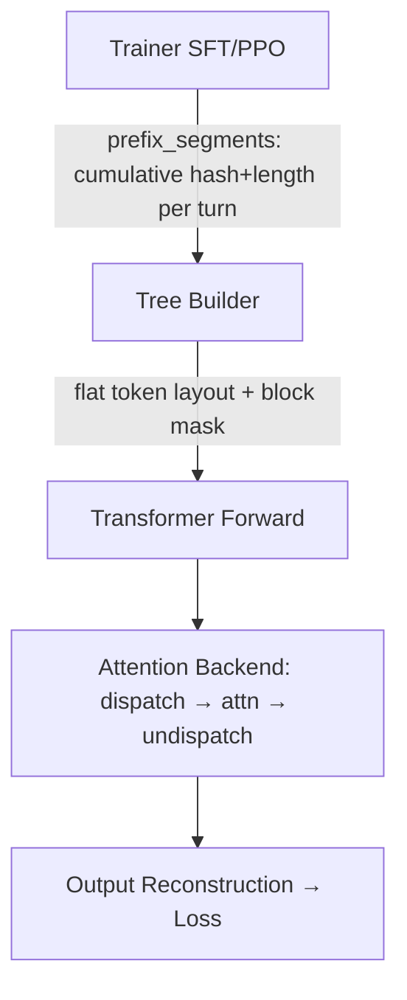
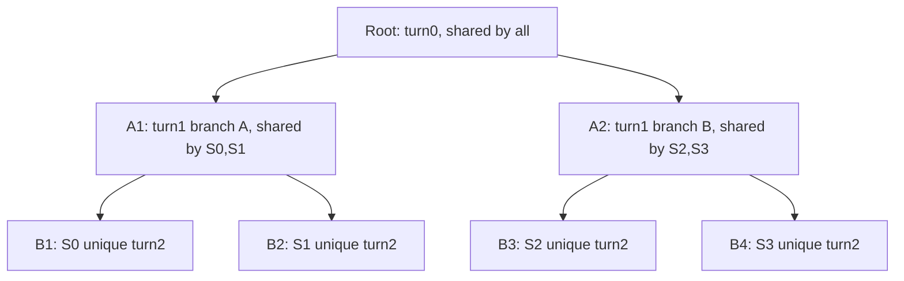

# [RFC] Prefix-Tree Shared Attention for Multi-Turn RL Training

**Status:** Draft for community feedback  
**Author:** @yumingxuan  
**Date:** 2026-05-12  


## 1. Summary

In GRPO and multi-trajectory RL training, each prompt (and each turn) is sampled `n` times — all responses share an identical prefix, yet standard training recomputes it independently for each sample. This RFC proposes packing all samples into a flat `[prefix | leaf_0 | ... | leaf_{n-1}]` layout and running a single forward pass with cross-leaf isolation enforced via [Magi Attention](https://github.com/SandAI-org/MagiAttention)'s workload-balanced CP dispatch — mathematically equivalent to independent per-sample forwards.

Inspired by [Forge](https://www.minimax.io/news/forge-scalable-agent-rl-framework-and-algorithm)'s *Prefix Tree Merging*, this implementation targets VERL's Megatron backend (FSDP planned) and generalizes to **arbitrary-depth multi-level trees**, enabling prefix sharing across multiple conversation turns — not just the top-level prompt.


## 2. Motivation

In GRPO and multi-trajectory RL training, each prompt (or each turn) is sampled `n` times, and all `n` responses share an identical prefix. Standard training computes attention over the full sequence for each sample independently — paying redundant O(P²) cost for the shared prefix on every forward pass. At high prefix ratios (e.g. long system prompts, multi-turn history), this dominates total compute.


## 3. Design

### Overview

The trainer computes `prefix_segments` per sample — a list of `(hash, cumulative_length)` pairs, one per conversation turn:

```python
prefix_segments = [
    (hash(sys),   len_sys),     # turn 0: system prompt only
    (hash(user1), len_u1),      # turn 0+1: sys + user1
    (hash(asst1), len_asst1),   # turn 0+1+2: sys + user1 + asst1
    ...
]
```

The tree builder compares hashes across samples in the micro-batch to identify which prefixes are shared, constructs a flat deduplicated token layout, and generates the corresponding block-sparse attention mask. The model forward runs once on the flat layout; outputs are reconstructed per sample before loss computation.



- **Trainer:** computes `prefix_segments` per sample — a list of cumulative `(hash, length)` pairs, one per conversation turn.
- **Tree Builder:** compares hashes across samples in the micro-batch, identifies shared prefixes, and constructs the flat deduplicated token layout and block-sparse attention mask.
- **Transformer Forward:** runs a single forward pass on the flat layout, which is shorter than `n` independent full sequences.
- **Attention Backend (Magi):** dispatches tokens to CP ranks by attention workload, computes sparse attention per rectangle, and undispatches outputs.
- **Output Reconstruction:** concatenates prefix and leaf output slices per sample before loss computation.

### Attention Implementation

Prefix detection is algorithm-dependent (GRPO, multi-turn SFT, agent RL each have different sharing patterns). The trainer is only required to provide the deduplicated token segments via a unified interface — the tree builder handles layout and mask generation. The algorithm is also responsible for grouping samples with similar prefixes into the same micro-batch.

**Multi-level** (e.g. multi-turn agent RL where responses diverge into sub-groups sharing a turn-2 prefix):



Flat layout: `[Root | A1 | B1 | B2 | A2 | B3 | B4]`

Mask (multi-level tree, 4 samples, 7 nodes — token counts from experiment):

Sample composition:

```
S0: Root + A1 + B1
S1: Root + A1 + B2
S2: Root + A2 + B3
S3: Root + A2 + B4
```

```
             | Root   A1    B1    B2    A2    B3    B4
Length       | 6406  3163  3196  3191  3199  3212  3202
Root         |  ##    ·     ·     ·     ·     ·     ·
A1 (S0,S1)   |  ##    ##    ·     ·     ·     ·     ·
B1 (S0)      |  ##    ##    ##    ·     ·     ·     ·
B2 (S1)      |  ##    ##    ·     ##    ·     ·     ·
A2 (S2,S3)   |  ##    ·     ·     ·     ##    ·     ·
B3 (S2)      |  ##    ·     ·     ·     ##    ##    ·
B4 (S3)      |  ##    ·     ·     ·     ##    ·     ##

## = causal self or full attend   · = masked
```


### Planned Framework Support

| | Megatron | FSDP |
|---|---|---|
| Multi-level tree | ✅ | planned |
| TP / PP / CP | ✅ | planned |


## 4. Limitations

- **Prefix sharing is within-microbatch only:** samples across different micro-batches cannot share prefix computation. Effective sharing requires the algorithm to group samples with identical prefixes into the same micro-batch.


## 5. Results

MiMo-7B-RL, 8×H20, TP=4. Preliminary results on a toy multi-turn SFT dataset (2-branch multi-level tree, seq~12.8k, 50% prefix sharing).

| Backend | mbs | Step time | Peak mem | loss@1 |
|---------|-----|-----------|----------|--------|
| FA3 | 2 | 6.7s | 77 GB | 0.0292 |
| FA3 | 4 | 6.6s | 122 GB | 0.0292 |
| **magi** | 4 | **3.97s** | **86 GB** | 0.0296 |

**42% faster than FA3 mbs=2, 30% less memory than FA3 mbs=4.** 

## 6. Plans

- Based on one of the existing Multi-trajectory implementation, write a rl demo 
- Write a cache based implementation, allowing cross-micro batch prefix sharing
    - cache eviction strategy on long sequence + large bs
    - In ideal case (all data cached), at tree with depth 16, we could have 2x extra speedup

## 7. References

- [Forge](https://www.minimax.io/news/forge-scalable-agent-rl-framework-and-algorithm)
- [#4368 PrefixGrouper](https://github.com/verl-project/verl/pull/4368) — FSDP/GRPO-only; decomposes into two attention passes (prefix-only, then suffix with cached prefix KV injected layer-wise), requiring model modification and storing extra KV tensors. This RFC could be later extended with caching to allow prefix sharing at mini-batch level, with forward order scheduled to minimize currently active cache.
- [#6122 group-sticky LB](https://github.com/verl-project/verl/pull/6122)

Multi-trajectory: [#6271](https://github.com/verl-project/verl/pull/6271) · [#5443](https://github.com/verl-project/verl/pull/5443) · [#1147](https://github.com/verl-project/verl/issues/1147) · [#5375](https://github.com/verl-project/verl/issues/5375) · [#5790](https://github.com/verl-project/verl/issues/5790)

Backends: [Magi Attention](https://github.com/SandAI-org/magi-attention) — uses a fine-grained chunk-level sharding strategy with a dispatch solver that balances computational workloads across CP ranks. This is critical for prefix-tree layouts where the attention pattern is highly sparse and uneven (prefix tokens attend to far more KV than leaf tokens); standard CP splits like Megatron's 2×CP interleaved would severely imbalance load.

