# 弹性 Rollout 与训练调度系统

## 1. 整体架构

### 1.1 资源划分模型

弹性调度系统将 GPU 集群划分为**两类**资源：

- **固定 Rollout 资源（Fixed Rollout）**：专用于推理生成，持续产生样本，由独立的 vLLM/SGLang 服务承载，始终保持活跃
- **弹性资源（Elastic）**：可在 Rollout 和 Train 两种角色之间动态切换，由 `ElasticActorWorker` 承载

> **没有"固定 Train 资源"**。所有训练算力均来自弹性资源。可通过 `min_train_resources` 参数保留至少 N 个弹性单元始终处于 Train 模式，以保证训练不中断。

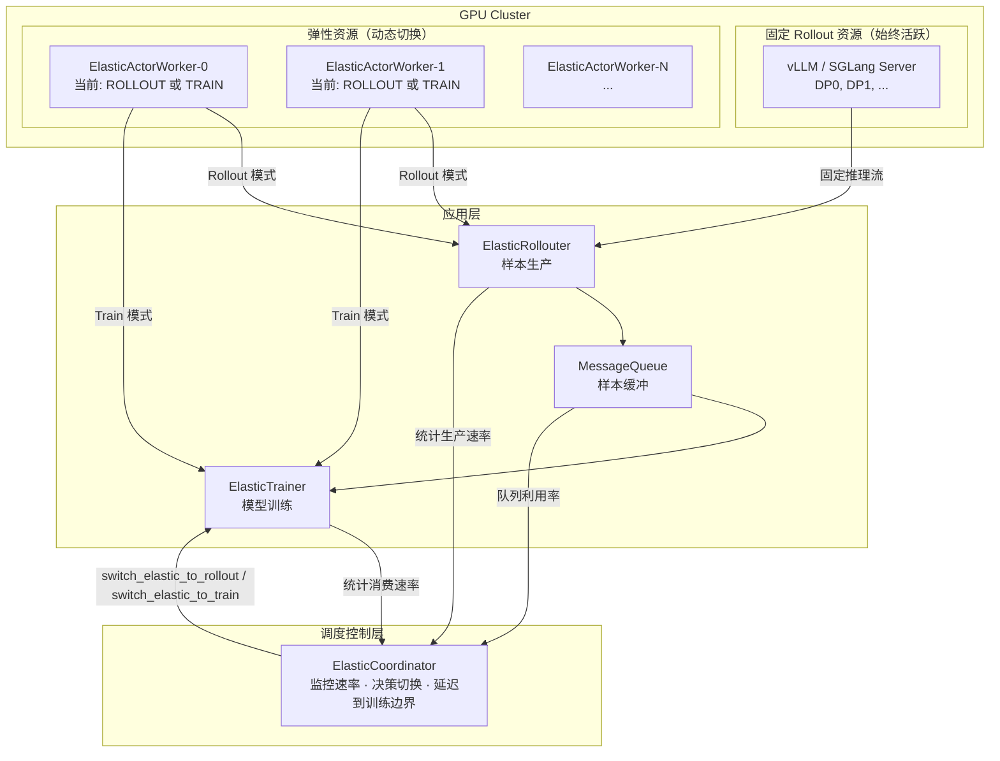

### 1.2 弹性资源双模式设计（核心）

每个 `ElasticActorWorker` 同时持有 **Actor Engine**（训练引擎）和 **Rollout Engine**（推理服务器），两者互斥地占用同一份 GPU 显存：

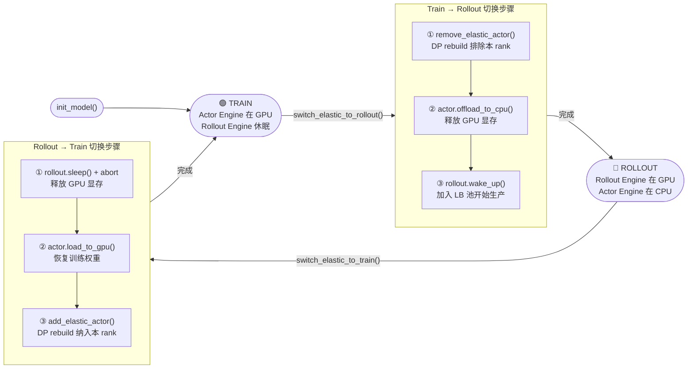

**GPU 显存安全保证**：
- **Train → Rollout**：Actor 权重先 offload 到 CPU，再 wake_up rollout server
- **Rollout → Train**：Rollout server 先 sleep 释放显存，再 load actor 权重到 GPU

### 1.3 调度时序

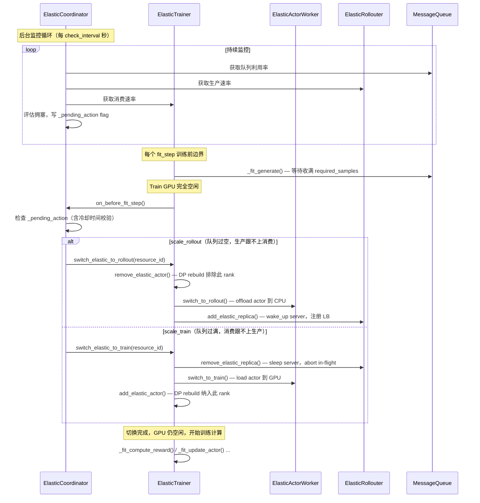
        
---
    
## 2. 核心组件
    
### 2.1 ElasticCoordinator
    
`ElasticCoordinator` 是系统的调度大脑，以 Ray Actor 形式运行。
    
**职责**：
1. 后台轮询 MQ 队列利用率、Rollouter 生产速率、Trainer 消费速率
2. 基于 EMA 平滑速率和水位阈值决策切换方向
3. 仅写 `_pending_action` flag，**不直接执行**切换
4. 在 `on_before_fit_step()` 被调用时（训练边界、Train GPU 空闲）才实际执行
    
**调度逻辑**：

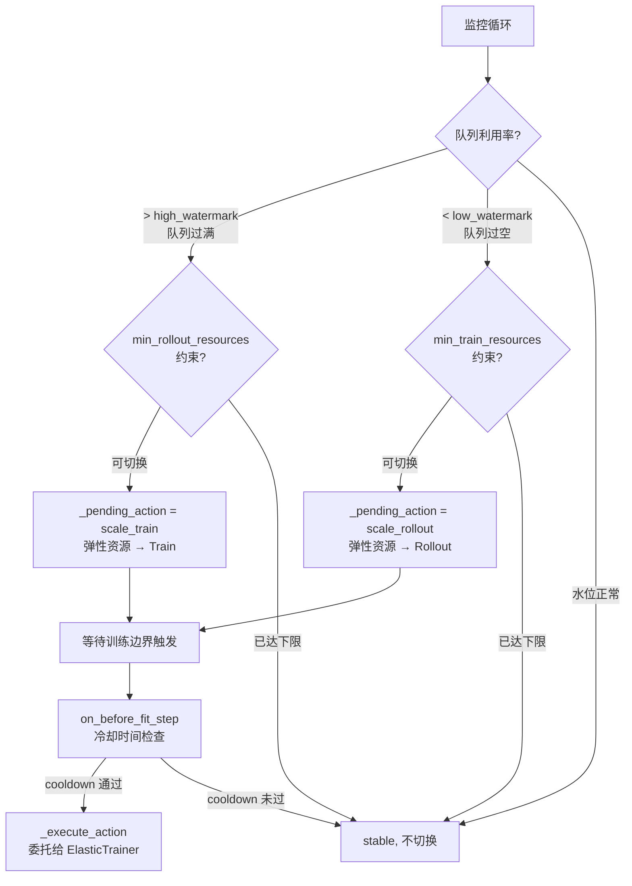

**关键参数**：

| 参数 | 默认值 | 说明 |
|------|--------|------|
| `high_watermark` | 0.8 | 队列超过此利用率 → 切换弹性资源为 Train |
| `low_watermark` | 0.3 | 队列低于此利用率 → 切换弹性资源为 Rollout |
| `cooldown_seconds` | 30.0 | 两次切换之间的最小间隔 |
| `min_rollout_resources` | 0 | 始终保持 Rollout 模式的最小弹性资源数 |
| `min_train_resources` | 0 | 始终保持 Train 模式的最小弹性资源数 |
| `ema_alpha` | 0.3 | 速率 EMA 平滑系数 |
| `confidence_threshold` | 0.6 | 执行切换所需的最低置信度 |

### 2.2 ElasticTrainer

`ElasticTrainer` 继承自 `FullyAsyncTrainer`，拥有完整角色切换序列的执行权。

**新增 API**：

| 方法 | 说明 |
|------|------|
| `switch_elastic_to_rollout(resource_id, param_version)` | 完整 Train→Rollout 序列 |
| `switch_elastic_to_train(resource_id, param_version)` | 完整 Rollout→Train 序列 |
| `add_elastic_actor(resource_id, world_ranks)` | 纳入新 Train rank，触发 DP rebuild |
| `remove_elastic_actor(resource_id)` | 排除 Train rank，触发 DP rebuild |
| `get_total_consumed_samples()` | 供 Coordinator 轮询消费速率 |

**DP Rebuild 触发时机**：切换发生在 `_fit_generate()` 收满数据后、GPU 计算启动前，此时 Train GPU **完全空闲**，重建成本为零。

### 2.3 ElasticActorWorker

`ElasticActorWorker` 继承自 `ActorRolloutRefWorker`，仅管理**训练引擎状态**。Rollout 服务器生命周期（wake_up / sleep / abort）完全由 `ElasticAgentLoopManager` 管理。

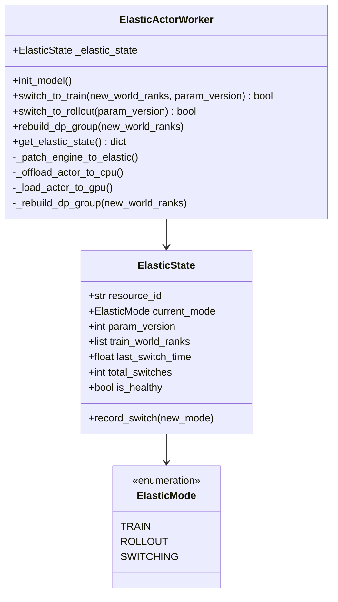

Engine 通过 `_patch_engine_to_elastic()` 动态注入弹性能力：在 `init_model()` 时将原始引擎的 `__class__` 替换为带 `ElasticMixin` 的子类（`ElasticMegatronMixin` 或 `ElasticFSDPMixin`），无需修改基础引擎代码。

### 2.4 ElasticRollouter

`ElasticRollouter` 继承自 `FullyAsyncRollouter`，通过替换 `ElasticAgentLoopManager` 获得弹性服务器管理能力。

**架构**：

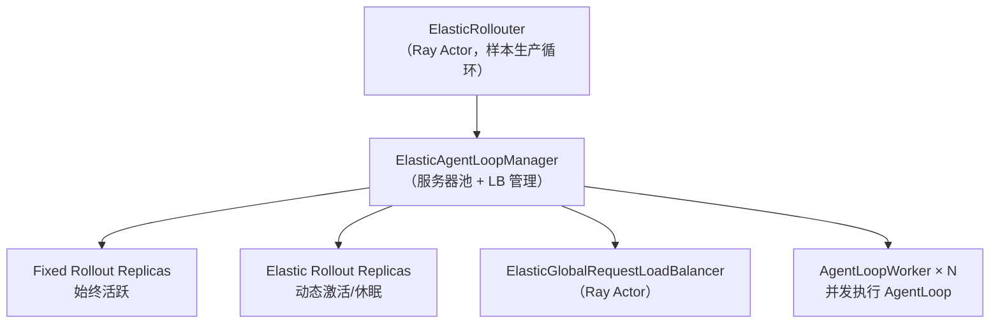

**弹性副本预注册机制**：
- 启动时，所有弹性 `RolloutReplica` 在 `ElasticAgentLoopManager.create()` 中通过 `init_hybrid()` 初始化，随后立即 `sleep()`
- 注册进 `_registered_elastic_replicas` 但不加入 LB 池
- `add_elastic_replica()` 时 `wake_up()` + 加入 LB；`remove_elastic_replica()` 时触发 abort + `sleep()`

**ElasticGlobalRequestLoadBalancer** 在基础 LB 之上增加了 `_removed_servers` 集合，支持标记删除语义（mark-for-removal），使新请求不再路由到即将被移除的 server，同时存量请求继续正常完成。

---

## 3. DP 组动态重建

### 3.1 Megatron DP 重建流程

Megatron DP 每个 rank 持有**完整模型参数**（非分片），DP 组仅影响梯度 all-reduce。
        
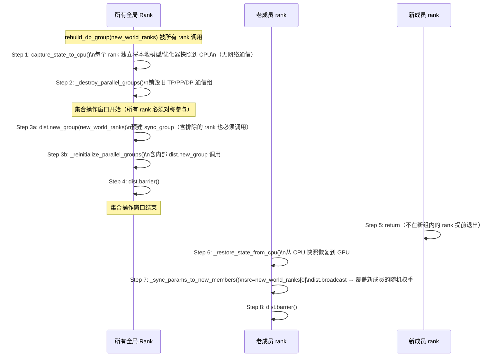

**Collective Barrier 对称性**（关键约束）：

`dist.new_group()` 和 `mpu.initialize_model_parallel()` 内部均包含集合操作，**所有全局 rank 必须参与相同数量的 `dist.new_group` 调用**，否则 NCCL 死锁。因此 Step 3 被提前到 `is_in_new_group` 判断之前执行，被排除的 rank 也会执行这两个集合操作后才 return。

### 3.2 FSDP2 DP 重建流程

FSDP2 参数以 `DTensor` 分片存储，重建时需先 `unshard` 再 offload。

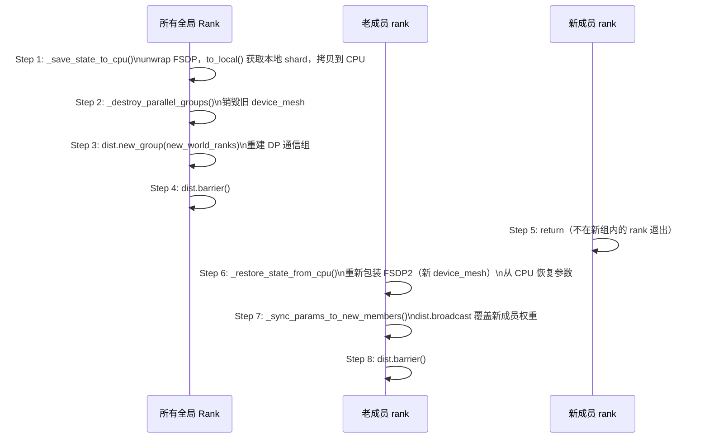

### 3.3 DP 扩缩容时参数分布（以 Megatron DP=2→4 为例）

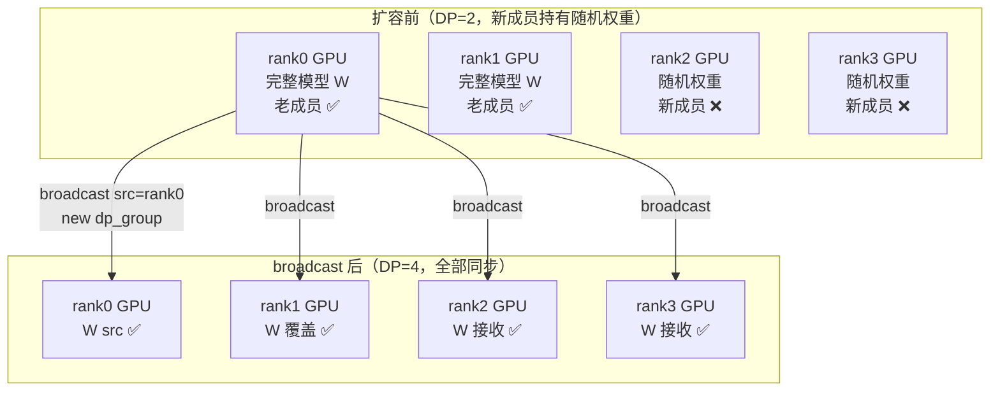

| 阶段 | 说明 |
|------|------|
| CPU offload | 每个 rank 独立操作本地内存，**零网络通信** |
| 新成员 CPU 快照 | 仅用于恢复 tensor shape/dtype，实际值会被 broadcast 覆盖 |
| broadcast src | `new_world_ranks[0]`（全局 rank 0），在新建的 `sync_group` 内广播 |
| 缩容（DP=4→2） | 无新成员，无 broadcast，每个 rank 从自己 CPU 快照恢复，参数不变 |

---

## 4. AgentLoop 中 Server 删除的并发安全分析

### 4.1 Server 删除执行顺序

`remove_elastic_replica()` 严格按如下顺序执行：

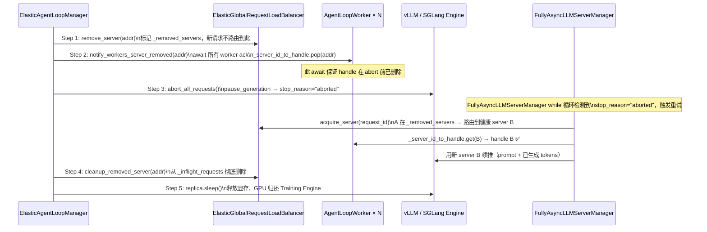

### 4.2 并发安全性分析

`generate()` 执行期间并发触发 `remove_server` 的各类 race 分析：

| 场景 | 是否安全 | 原因 |
|------|---------|------|
| `generate()` 已持有 server handle，同时 `_server_id_to_handle` 删除该 key | ✅ 安全 | `server` 是已取出的 Python 引用，dict 删除 key 不影响引用有效性 |
| `abort` 返回 `"aborted"`，重试时 `_server_id_to_handle[A]` 已被删除 | ✅ 安全 | Step 2 用 `await asyncio.gather` 阻塞到所有 worker ack，**保证 handle 先删再 abort** |
| sticky session 重试时 LB 仍返回被删 server A | ✅ 安全 | `acquire_server` 检查 `_removed_servers`，A 已在其中，重新路由到 B |
| `_release_server(A)` (fire-and-forget) 与 `cleanup_removed_server(A)` 并发 | ✅ 安全 | `ElasticGlobalRequestLoadBalancer.release_server` 对不存在的 key 静默返回，不抛异常 |
| 并发调用 `remove_elastic_replica` 两次（同时修改 `server_addresses` list） | ⚠️ 理论不安全 | Python list `pop` 非原子；但 `ElasticCoordinator` 通过 `_switch_lock` 保证串行调度，实践中不会并发 |

### 4.3 `partial_rollout` 重试机制

`FullyAsyncLLMServerManager.generate()` 对 AgentLoop 透明地完成断点续推：

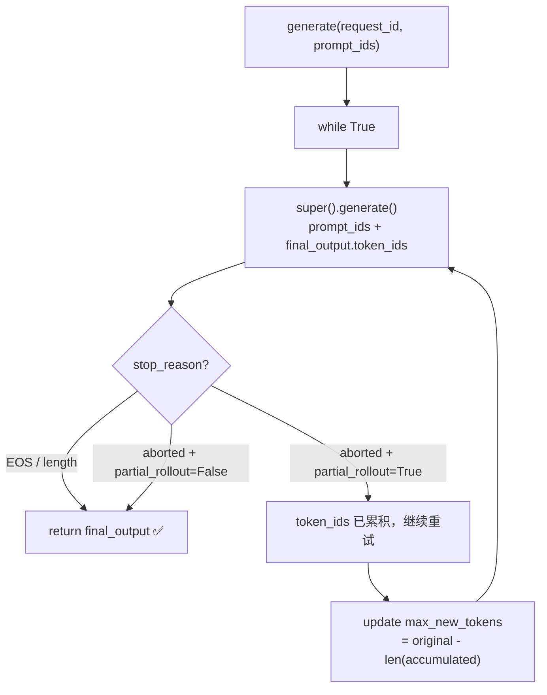

**关键细节**：重试时拼接 `prompt_ids + final_output.token_ids`，新 server 从断点位置续推，上层 AgentLoop 感知不到中断。

---

## 5. 文件结构

```
verl/experimental/elastic_scheduling/
├── README.md                          # 本文档
├── main.py                            # ElasticSchedulingTaskRunner（主入口）
├── coordinator.py                     # ElasticCoordinator（Ray Actor，调度决策）
├── elastic_trainer.py                 # ElasticTrainer（完整切换序列执行）
├── elastic_rollouter.py               # ElasticRollouter（样本生产，弹性副本管理）
├── elastic_engine_workers.py          # ElasticActorWorker（训练引擎弹性切换）
├── elastic_checkpoint_engine.py       # ElasticCheckpointEngine（参数同步扩展）
├── agent_loop/
│   ├── __init__.py
│   └── elastic_agent_loop.py          # ElasticAgentLoopManager
│                                      # ElasticGlobalRequestLoadBalancer
│                                      # ElasticAgentLoopWorker
├── engine/
│   ├── __init__.py                    # get_elastic_engine_cls() 工厂函数
│   ├── fsdp/
│   │   └── elastic_transformer_impl.py  # ElasticFSDPMixin
│   │                                    # ElasticFSDPEngineWithLMHead
│   └── megatron/
│       └── elastic_transformer_impl.py  # ElasticMegatronMixin
│                                        # ElasticMegatronEngineWithLMHead
├── config/
│   ├── elastic_ppo_trainer.yaml          # 多节点配置
│   └── elastic_ppo_trainer_single_node.yaml  # 单节点开发配置
└── test/
    ├── test_fsdp_dp_rebuild_real_model.py    # FSDP2 DP 重建全量测试
    ├── test_megatron_dp_rebuild_real_model.py # Megatron DP 重建全量测试（R1–R7）
    ├── test_elastic_scheduling.py
    └── test_elastic_scheduling_ray.py
```

---

## 6. 配置说明

### 6.1 资源配置语义

弹性调度涉及两组资源参数，与标准训练语义保持一致：

| 参数组 | 含义 | 说明 |
|--------|------|------|
| `rollout.nnodes` / `rollout.n_gpus_per_node` | 固定 Rollout 资源池 | 始终活跃，专用于推理生成，与标准训练 `rollout.*` 同义 |
| `trainer.nnodes` / `trainer.n_gpus_per_node` | 弹性资源总量 | `nnodes × n_gpus_per_node` = 弹性 GPU 总数，与标准训练 `trainer.*` 同义 |

**单一大 RayWorkerGroup 设计**：

所有弹性 GPU 构成**唯一一个** `RayWorkerGroup`，`process_on_nodes = [n_gpus_per_node] * nnodes`，world_size = `nnodes × n_gpus_per_node`。
这使所有弹性 workers 共享同一个 `dist.init_process_group` world，Megatron/FSDP 在其中自动划分 TP / PP / DP 组，所有 DP replica **同时训练并做梯度 all-reduce**。

**关键推导关系**：

```
world_size      = trainer.nnodes × trainer.n_gpus_per_node
gpus_per_group  = TP × PP × CP   （由 actor.megatron 并行配置决定）
n_elastic       = world_size / gpus_per_group   （可弹性切换的最小单元数）
DP_size         = n_elastic        （初始全部参与训练时的 DP 并行度）
```

弹性切换以 **1 个 elastic unit（= TP×PP×CP 个 ranks）** 为最小粒度，通过 `rebuild_dp_group(new_world_ranks)` 动态调整参与 DP 的 ranks 子集。

**示例**（单节点 8 GPU，2 固定 Rollout + 6 弹性，TP=2）：

```yaml
rollout:
  nnodes: 1
  n_gpus_per_node: 2          # 2 GPU 固定 rollout

trainer:
  nnodes: 1
  n_gpus_per_node: 6          # 6 GPU 弹性资源（1 个大 wg，world_size=6）

actor_rollout_ref:
  actor:
    megatron:
      tensor_model_parallel_size: 2   # TP=2
      pipeline_model_parallel_size: 1 # PP=1
      context_parallel_size: 1        # CP=1
```

→ `gpus_per_group = 2×1×1 = 2`，`n_elastic = 6/2 = 3` 个可切换单元，初始 `DP = 3`（全部参与训练，梯度 all-reduce 跨 3 个 replica）

切换 1 个单元到 Rollout 后：`rebuild_dp_group([0,1,2,3])` → `DP = 2`，剩余 4 个 ranks 继续做梯度同步训练。

### 6.2 与 Fully Async 的资源池设计区别

两种模式均使用**单一 RayWorkerGroup**，但资源规模和 DP 管理方式不同：

| 维度 | Fully Async | 弹性调度（Elastic） |
|------|-------------|-------------------|
| **RayWorkerGroup 数** | 1（固定 rollout + actor 共用，或分离） | 1（所有弹性 GPU 统一） |
| **world_size** | `rollout.nnodes × rollout.n_gpus_per_node` | `trainer.nnodes × trainer.n_gpus_per_node` |
| **DP 变化** | 固定，不变 | 动态，随弹性切换增减 |
| **DP 调整方式** | — | `rebuild_dp_group(new_world_ranks)` |
| **角色切换粒度** | 无（replica 永远在线） | TP×PP×CP 个 ranks 为一个弹性单元 |

**为什么弹性调度也是单一大 wg（而非多个独立 wg）？**

不同 `RayWorkerGroup` 的 workers 各自调用 `dist.init_process_group`，属于**不同的 PyTorch distributed world**。`dist.new_group()` 是全局 collective，要求所有参与进程在**同一个 world** 里同时执行——跨 wg 调用会 hang 或报错。

弹性切换时，被切出的 ranks 通过 `rebuild_dp_group(new_world_ranks)` 退出当前 DP 组（仍参与 collective，但不再做梯度同步），留在 world 里等待后续切回。

```
total=12 GPU，TP=2，PP=1，CP=1
→ 1 个 RayWorkerGroup，world_size=12，ranks=[0..11]
→ 初始 DP=6，每个 elastic unit = ranks[0,1], [2,3], [4,5], [6,7], [8,9], [10,11]

switch_elastic_to_rollout("elastic_0")：
  → rebuild_dp_group([2,3,4,5,6,7,8,9,10,11])
  → ranks[0,1] 退出 DP 组，offload actor 权重，rollout server 唤醒
  → 剩余 ranks[2..11] DP=5，梯度 all-reduce 在 5 个 unit 之间继续

switch_elastic_to_train("elastic_0")：
  → rollout server sleep，actor 权重 load 回 GPU
  → rebuild_dp_group([0,1,2,3,...,11])，DP 恢复 6
```

### 6.3 调度参数

```yaml
elastic_scheduling:
  # 调度水位（基于 MessageQueue 利用率）
  high_watermark: 0.8         # 超过此值 → 弹性资源切换为 Train（减少 Rollout）
  low_watermark: 0.3          # 低于此值 → 弹性资源切换为 Rollout（增加生产）

  # 资源保护下限
  min_rollout_resources: 0    # 至少保留 N 个弹性 Rollout（防止队列彻底断供）
  min_train_resources: 0      # 至少保留 N 个弹性 Train（防止训练停止）

  # 切换节奏控制
  cooldown_seconds: 30.0      # 两次切换之间的最小冷却时间（防止抖动）
  check_interval: 2.0         # 监控循环轮询间隔（秒）
  confidence_threshold: 0.6   # 执行切换所需的最低置信度

  # 速率估计
  ema_alpha: 0.3              # EMA 平滑系数（越小越平滑，反应越慢）
```

---

## 7. 关键设计决策

### 7.1 为什么选择训练前边界触发切换

- **Train GPU 完全空闲**：`_fit_generate()` 期间 Train Workers 仅等待队列数据，GPU 零占用，切换成本为零
- **监控与执行解耦**：后台监控循环只写 `_pending_action` flag，实际切换在安全窗口由 `on_before_fit_step()` 触发，避免异步竞争
- **自然对齐**：`_fit_generate()` 等待越久 = 生产越不足，与 `scale_rollout` 决策方向天然一致

### 7.2 FSDP2 与 Megatron 重建策略对比

| 特性 | FSDP2 | Megatron |
|------|-------|----------|
| 参数存储 | DTensor 分片（各 rank 持有部分） | 完整副本（各 rank 持有全量） |
| CPU offload | 需 `to_local()` 提取本地 shard | 直接 `param.data.cpu()` |
| Barrier 对称性要求 | 同 | 同（`dist.new_group` 必须全局对称） |
| 重建后 broadcast | 有（新成员接收老成员参数） | 有（新成员接收 rank0 参数） |


### 7.3 Rollout 弹性与非弹性 replica 分配

**问题**：`AgentLoopManager` 全局唯一，其内部所有 `RolloutReplica` 共享同一个 `ElasticGlobalRequestLoadBalancer`。
Replica 的 Ray 命名 actor 格式为 `sglang_server_{replica_rank}_{node_rank}`，若弹性与非弹性 replica 的
`replica_rank` 均从 0 开始，则必然产生 `ActorAlreadyExistsError`。

**资源亲和性要求**：在多机多卡场景中，弹性资源（与训练引擎共享 GPU 的 hybrid replica）应当优先占用
Placement Group 的低编号 bundle，这些 bundle 与训练引擎所在节点物理相邻，NCCL 通信延迟更低。
独占 rollout 资源（standalone replica）使用剩余 bundle，亲和性要求较低。

**解决方案**：`ElasticAgentLoopManager.create()` 采用三步初始化顺序，确保全局 `replica_rank` 唯一：

```
Step 1  弹性 hybrid replica (rank 0 … N_e-1)
        └── init_hybrid(elastic_worker_group) → 立即 sleep()
            (占用最低编号 bundle，最大化 GPU 亲和性)

Step 2  固定 standalone replica (rank N_e … N_e+N_f-1)
        └── init_standalone()  start_rank=N_e，actor 名不与弹性重叠

Step 3  构建 ElasticGlobalRequestLoadBalancer（只含固定 replica 的地址）
        弹性 replica 以 sleeping 状态注册到 _registered_elastic_replicas，
        通过 add_elastic_replica() 按需激活后再加入 LB
```

关键代码路径：
- `_initialize_elastic_replicas(start_rank=0)` → 返回 `num_elastic`
- `_initialize_llm_servers(start_rank=num_elastic)` → 固定 replica rank 从 `num_elastic` 开始
- `replica_rank` 直接决定 Ray named actor 名称，全局唯一即可避免命名冲突

### 7.4 弹性资源的参数同步

#### 7.4.1 Replica 分类

弹性调度下存在两类 Rollout Replica：

| 类型 | 描述 | GPU 归属 |
|------|------|----------|
| **Standalone Replica** | 专用 rollout 节点，GPU 始终由 rollout server 持有 | 固定分配给 rollout |
| **Hybrid Replica** | 弹性节点，GPU 在训练引擎与 rollout server 之间动态切换 | 随弹性状态切换 |

Hybrid Replica 在任意时刻有两种状态：
- **唤醒状态（ROLLOUT 模式）**：rollout server 占用 GPU，actor 权重已 offload 到 CPU。
- **休眠状态（TRAIN 模式）**：actor 权重在 GPU 上，rollout server 处于 sleep 状态（kv-cache 和权重均已释放）。

#### 7.4.2 参数同步策略

`ElasticCheckpointManager` 通过两个副本集合划分同步路径：

| 副本集合 | 内容 | 同步路径 |
|----------|------|----------|
| `self.replicas`（基类） | Standalone + **唤醒状态的 Hybrid** | NCCL（基类 `update_weights` 统一处理）|
| `_sleep_hybrid_replicas` | **休眠状态的 Hybrid** | naive 进程内同步 |

**NCCL 路径**（Standalone + 唤醒 Hybrid，由基类 `CheckpointEngineManager.update_weights()` 统一处理）：
```
abort_all_requests → release_kv_cache → build NCCL group → trainer/rollout update_weights → finalize → resume_kv_cache → resume_generation
```
HYBRID 模式下 `sleep` 会同时释放 kv_cache **和** weights，若复用 `sleep` 则 rollout engine 的权重缓冲区被销毁，NCCL 无法写入。因此改用 `release_kv_cache` / `resume_kv_cache` 专用接口——**只操作 kv_cache，model weights 始终保留在 GPU**，NCCL 直接将新权重写入已有缓冲区。

**naive 路径**（休眠状态的 Hybrid，进程内直接同步）：
```
actor_worker_wg.update_weights()  ← 在 ElasticActorWorker 进程内直接将 actor 参数写入 rollout 内存
```
rollout server 与 training engine 在**同一批进程**内运行（`ElasticActorWorker`），actor 权重可通过进程内函数调用直接同步给 rollout engine，等价于 `checkpoint_engine.backend="naive"` 语义。此路径无需建立 NCCL 通信组，rollout server 保持休眠。

**副本状态转换与 `self.replicas` 维护**：
```
add_hybrid_replicas()    → 初始放入 _sleep_hybrid_replicas（不进入 self.replicas）
mark_hybrid_awake()      → _sleep_hybrid_replicas → self.replicas（调用 super().add_replicas()）
mark_hybrid_sleeping()   → self.replicas → _sleep_hybrid_replicas（调用 super().remove_replicas()）
remove_hybrid_replicas() → 从当前所在集合移除（若 AWAKE 则同步调用 super().remove_replicas()）
```

> **新增接口**：`release_kv_cache` / `resume_kv_cache` 已在 `RolloutReplica` 基类及
> sglang / vllm / trtllm 三个实现中添加，语义为"只操作 kv_cache 显存，不触碰 model weights"。

#### 7.4.3 弹性切换后无需单独同步

**Train → Rollout 切换**（`switch_elastic_to_rollout`）：
1. actor 权重 offload 到 CPU
2. **此前 `update_weights`（naive 路径）已将最新参数写入 rollout engine 的权重缓冲区**
3. `wake_up()` 直接唤醒 rollout server，rollout engine 持有的权重即为最新版本

因此，弹性切换的 wake_up 流程中**无需额外参数同步**。每次 `update_weights`（周期性触发）均覆盖了所有 hybrid replica——休眠时走 naive 路径（进程内写入 rollout weights 缓冲区），唤醒时走 NCCL 路径——因此无论 replica 处于哪种状态，rollout engine 持有的权重始终是最新版本。

#### 7.4.4 cuda_graph 初始化

`ElasticActorWorker` 在 `init_model()` 阶段一次性完成 rollout engine 的 cuda_graph capture（如果 rollout 引擎支持）。弹性切换（sleep / wake_up）**不触发 cuda_graph 的重建**，wake_up 后直接复用已有的 cuda_graph，避免切换时的额外 warm-up 开销。

#### 7.4.5 时序保障

```
训练循环 fit_step:
  Phase 1: _fit_generate()         ← 从队列拉取样本（rollout 并行生成中）
  Phase 2: _fit_training_step()    ← 训练更新
    Phase 3: _fit_update_weights()   ← 参数同步（每 trigger_parameter_sync_step 步触发一次）
                ├─ self.replicas（standalone + 唤醒的 hybrid） → NCCL sync（abort → release_kv_cache → sync → resume_kv_cache → resume）
                └─ _sleep_hybrid_replicas（休眠的 hybrid）     → naive sync（actor_wg.update_weights()，进程内直接写入）
  Phase 4: _apply_pending_dp_changes()  ← 处理弹性切换（wake_up / sleep）
```

弹性切换发生在 Phase 4，而参数同步发生在 Phase 3，保证切换前已完成最新参数的下发。


### 7.5 弹性资源对于样本数量的动态获取

**问题**：训练引擎的 `required_samples`（每步从队列拉取的最小样本数）在初始化时由
`ppo_mini_batch_size × require_batches` 固定计算。当弹性切换改变 DP 大小后，每个 DP rank
处理的 micro-batch 数不变，但 **全局 batch size = micro_batch × DP_size** 发生变化。
若 `required_samples` 不同步更新，则可能：
1. 拉取到的样本数无法被新的 DP 整除，导致数据截断或 shape 不一致
2. DP 扩大后每步实际消费量不足，训练效率下降

**解决方案**：`ElasticTrainer` 覆盖 `_fit_generate()` 前的逻辑，在 `_apply_pending_dp_changes()`
完成 DP rebuild 后，调用 `_update_required_samples()` 重新计算：

```
required_samples = ppo_mini_batch_size × require_batches × current_dp_size
```

其中 `current_dp_size` = 固定 actor_wg 大小（若存在）＋ 所有处于 TRAIN 状态的弹性 actor_wg 大小之和。
`required_samples` 必须为 `ppo_mini_batch_size` 的整数倍（DP 可整除性由此保证）。

时序保证：`_update_required_samples()` 在 `_apply_pending_dp_changes()` 的末尾调用，
而 `_apply_pending_dp_changes()` 发生在 `fit_step` 的 Phase 3（GPU 空闲窗口），
下一次 `_fit_generate()` 进入队列拉取时已使用更新后的值。


### 7.6 指标记录

弹性调度相关指标在每个 `fit_step` 结束时通过 `_fit_postprocess_step()` 写入 `self.metrics`，
随正常训练 metrics 一起上报到日志系统。

| 指标键 | 含义 | 来源 |
|--------|------|------|
| `elastic/total_switch_to_rollout` | 累计 Train→Rollout 切换次数 | `ElasticTrainer._total_elastic_removes` |
| `elastic/total_switch_to_train` | 累计 Rollout→Train 切换次数 | `ElasticTrainer._total_elastic_adds` |
| `elastic/last_switch_latency_s` | 最近一次切换耗时（秒） | `ElasticTrainer._last_switch_latency` |
| `elastic/num_rollout_replicas` | 当前活跃 rollout replica 数（固定 + 弹性） | `ElasticAgentLoopManager` 统计 |
| `elastic/num_train_actors` | 当前参与训练的 actor 数（固定 + 弹性） | `ElasticTrainer.get_num_active_train_actors()` |
| `elastic/current_dp_size` | 当前训练 DP 并行度 | 固定 wg + 弹性 TRAIN wg 之和 |
| `elastic/required_samples` | 本步目标样本数（随 DP 动态更新） | `ElasticTrainer.required_samples` |

指标写入时机：`_fit_postprocess_step()` → `self.metrics.update(...)` → `metrics_aggregator.add_step_metrics()`

### 7.7 样本 Staleness 处理

弹性切换可能导致 Rollout 参数版本落后：
- 每个样本携带生成时的 `param_version`
- Trainer 计算 `stale_delta = current_version - sample_version`
- `stale_delta > staleness_threshold` 时丢弃该样本（与 `FullyAsyncTrainer` 保持一致）

---

## Q&A

### Q: DP 2→4 时，rank2/3 的 CPU 快照里是随机权重，`restore_from_cpu()` 之后它们的 GPU 参数正确吗？

**A**：不正确——`restore_from_cpu()` 只是把 CPU 快照（随机值）搬回 GPU。之后 Step 7 的 `_sync_params_to_new_members()` 用 `dist.broadcast(src=rank0)` 覆盖 rank2/3 的权重，使它们与 rank0 一致。rank2/3 的 CPU 快照仅用于重建 tensor 的 shape/dtype 结构，实际数值无关紧要。

### Q: 为什么不直接从 rank0 通过网络发给 rank2/3，跳过 CPU offload？

**A**：Megatron 的并行组（DP/TP/PP）是进程级全局单例，**必须先销毁旧组再重建新组**。销毁期间 NCCL 通信不可用，因此只能先把参数存到本地 CPU，等新组建立后再广播。

### Q: `remove_elastic_replica` 执行期间，正在 `generate()` 的请求会丢失吗？
 
**A**：不会。依赖三层保障：
1. LB 的 `_removed_servers` 标记使新请求不路由到被删 server
2. `notify_workers_server_removed()` 的 `await` 保证 handle 在 `abort` 前已从所有 worker 删除
3. `FullyAsyncLLMServerManager` 检测到 `stop_reason="aborted"` 后，自动将 `prompt + 已生成 tokens` 拼接发给新 server 续推，AgentLoop 无感知

```shell
# 执行
ray list jobs --address='http://10.148.11.18:8420' --format json 2>/dev/null | python3 -c "import sys,json; [print(j['job_id']) for j in json.load(sys.stdin) if
j.get('status') in ('RUNNING','PENDING')]" | xargs -I{} ray job stop {} --address='http://10.148.11.18:8420'

# 再执行
ray job submit --address='http://10.148.11.18:8420' --runtime-env=verl/experimental/elastic_scheduling/shell/dapo_7b_math_megatron_2_6.yaml -- bash verl/experimental/elastic_scheduling/shell/dapo_7b_math_megatron_2_6.sh
```
