# 弹性 Rollout 与训练调度系统

## 1. 整体架构

### 1.1 资源划分模型

弹性调度系统将 GPU 集群划分为**两类**资源：

- **固定 Rollout 资源（Standalone Replica）**：专用推理节点，GPU 始终由 vLLM/SGLang 服务持有，持续产生训练样本
- **弹性资源（Elastic Unit）**：可在 Rollout 和 Train 两种角色之间动态切换，由 `ElasticActorWorker` 承载

> **没有"固定 Train 资源"**。所有训练算力均来自弹性资源。可通过 `min_train_resources` 参数保留至少 N 个弹性单元始终处于 Train 模式，以保证训练不中断。

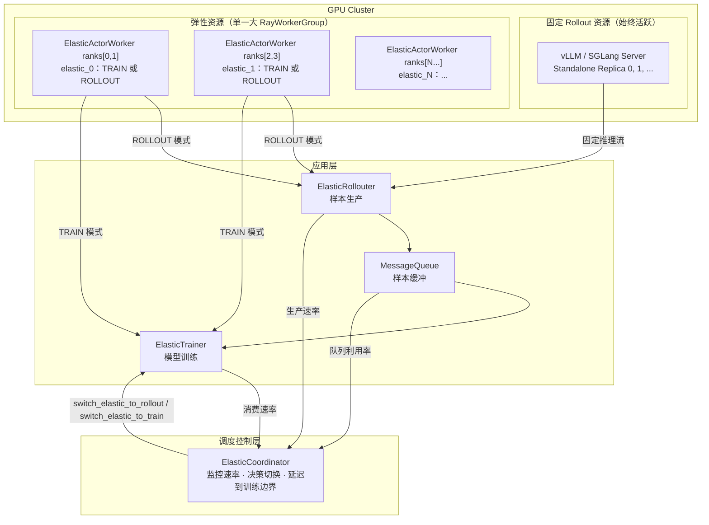

### 1.2 弹性资源双模式设计

每个弹性单元（`ElasticActorWorker` 一组 ranks）同时持有 **Actor Engine**（训练引擎）和 **Rollout Engine**（推理服务器），两者互斥地使用同一份 GPU 显存：

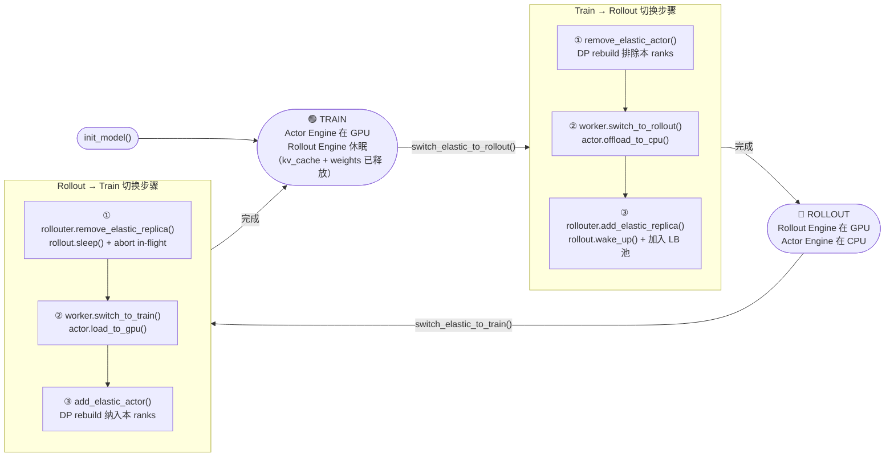

**GPU 显存安全保证**：
- **Train → Rollout**：Actor 权重先 offload 到 CPU，再 wake_up rollout server
- **Rollout → Train**：Rollout server 先 sleep 释放显存（weights + kv_cache），再 load actor 权重到 GPU

### 1.3 fit_step 时序

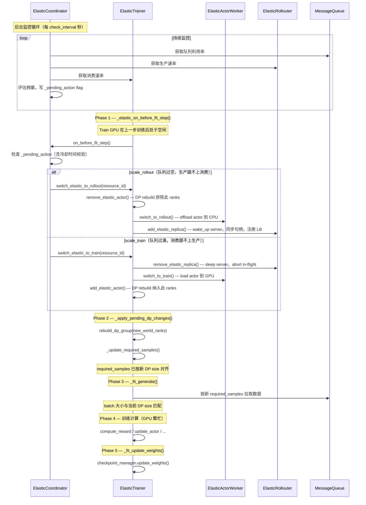
        
> **为什么切换必须在拉数据之前**：弹性切换改变 DP size，进而改变 `required_samples` 和 `mini_batch_size`。若先拉数据（按旧 DP size），再切换，当次训练的 batch 大小与新 DP size 不匹配，触发 `train_mini_batch` 的 `assert mini_batch_size % dp_size == 0`。将切换提前到 `_fit_generate()` 之前，保证每次拉到的 batch 天然满足当前 DP 的整除约束。

---
    
## 2. 核心组件
    
### 2.1 ElasticCoordinator
    
`ElasticCoordinator` 是系统的调度大脑，以 Ray Actor 形式运行。
    
**职责**：
1. 后台轮询 MQ 队列利用率、Rollouter 生产速率、Trainer 消费速率
2. 基于 EMA 平滑速率和水位阈值决策切换方向
3. 仅写 `_pending_action` flag，**不直接执行**切换
4. 在 `on_before_fit_step()` 被调用时（训练边界、Train GPU 空闲）才实际执行
    
**调度逻辑**：

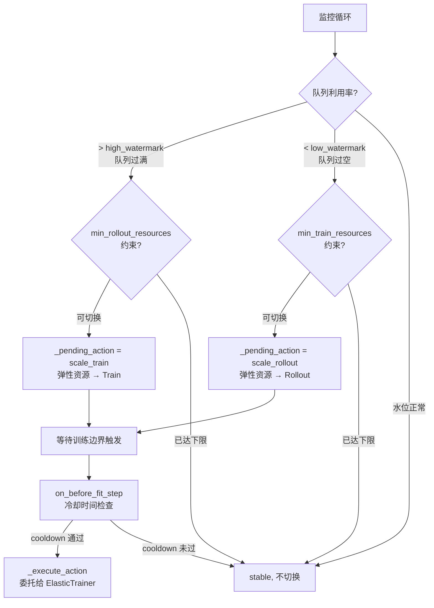

**关键参数**：

| 参数 | 默认值 | 说明 |
|------|--------|------|
| `high_watermark` | 0.8 | 队列超过此利用率 → 切换弹性资源为 Train |
| `low_watermark` | 0.3 | 队列低于此利用率 → 切换弹性资源为 Rollout |
| `cooldown_seconds` | 30.0 | 两次切换之间的最小间隔 |
| `min_rollout_resources` | 0 | 始终保持 Rollout 模式的最小弹性资源数 |
| `min_train_resources` | 0 | 始终保持 Train 模式的最小弹性资源数 |
| `ema_alpha` | 0.3 | 速率 EMA 平滑系数 |
| `confidence_threshold` | 0.6 | 执行切换所需的最低置信度 |

### 2.2 ElasticTrainer

`ElasticTrainer` 继承自 `FullyAsyncTrainer`，拥有完整角色切换序列的执行权。

**新增 API**：

| 方法 | 说明 |
|------|------|
| `switch_elastic_to_rollout(resource_id, param_version)` | 完整 Train→Rollout 序列 |
| `switch_elastic_to_train(resource_id, param_version)` | 完整 Rollout→Train 序列 |
| `add_elastic_actor(resource_id, param_version)` | 标记单元为 ACTIVE，触发 DP rebuild |
| `remove_elastic_actor(resource_id)` | 标记单元为 INACTIVE，触发 DP rebuild |
| `register_elastic_worker_group(resource_id, wg)` | 注册统一弹性 RayWorkerGroup |
| `register_elastic_unit_ranks(unit_ranks)` | 注册 resource_id → ranks 映射 |
| `get_total_consumed_samples()` | 供 Coordinator 轮询消费速率 |

**DP Rebuild 触发时机**：切换请求通过 `_pending_elastic_adds / _pending_elastic_removes` 缓冲，在下一个 `_apply_pending_dp_changes()`（Phase 3，GPU 完全空闲）执行，重建成本为零。

### 2.3 ElasticActorWorker

`ElasticActorWorker` 继承自 `ActorRolloutRefWorker`，**仅管理训练引擎状态**。Rollout 服务器的生命周期（wake_up / sleep / abort）完全由 `ElasticAgentLoopManager` 管理，两者职责严格分离。

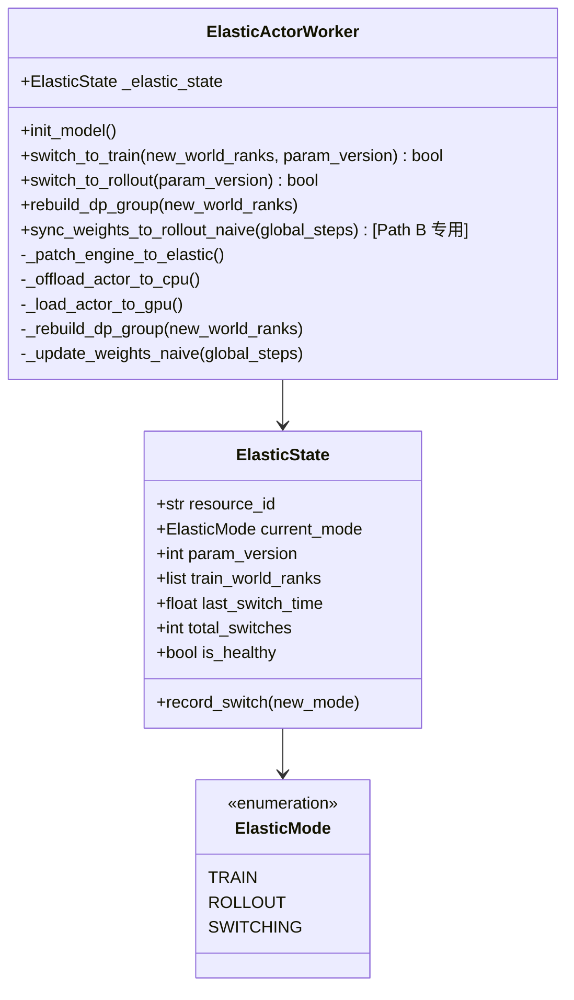

Engine 通过 `_patch_engine_to_elastic()` 动态注入弹性能力：在 `init_model()` 时将原始引擎的 `__class__` 替换为带 `ElasticMixin` 的子类（`ElasticMegatronMixin` 或 `ElasticFSDPMixin`），无需修改基础引擎代码。

### 2.4 ElasticRollouter

`ElasticRollouter` 继承自 `FullyAsyncRollouter`，通过替换 `ElasticAgentLoopManager` 获得弹性服务器管理能力。

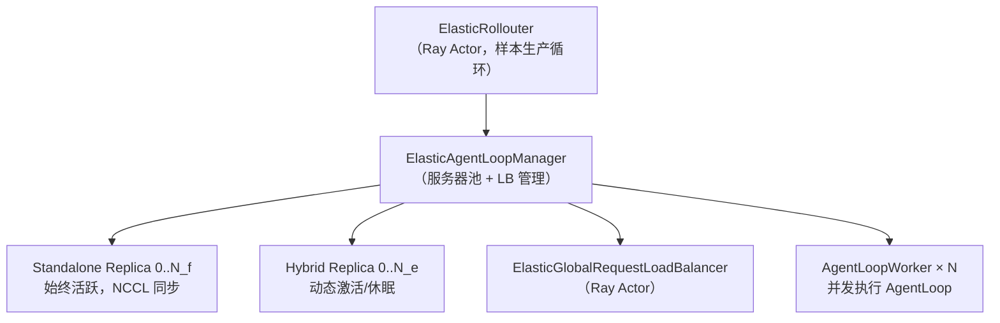

**弹性副本预注册机制**：
- 启动时，所有弹性 `RolloutReplica` 通过 `init_hybrid()` 初始化后立即 `sleep()`
- 注册进 `_registered_elastic_replicas` 但不加入 LB 池
- `add_elastic_replica()` 时：`wake_up()` → 同步 Worker 句柄（await）→ 注册 LB（严格有序，消除竞态）
- `remove_elastic_replica()` 时：LB 标记删除 → 同步删除 Worker 句柄（await）→ abort in-flight → `sleep()`

> **HYBRID 模式 `wake_up` 实现**：弹性 Rollout Server 以 `RolloutMode.HYBRID` 运行（与训练引擎共享 GPU）。`wake_up()` 调用 `ResumeMemoryOccupationReqInput(tags=["kv_cache", "weights"])` 恢复显存占用，而非 Standalone 模式的 `ResumeMemoryOccupationReqInput(tags=["kv_cache"])`。

**ElasticGlobalRequestLoadBalancer** 在基础 LB 之上增加了 `_removed_servers` 集合，支持标记删除语义（mark-for-removal），使新请求不再路由到即将被移除的 server，同时存量请求继续正常完成。

**Q: cuda_graph 切换后需要重新 capture 吗？**

不需要。`ElasticActorWorker` 在 `init_model()` 阶段一次性完成 rollout engine 的 cuda_graph capture。弹性切换（sleep / wake_up）**不触发 cuda_graph 的重建**，wake_up 后直接复用已有的 cuda_graph，避免切换时的额外 warm-up 开销。


### 2.5 ElasticCheckpointManager（参数同步）

`ElasticCheckpointManager` 继承自 `CheckpointEngineManager`，扩展了对 Hybrid Replica 的参数同步支持。

#### 2.5.1 副本分类与同步路径

弹性调度下存在两类 Rollout Replica：

| 类型 | 状态 | GPU 归属 | 同步路径 |
|------|------|----------|---------|
| **Standalone Replica** | 始终活跃 | 固定分配给 rollout | NCCL（Path A） |
| **Hybrid Replica（唤醒）** | ROLLOUT 模式 | rollout server 持有 | NCCL（Path A） |
| **Hybrid Replica（休眠）** | TRAIN 模式 | actor engine 持有 | Naive 进程内（Path B） |

`ElasticCheckpointManager` 维护两个副本集合：

| 集合 | 内容 | 同步路径 |
|------|------|---------|
| `self.replicas`（继承） | Standalone + **唤醒状态的 Hybrid** | NCCL（基类统一处理） |
| `_sleep_hybrid_replicas` | **休眠状态的 Hybrid** | Naive 进程内同步 |

#### 2.5.2 双路并行同步流程

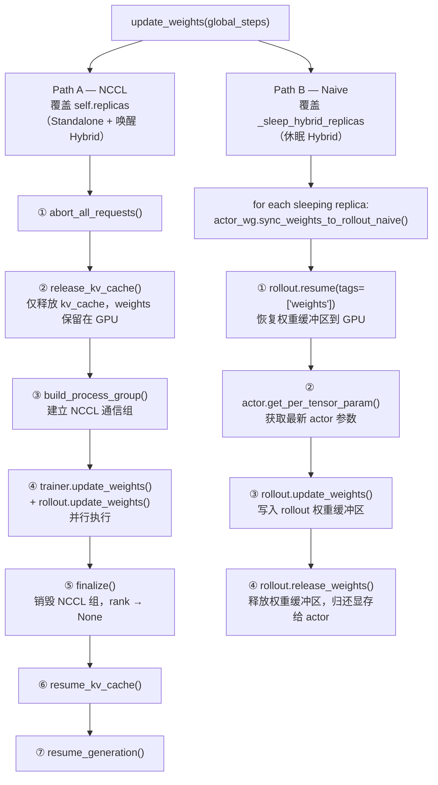

**Q: 为什么 Path A 使用 `release_kv_cache` 而非 `sleep`？**

HYBRID 模式的 `sleep()` 会同时释放 kv_cache **和** weights。若复用 `sleep`，rollout engine 的权重缓冲区被销毁，NCCL 无法将新权重写入。因此改用专用接口 `release_kv_cache / resume_kv_cache`——**只操作 kv_cache，model weights 始终保留在 GPU**，NCCL 直接将新权重覆写到已有缓冲区。

**Q: 为什么 Path B 不复用 `update_weights`（基类方法）？**

Path A 中 `trainer.update_weights()` 调用基类的 NCCL `send_weights` 逻辑，属于 NCCL 建组后的 rank 操作。
Path B 使用的是独立方法 `sync_weights_to_rollout_naive()`，专供休眠 Hybrid 调用。
若 `ElasticActorWorker` 的 `update_weights` 被覆写为 naive 逻辑，则 Path A 的 trainer 端在 NCCL 建组后沉默不发送，rollout 端永远等待，系统死锁。
因此 Path B 使用独立方法 `sync_weights_to_rollout_naive()`，与基类 `update_weights` 完全隔离。


#### 2.5.3 副本状态转换

```
add_hybrid_replicas()    → 初始放入 _sleep_hybrid_replicas（不进入 self.replicas）
mark_hybrid_awake()      → _sleep_hybrid_replicas → self.replicas (Train → Rollout 切换时)
mark_hybrid_sleeping()   → self.replicas → _sleep_hybrid_replicas (Rollout → Train 切换时)
remove_hybrid_replicas() → 从当前所在集合移除
```

#### 2.5.4 弹性切换后无需额外同步

**Train → Rollout 切换**（`switch_elastic_to_rollout`）流程：
1. actor 权重 offload 到 CPU
2. 此前 `update_weights`（Path B naive 路径）**已将最新参数写入 rollout engine 的权重缓冲区**
3. `wake_up()` 直接唤醒 rollout server，持有的权重即为最新版本

因此，弹性切换的 `wake_up` 中**无需额外参数同步**。无论副本处于哪种状态，每次 `update_weights` 均覆盖所有 hybrid replica（休眠时走 Path B，唤醒时走 Path A），权重始终保持最新。

#### 2.5.5 同步时序保障

```
fit_step:
  Phase 1: _elastic_on_before_fit_step()  ← 弹性切换（GPU 空闲，在拉数据之前）
  Phase 2: _apply_pending_dp_changes()    ← DP rebuild + _update_required_samples()
  Phase 3: _fit_generate()          ← 按新 required_samples 拉取样本（DP 已确定）
  Phase 4: 训练计算（GPU 繁忙）
    └─ _fit_update_actor()          ← actor 参数更新
    └─ _fit_update_weights()        ← 参数同步（每 trigger_parameter_sync_step 步触发）
          ├─ Path A: self.replicas（standalone + 唤醒 hybrid）→ NCCL
          └─ Path B: _sleep_hybrid_replicas（休眠 hybrid）    → naive 进程内
```

弹性切换（Phase 1）发生在拉取数据（Phase 3）之前，确保 `required_samples` 和 `mini_batch_size` 已按新 DP size 对齐，batch 大小与训练时 DP 拓扑完全一致。参数同步（Phase 4）在切换之后，保证切换后的副本持有最新参数。

---

## 3. 关键设计

### 3.1 Model Engine 的 DP 重组

#### 3.1.1 单一大 RayWorkerGroup 设计

所有弹性 GPU 构成**唯一一个** `RayWorkerGroup`，`process_on_nodes = [n_gpus_per_node] * nnodes`。这使所有弹性 workers 共享同一个 `dist.init_process_group` world，Megatron/FSDP 在其中自动划分 TP/PP/DP 组。

**不能拆成多个 wg 的原因**：`dist.new_group()` 是全局 collective，要求所有参与进程在同一个 world 里**同时执行**——跨 wg 调用会 hang 或报错。

```
配置示例（12 GPU，TP=2）：
→ 1 个 RayWorkerGroup，world_size=12，ranks=[0..11]
→ 初始 DP=6，elastic unit = [0,1], [2,3], [4,5], [6,7], [8,9], [10,11]

switch_elastic_to_rollout("elastic_0")：
  → rebuild_dp_group([2,3,...,11])，DP=5
  → ranks[0,1] offload actor，rollout server 唤醒

switch_elastic_to_train("elastic_0")：
  → rollout server sleep，actor load 到 GPU
  → rebuild_dp_group([0,1,...,11])，DP 恢复 6
```

**关键推导关系**：

```
world_size      = trainer.nnodes × trainer.n_gpus_per_node
gpus_per_group  = TP × PP × CP   （Megatron 并行配置）
n_elastic       = world_size / gpus_per_group   （可切换的最小单元数）
DP_size         = n_elastic        （初始全部参与训练时）
```

#### 3.1.2 Megatron DP 重建流程

Megatron DP 每个 rank 持有**完整模型参数**（非分片），DP 组仅影响梯度 all-reduce。
        
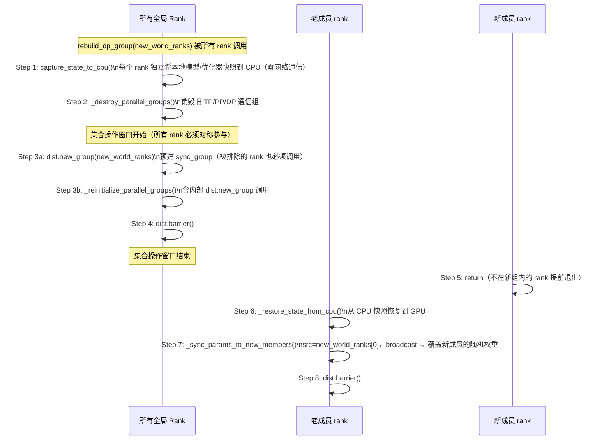

**Collective Barrier 对称性**（关键约束）：

`dist.new_group()` 和 `mpu.initialize_model_parallel()` 内部均包含集合操作，**所有全局 rank 必须参与相同数量的 `dist.new_group` 调用**，否则 NCCL 死锁。Step 3 因此提前到 `is_in_new_group` 判断之前执行，被排除的 rank 也执行这两个集合操作后才 return。

#### 3.1.3 FSDP2 DP 重建流程

FSDP2 参数以 `DTensor` 分片存储，重建时需先 `unshard` 再 offload。


#### 3.1.4 DP 扩缩容时参数分布（以 Megatron DP=2→4 为例）

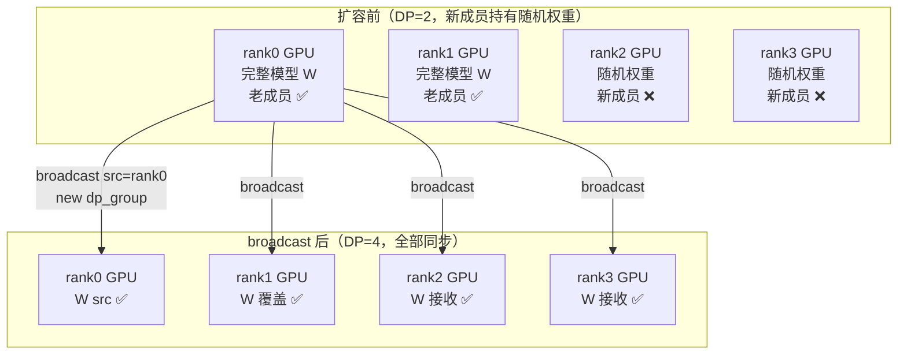

| 阶段 | 说明 |
|------|------|
| CPU offload | 每个 rank 独立操作本地内存，**零网络通信** |
| 新成员 CPU 快照 | 仅用于重建 tensor shape/dtype，实际值由 broadcast 覆盖 |
| broadcast src | `new_world_ranks[0]`（全局 rank 0），在新建的 `sync_group` 内广播 |
| 缩容（DP=4→2） | 无新成员，无 broadcast，每个 rank 从自己 CPU 快照恢复，参数不变 |

**Q: DP 2→4 时，rank2/3 的 CPU 快照里是随机权重，`restore_from_cpu()` 之后它们的 GPU 参数正确吗？**

不正确——`restore_from_cpu()` 只是把 CPU 快照（随机值）搬回 GPU。之后 Step 7 的 `_sync_params_to_new_members()` 用 `dist.broadcast(src=rank0)` 覆盖 rank2/3 的权重，使它们与 rank0 一致。rank2/3 的 CPU 快照仅用于重建 tensor 的 shape/dtype 结构，实际数值无关紧要。

**Q: 为什么不直接从 rank0 通过网络发给 rank2/3，跳过 CPU offload？**

Megatron 的并行组（DP/TP/PP）是进程级全局单例，**必须先销毁旧组再重建新组**。销毁期间 NCCL 通信不可用，因此只能先把参数存到本地 CPU，等新组建立后再广播。


### 3.2 AgentLoop 中 Server 安全并发增删

#### 3.2.1 副本编号不重叠设计

`ElasticAgentLoopManager.create()` 采用三步初始化顺序，确保全局 `replica_rank` 唯一：

```
Step 1  弹性 Hybrid Replica (rank 0 … N_e-1)
        └── init_hybrid(elastic_worker_group) → 立即 sleep()
            (占用最低编号 bundle，最大化 GPU 亲和性)

Step 2  固定 Standalone Replica (rank N_e … N_e+N_f-1)
        └── init_standalone()  start_rank=N_e，actor 名不与弹性重叠

Step 3  构建 ElasticGlobalRequestLoadBalancer（只含固定 replica 的地址）
        弹性 replica 以 sleeping 状态注册到 _registered_elastic_replicas，
        通过 add_elastic_replica() 按需激活后再加入 LB
```

`replica_rank` 直接决定 Ray named actor 名称（`sglang_server_{replica_rank}_{node_rank}`），全局唯一即可避免 `ActorAlreadyExistsError`。

#### 3.2.2 Server 增加执行顺序

`add_elastic_replica()` 严格按如下顺序执行，**Worker 句柄同步必须先于 LB 注册**：

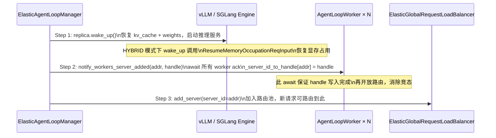

> **关键时序约束**：若先注册 LB（Step 3）再同步句柄（Step 2），Worker 可能在 `_server_id_to_handle` 尚未写入时收到路由请求，导致 `RuntimeError: Unknown server_id`。必须保证所有 Worker 确认持有句柄后，再开放 LB 路由。

#### 3.2.3 Server 删除执行顺序

`remove_elastic_replica()` 严格按如下顺序执行：

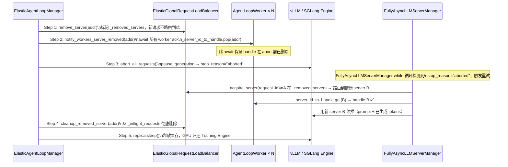

#### 3.2.4 并发安全性分析

| 场景 | 是否安全 | 原因 |
|------|---------|------|
| `generate()` 已持有 server handle，同时 `_server_id_to_handle` 删除该 key | ✅ 安全 | `server` 是已取出的 Python 引用，dict 删除 key 不影响引用有效性 |
| `abort` 返回 `"aborted"`，重试时 `_server_id_to_handle[A]` 已被删除 | ✅ 安全 | Step 2 用 `await asyncio.gather` 阻塞到所有 worker ack，**保证 handle 先删再 abort** |
| sticky session 重试时 LB 仍返回被删 server A | ✅ 安全 | `acquire_server` 检查 `_removed_servers`，A 已在其中，重新路由到 B |
| `_release_server(A)` (fire-and-forget) 与 `cleanup_removed_server(A)` 并发 | ✅ 安全 | `ElasticGlobalRequestLoadBalancer.release_server` 对不存在的 key 静默返回，不抛异常 |
| 并发调用 `remove_elastic_replica` 两次（同时修改 `server_addresses` list） | ⚠️ 理论不安全 | Python list `pop` 非原子；但 `ElasticCoordinator` 通过 `_switch_lock` 保证串行调度，实践中不会并发 |
| `add_elastic_replica` 后新请求在 Worker 句柄写入前到达 | ✅ 已修复 | `notify_workers_server_added()` await 所有 Worker ack 后，才调用 `LB.add_server()`，彻底消除竞态 |

#### 3.2.5 `partial_rollout` 重试机制

`FullyAsyncLLMServerManager.generate()` 对 AgentLoop 透明地完成断点续推：

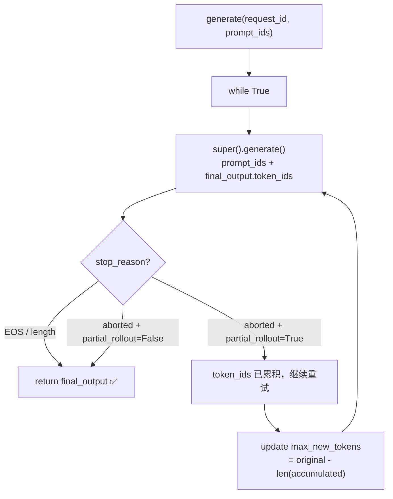

重试时拼接 `prompt_ids + final_output.token_ids`，新 server 从断点位置续推，上层 AgentLoop 无感知。

**Q: `add_elastic_replica` 执行期间，新请求在 Worker 句柄写入前就被路由过来，会出现 `Unknown server_id` 吗？**

不会发生。`notify_workers_server_added()` 使用 `await asyncio.gather` 阻塞到所有 Worker 确认写入 `_server_id_to_handle` 后，才调用 `LB.add_server()` 开放路由。因此路由池开放时，所有 Worker 的句柄映射已完全就绪。

**Q: `remove_elastic_replica` 执行期间，正在 `generate()` 的请求会丢失吗？**

不会。依赖三层保障：
1. LB 的 `_removed_servers` 标记使新请求不路由到被删 server
2. `notify_workers_server_removed()` 的 `await` 保证 handle 在 `abort` 前已从所有 worker 删除
3. `FullyAsyncLLMServerManager` 检测到 `stop_reason="aborted"` 后，自动将 `prompt + 已生成 tokens` 拼接发给新 server 续推，AgentLoop 无感知

### 3.3 弹性触发时机及过程

#### 3.3.1 为什么切换必须在拉数据（_fit_generate）之前

- **Train GPU 完全空闲**：上一步训练结束后、拉取下一批数据之前，Train Workers GPU 零占用，是执行 offload / load 最低成本的窗口
- **batch 大小与 DP 必须对齐**：切换改变 DP size → `required_samples` 和 `mini_batch_size` 随之更新。若先拉数据再切换，当次 batch 按旧 DP 大小拉取，与新 DP size 不整除，触发 `assert mini_batch_size % dp_size == 0`；切换前置后，`_fit_generate()` 按最新 `required_samples` 拉取，天然对齐
- **监控与执行解耦**：后台监控循环只写 `_pending_action` flag，实际切换在安全窗口由 `on_before_fit_step()` 触发，避免异步竞争
- **自然对齐**：等待数据越久 = 生产越不足，与 `scale_rollout` 决策方向一致；切换完成后再进入等待，可让新的 Rollout 副本立即开始产出样本，缩短等待时间

#### 3.3.2 弹性切换完整过程

```
Train → Rollout (switch_elastic_to_rollout)
─────────────────────────────────────────────
① remove_elastic_actor()
    → _elastic_active_units.remove(resource_id)
    → _pending_elastic_removes.append(resource_id)
    → _dp_rebuild_pending = True
② worker.switch_to_rollout()
    → actor.offload_to_cpu()  [释放 GPU 显存]
③ rollouter.add_elastic_replica()
    → rollout.wake_up()                       [恢复 kv_cache + weights，启动推理服务]
    → notify_workers_server_added() [await]   [所有 Worker 确认持有句柄后再继续]
    → LB.add_server()                         [开放路由，新请求可路由到此副本]
    → checkpoint_manager.mark_hybrid_awake()  [切换同步路径 → NCCL]

Rollout → Train (switch_elastic_to_train)
─────────────────────────────────────────────
① rollouter.remove_elastic_replica()
    → LB 标记删除，abort in-flight 请求
    → rollout.sleep()          [释放 weights + kv_cache]
    → checkpoint_manager.mark_hybrid_sleeping()  [切换同步路径 → naive]
② worker.switch_to_train()
    → actor.load_to_gpu()      [从 CPU 恢复权重]
    → rebuild_dp_group()       [重建 DP 通信组]
③ add_elastic_actor()
    → _elastic_active_units.add(resource_id)
    → _pending_elastic_adds.append(resource_id)
    → _dp_rebuild_pending = True

DP Rebuild（在下一个 Phase 3 执行）
─────────────────────────────────────────────
→ _apply_pending_dp_changes()
    → new_world_ranks = 所有 ACTIVE units 的 ranks 并集
    → elastic_wg.execute_all("rebuild_dp_group", new_world_ranks)
    → _update_required_samples()  [按新 DP 大小重新计算]
```

#### 3.3.3 required_samples 与 mini_batch_size 动态对齐

弹性切换改变 DP 大小后，`engine_workers.train_mini_batch` 会做如下断言：

```python
assert mini_batch_size % dp_size == 0
```

当 `ppo_mini_batch_size × rollout_n` 不能被新 DP size 整除时（例如 768 % 5 ≠ 0），会抛出 `AssertionError`。为此引入统一的对齐方法 `_get_dp_aligned_mini_batch_size()`：

```
aligned_mini_batch = ceil(ppo_mini_batch_size × rollout_n / dp_size) × dp_size
required_samples   = aligned_mini_batch × require_batches
```

两处均调用同一方法，保证一致性：

| 调用位置 | 作用 |
|---------|------|
| `_update_required_samples()` | 确定从队列拉取的样本总量，同时满足 `required_samples % dp_size == 0` |
| `_update_actor()` | 传给 `train_mini_batch` 的 `mini_batch_size`，满足 `mini_batch_size % dp_size == 0` |

**示例**（`ppo_mini_batch_size=48, rollout_n=16, dp_size=5`）：
```
base          = 48 × 16 = 768
aligned       = ceil(768 / 5) × 5 = 154 × 5 = 770
required_samples = 770 × require_batches
```

在 `_apply_pending_dp_changes()` 末尾调用，保证下一次 `_fit_generate()` 拉取对齐后的样本数，`_update_actor()` 使用同样对齐的 `mini_batch_size`。

#### 3.3.4 样本 Staleness 处理

弹性切换可能导致 Rollout 参数版本落后：
- 每个样本携带生成时的 `param_version`
- Trainer 计算 `stale_delta = current_version - sample_version`
- `stale_delta > staleness_threshold` 时丢弃该样本（与 `FullyAsyncTrainer` 保持一致）

### 3.4 关键指标

弹性调度相关指标在每个 `fit_step` 结束时通过 `_fit_postprocess_step()` 写入 `self.metrics`，随正常训练 metrics 一起上报到日志系统。

| 指标键 | 含义 | 来源 |
|--------|------|------|
| `elastic/total_switch_to_rollout` | 累计 Train→Rollout 切换次数 | `ElasticTrainer._total_elastic_removes` |
| `elastic/total_switch_to_train` | 累计 Rollout→Train 切换次数 | `ElasticTrainer._total_elastic_adds` |
| `elastic/last_switch_latency_s` | 最近一次切换耗时（秒） | `ElasticTrainer._last_switch_latency` |
| `elastic/num_rollout_replicas` | 当前活跃 rollout replica 数（固定 + 弹性） | `ElasticAgentLoopManager` 统计 |
| `elastic/num_train_actors` | 当前参与训练的 actor 数（固定 + 弹性） | `ElasticTrainer.get_num_active_train_actors()` |
| `elastic/current_dp_size` | 当前训练 DP 并行度 | 固定 wg + 弹性 TRAIN wg 之和 |
| `elastic/required_samples` | 本步目标样本数（随 DP 动态更新） | `ElasticTrainer.required_samples` |

指标写入时机：`_fit_postprocess_step()` → `self.metrics.update(...)` → `metrics_aggregator.add_step_metrics()`


---

## 4. 配置说明

### 4.1 资源配置语义

| 参数组 | 含义 | 说明 |
|--------|------|------|
| `rollout.nnodes` / `rollout.n_gpus_per_node` | 固定 Rollout 资源池 | Standalone Replica，始终活跃 |
| `trainer.nnodes` / `trainer.n_gpus_per_node` | 弹性资源总量 | 唯一大 wg，world_size = nnodes × n_gpus_per_node |

**示例**（单节点 8 GPU，2 固定 Rollout + 6 弹性，TP=2）：

```yaml
rollout:
  nnodes: 1
  n_gpus_per_node: 2          # 2 GPU 固定 rollout

trainer:
  nnodes: 1
  n_gpus_per_node: 6          # 6 GPU 弹性资源（world_size=6）

actor_rollout_ref:
  actor:
    megatron:
      tensor_model_parallel_size: 2
      pipeline_model_parallel_size: 1
      context_parallel_size: 1
```

→ `gpus_per_group = 2`，`n_elastic = 3` 个可切换单元，初始 `DP = 3`

切换 1 个单元到 Rollout 后：`rebuild_dp_group([0,1,2,3])` → `DP = 2`

### 4.2 调度参数

```yaml
elastic_scheduling:
  high_watermark: 0.8         # 超过此值 → 弹性资源切换为 Train（减少 Rollout）
  low_watermark: 0.3          # 低于此值 → 弹性资源切换为 Rollout（增加生产）
  min_rollout_resources: 0    # 至少保留 N 个弹性 Rollout（防止队列彻底断供）
  min_train_resources: 0      # 至少保留 N 个弹性 Train（防止训练停止）
  cooldown_seconds: 30.0      # 两次切换之间的最小冷却时间（防止抖动）
  check_interval: 2.0         # 监控循环轮询间隔（秒）
  confidence_threshold: 0.6   # 执行切换所需的最低置信度
  ema_alpha: 0.3              # EMA 平滑系数（越小越平滑，反应越慢）
```

## 5. 文件结构

```
verl/experimental/elastic_scheduling/
├── README.md                          # 本文档
├── main.py                            # ElasticSchedulingTaskRunner（主入口）
├── coordinator.py                     # ElasticCoordinator（Ray Actor，调度决策）
├── elastic_trainer.py                 # ElasticTrainer（完整切换序列执行）
├── elastic_rollouter.py               # ElasticRollouter（样本生产，弹性副本管理）
├── elastic_engine_workers.py          # ElasticActorWorker（训练引擎弹性切换）
│                                      # sync_weights_to_rollout_naive（Path B 专用）
├── elastic_checkpoint_engine.py       # ElasticCheckpointManager（参数同步，双路）
├── agent_loop/
│   ├── __init__.py
│   └── elastic_agent_loop.py          # ElasticAgentLoopManager
│                                      # ElasticGlobalRequestLoadBalancer
│                                      # ElasticAgentLoopWorker
├── engine/
│   ├── __init__.py                    # get_elastic_engine_cls() 工厂函数
│   ├── fsdp/
│   │   └── elastic_transformer_impl.py  # ElasticFSDPMixin
│   │                                    # ElasticFSDPEngineWithLMHead
│   └── megatron/
│       └── elastic_transformer_impl.py  # ElasticMegatronMixin
│                                        # ElasticMegatronEngineWithLMHead
├── config/
│   ├── elastic_ppo_trainer.yaml          # 多节点配置
│   └── elastic_ppo_trainer_single_node.yaml  # 单节点开发配置
└── test/
    ├── test_fsdp_dp_rebuild_real_model.py    # FSDP2 DP 重建全量测试
    ├── test_megatron_dp_rebuild_real_model.py # Megatron DP 重建全量测试（R1–R7）
    ├── test_elastic_scheduling.py
    └── test_elastic_scheduling_ray.py
```