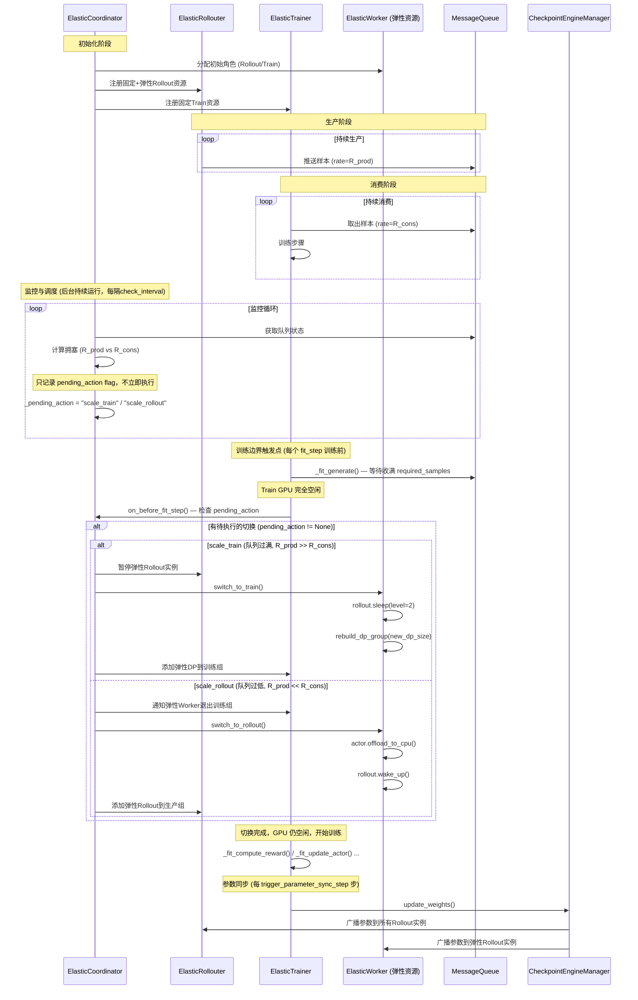
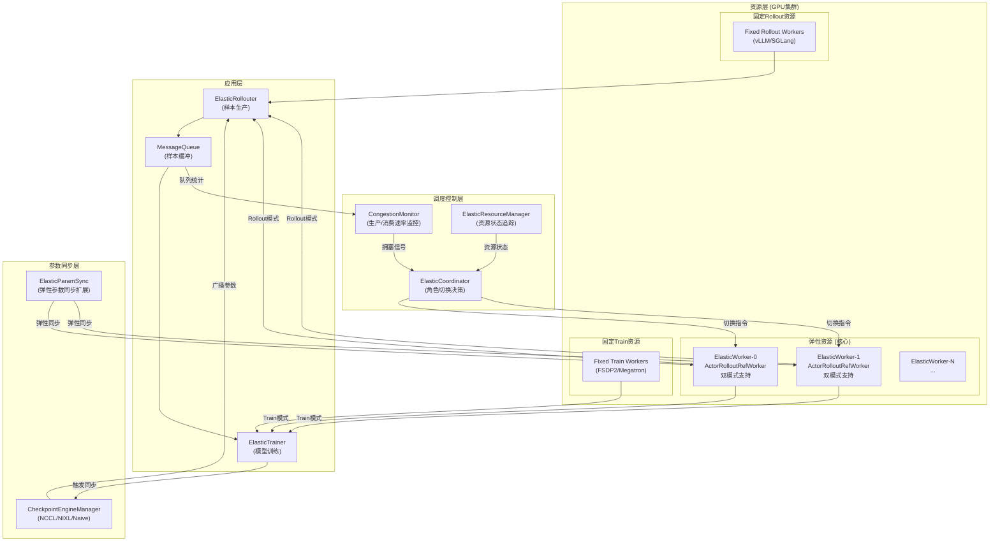

# 弹性Rollout与训练调度系统设计方案

## 1. 整体架构设计

### 1.1 资源划分模型

弹性调度系统将 GPU 集群划分为三种资源：

- **固定 Rollout 资源（Fixed Rollout）**：专用于推理生成，持续产生样本
- **固定 Train 资源（Fixed Train）**：专用于模型训练，持续消费样本
- **弹性资源（Elastic）**：可在 Rollout 和 Train 角色之间动态切换的资源，由 `ActorRolloutRefWorker` 承载

```
┌──────────────────────────────────────────────────────────────┐
│                    GPU Cluster Resources                     │
│                                                              │
│  ┌─────────────────┐  ┌─────────────────┐  ┌─────────────┐  │
│  │  Fixed Rollout  │  │   Fixed Train   │  │   Elastic   │  │
│  │   Resources     │  │   Resources     │  │  Resources  │  │
│  │  (vLLM/SGLang)  │  │ (FSDP2/Megatron)│  │(Dual Mode)  │  │
│  │  DP0,DP1,...    │  │  DP0,DP1,...    │  │DP0,DP1,...  │  │
│  └────────┬────────┘  └────────┬────────┘  └──────┬──────┘  │
│           │                    │                   │         │
│           │     ┌──────────────┴──────────────┐   │         │
│           │     │     Elastic Coordinator       │───┘         │
│           │     │  (监控拥塞、触发角色切换)       │            │
│           │     └──────────────┬──────────────┘             │
│           │                    │                             │
└───────────┼────────────────────┼─────────────────────────────┘
            │                    │
     ┌──────▼──────┐    ┌────────▼──────┐
     │  Rollout    │    │    Trainer    │
     │  Manager   │    │   Manager    │
     │ (生产样本)   │    │ (消费样本)    │
     └──────┬──────┘    └────────┬──────┘
            │                    │
            ▼                    ▼
     ┌──────────────────────────────────────┐
     │            Message Queue             │
     │  (Buffer between Rollout & Train)    │
     └──────────────────────────────────────┘
```

### 1.2 弹性资源双模式设计（核心）

`ActorRolloutRefWorker` 在当前设计中仅支持单一角色（纯 Rollout 或纯 Train），弹性设计的核心是使其同时持有两种能力，并通过 **sleep/wake_up** 机制进行无缝切换：

```
┌──────────────────────────────────────────────────────────────┐
│          ElasticActorRolloutRefWorker (弹性 Worker)           │
│                                                              │
│  ┌──────────────────────┐    ┌────────────────────────────┐  │
│  │   Actor Engine       │    │     Rollout Engine         │  │
│  │  (FSDP2/Megatron)    │    │   (vLLM/SGLang Server)     │  │
│  │                      │    │                            │  │
│  │  - model parameters  │    │  - KV cache                │  │
│  │  - optimizer state   │    │  - inference engine        │  │
│  │  - gradient buffers  │    │  - request scheduling      │  │
│  └──────────────────────┘    └────────────────────────────┘  │
│                                                              │
│              ┌──────────────────────────┐                   │
│              │     Mode Controller      │                   │
│              │                          │                   │
│              │  ROLLOUT_MODE:           │                   │
│              │    actor.sleep()  ───►   │                   │
│              │    rollout.wake_up()     │                   │
│              │                          │                   │
│              │  TRAIN_MODE:             │                   │
│              │    rollout.sleep()  ───► │                   │
│              │    actor.wake_up()       │                   │
│              └──────────────────────────┘                   │
└──────────────────────────────────────────────────────────────┘
```

**模式切换时序：**

- **切换为 Rollout 模式**：
  1. `actor.engine.offload_to_cpu()` — Actor 参数卸载至 CPU（释放 GPU 显存）
  2. `rollout.wake_up(tags=["weights", "kv_cache"])` — 激活 vLLM/SGLang
  3. 参数同步：从 Trainer 广播最新参数至该 Rollout 实例
  4. 加入 Rollout DP 组，开始产生样本

- **切换为 Train 模式**：
  1. `rollout.sleep(level=2)` — 释放 KV Cache 和推理引擎显存
  2. `actor.engine.load_to_gpu()` — 恢复 Actor 参数至 GPU
  3. 重建 DP 通信组（FSDP2 或 Megatron）
  4. 加入 Train DP 组，开始参与训练

### 1.3 数据流与调度时序

```
时间轴 ──────────────────────────────────────────────────────►

Fixed Rollout:  [产生样本] [产生样本] [产生样本] [产生样本] [产生样本]

Elastic (初始-Rollout): [产生样本] [等待切换]─┐ [产生样本] ...
                                              │
Fixed Train:    [训练]   [等待数据]─┐[训练]   │ [训练(+弹性DP)] [训练]
                                   ▲          │
                              【切换执行点】    │
                          收完数据、GPU空闲时  │
                                              │
Elastic (切换后-Train):  ─────────────────────┘[重建DP][训练][训练]
```

### 1.4 核心数据流（序列图）


        
---
    
## 2. 核心设计点
    
### 2.1 FSDP2 DP 分组动态重建
    
**场景**：弹性资源从 Rollout 切换到 Train 时，需要加入现有的 FSDP2 训练组。
    
**设计方案**：
    
```
初始状态 (Train DP=2):          切换后 (Train DP=3):

GPU0 ┐                          GPU0 ┐
     ├─ FSDP DP Group ─►             ├─ FSDP DP Group ─►
GPU1 ┘   (Shard 0,1)           GPU1 │   (Shard 0,1,2)
                                GPU2 ┘  ← 弹性资源加入
```

**重建步骤（对所有参与 Train 的 Worker 同步执行）**：

1. **Barrier 同步**：所有 train worker + 即将加入的弹性 worker 达到 barrier
2. **保存状态到 CPU**：当前 DP rank 0 将模型参数广播保存到 CPU 内存
3. **销毁旧 device_mesh**：`dist.destroy_process_group(old_dp_group)`
4. **重建 device_mesh**：`init_device_mesh("cuda", (new_dp_size, tp_size, pp_size))`
5. **重建 FSDP2 分片**：在新 mesh 上重新包装模型（或仅重置 DP 通信组）
6. **从 CPU 恢复参数**：新加入的 rank 从 rank 0 接收参数广播
7. **恢复训练**

**关键优化**：
- 仅重建 DP 维度的通信组，TP/PP 保持不变
- 使用 CPU 内存中转，避免磁盘 I/O
- 支持 `_flat_param` 的重新分片（FSDP2 通过 `reshard_after_forward` 配合）

**FSDP2 具体实现**：

```python
class FSDP2DPRebuildManager:
    """FSDP2 动态DP组重建管理器"""

    def __init__(self, model, optimizer):
        self.model = model
        self.optimizer = optimizer
        self._cpu_state = None   # CPU 内存中的模型状态
        self._cpu_optim = None   # CPU 内存中的优化器状态

    def rebuild_dp_group(self, new_world_ranks: list[int]):
        """
        重建 FSDP2 DP 分组

        流程：
        1. 捕获当前完整参数 (unshard)
        2. 卸载到 CPU
        3. 销毁旧分组
        4. 用新 ranks 创建 device_mesh
        5. 重新包装 FSDP2
        6. 从 CPU 恢复参数
        """
        # 1. 聚合完整参数
        self._gather_full_params()

        # 2. 卸载到 CPU
        self._offload_to_cpu()

        # 3. 销毁旧 DP 分组
        self._destroy_old_groups()

        # 4. Barrier
        torch.distributed.barrier()

        # 5. 重建 device_mesh
        new_mesh = init_device_mesh(
            "cuda",
            mesh_shape=(len(new_world_ranks), self.tp_size),
            mesh_dim_names=["dp", "tp"],
        )

        # 6. 重建 FSDP2 包装
        self._rewrap_fsdp2(new_mesh)

        # 7. 从 CPU 广播恢复参数
        self._broadcast_from_cpu()
```

### 2.2 Megatron DP 分组重建

**设计方案**（基于现有 `DynamicDPManager`）：

```
重建流程：
┌─────────────────────────────────────────────────────────────┐
│  1. capture_state()                                          │
│     - 将 model state_dict 拷贝到 CPU                          │
│     - 将 optimizer state 拷贝到 CPU                           │
├─────────────────────────────────────────────────────────────┤
│  2. offload_to_cpu()                                         │
│     - 将参数移至 CPU，释放 GPU 显存                           │
├─────────────────────────────────────────────────────────────┤
│  3. destroy_model_parallel()                                 │
│     - 销毁旧的 TP/PP/DP 分组                                  │
├─────────────────────────────────────────────────────────────┤
│  4. dist.barrier() (含弹性 worker 参与)                       │
├─────────────────────────────────────────────────────────────┤
│  5. initialize_model_parallel(new_dp_size)                  │
│     - 重新计算并行配置                                        │
│     - 创建新的 DP 分组 (包含弹性 Worker)                      │
├─────────────────────────────────────────────────────────────┤
│  6. load_to_gpu() + restore_state()                         │
│     - 从 CPU 内存恢复模型/优化器到 GPU                         │
│     - 新加入 Worker 通过 all_reduce broadcast 同步参数         │
└─────────────────────────────────────────────────────────────┘
```

**关键约束**：
- TP、PP 在弹性切换中保持不变（改变 TP/PP 需要重建整个模型）
- 弹性切换只调整 DP 维度
- 所有涉及的 Worker 需同步参与重建

### 2.3 AgentLoopManager 动态添加 Server 能力

支持弹性 Rollout 动态加入 AgentLoopManager：

```python
class ElasticAgentLoopManager(AgentLoopManager):
    """
    扩展 AgentLoopManager 支持动态添加/删除 Rollout Server
    """

    async def add_rollout_server(self, replica: RolloutReplica):
        """
        动态添加新的 Rollout Server

        步骤：
        1. 初始化新 replica (init_standalone 或 init_hybrid)
        2. 同步最新参数到新 replica
        3. 更新 GlobalRequestLoadBalancer (添加新 server_id)
        4. 更新 AgentLoopWorker 的 server 列表
        """
        # 1. 初始化新 server
        await replica.init_standalone()
        
        # 2. 参数同步
        await self.checkpoint_manager.sync_to_new_replica(replica)
    
        # 3. 更新负载均衡器
        new_server_id = replica._server_address
        await self.global_load_balancer.add_server.remote(server_id=new_server_id)
        
        # 4. 通知所有 AgentLoopWorker
        await asyncio.gather(*[
            worker.add_server.remote(new_server_id, replica._server_handle)
            for worker in self.agent_loop_workers
        ])
        
    async def remove_rollout_server(self, server_address: str):
        """
        优雅地删除 Rollout Server

        步骤：
        1. 停止向该 server 发送新请求
        2. 等待当前 in-flight 请求完成
        3. 从负载均衡器移除
        4. 关闭 server
        """
        # 1. 从负载均衡器移除 (停止新请求)
        await self.global_load_balancer.remove_server.remote(server_id=server_address)

        # 2. 等待 in-flight 请求完成
        await self._wait_for_server_drain(server_address)

        # 3. 停止 server
        replica = self._get_replica_by_address(server_address)
        await replica.abort_all_requests()
```

### 2.4 弹性参数同步设计

**关键场景**：弹性资源切换为 Rollout 后，需要获取最新的 Trainer 参数。

```
Trainer (FSDP2/Megatron)
    │
    │  get_per_tensor_param()  (全量参数生成器)
    │
    ▼
CheckpointEngine (NCCL/NIXL)
    │
    │  send_weights()  (流式传输)
    │
    ▼
ElasticRolloutReplica (新加入的弹性 Rollout)
    │
    │  update_weights()
    │
    ▼
vLLM/SGLang Server (接收并热更新参数)
```

**参数同步时机**：

1. **训练前边界触发切换**：每次 `_fit_generate()` 收满样本后、GPU 计算开始前，执行弹性资源切换（Train GPU 完全空闲，切换零额外开销）
2. **新 Rollout 加入时同步**：弹性资源切换为 Rollout 后，在下次 `update_weights()` 时接收完整参数广播
3. **版本追踪**：每个 Rollout 实例记录其当前参数版本，过期的样本会被标记为 stale

### 2.5 拥塞监控与调度决策

**监控指标**：
- `queue_size` / `queue_capacity`：队列利用率
- `production_rate`：Rollout 每秒产生的样本数（EMA 平滑）
- `consumption_rate`：Trainer 每秒消费的样本数（EMA 平滑）
- `imbalance_ratio`：`production_rate / consumption_rate`

**调度策略**：

```python
def decide_action(metrics: CongestionMetrics) -> SuggestedAction:
    if metrics.queue_utilization > HIGH_WATERMARK:
        # 队列满，训练跟不上 → 把弹性资源切换为 Train
        return SCALE_UP_TRAIN
    elif metrics.queue_utilization < LOW_WATERMARK:
        # 队列空，Rollout 不够 → 把弹性资源切换为 Rollout
        return SCALE_UP_ROLLOUT
    else:
        return STABLE
```

**切换时机选择**：
- **训练前边界（最优）**：监控后台持续运行、只写 `_pending_action` flag；实际切换在 `_fit_generate()` 收满数据后、GPU 计算开始前执行，此时 Train GPU 完全空闲，切换成本为零
- **Cooldown 保护**：每次切换后有 `cooldown_seconds` 的冷却时间，防止频繁抖动
- **Batch 边界对齐**：切换仅在 mini-batch 边界发生，保证训练连续性

---

## 3. 系统架构总览



---

## 4. 文件结构

```
verl/experimental/elastic_scheduling/
├── README.md                          # 本文档（设计方案）
├── __init__.py                        # 模块导出（所有核心组件）
├── config/
│   ├── elastic_ppo_trainer.yaml       # 多节点配置文件（生产环境）
│   └── elastic_ppo_trainer_single_node.yaml  # 单节点配置（开发测试）
│
├── main.py                            # ElasticSchedulingTaskRunner
│                                      #   - 集成所有组件的主入口
│                                      #   - 按顺序初始化 Trainer/Rollouter/Coordinator
│                                      #   - 连接 MessageQueue 和弹性参数同步
│
├── coordinator.py                     # 调度协调器
│   ├── ElasticCoordinator             #   - Ray Actor，系统大脑
│   │   ├── 监控队列利用率（EMA平滑）     #   - 持续轮询 MQ 队列状态
│   │   ├── 监控生产/消费速率            #   - 计算 EMA 速率估计
│   │   ├── _pending_action flag        #   - 监控只写 flag，不直接执行
│   │   └── on_before_fit_step()        #   - 训练边界 hook，在 GPU 空闲时执行切换
│   ├── ElasticResourceInfo            #   - 弹性资源状态数据类
│   ├── CongestionMonitor (Legacy)     #   - 向后兼容保留
│   └── ResourceCoordinator (Legacy)   #   - 向后兼容保留
│
├── elastic_worker.py                  # 弹性 Worker 核心组件
│   ├── ElasticWorkerMixin             #   - Mixin：添加弹性切换能力
│   │   ├── switch_to_train()          #   - 切换为训练模式
│   │   └── switch_to_rollout()        #   - 切换为推理模式
│   ├── FSDP2DPRebuildManager          #   - FSDP2 DP 组动态重建
│   │   ├── gather_full_params_to_cpu()#   - 收集完整参数到 CPU
│   │   ├── destroy_dp_groups()        #   - 销毁旧 DP 组
│   │   └── rebuild()                  #   - 完整重建序列
│   ├── MegatronDPRebuildManager       #   - Megatron DP 组动态重建
│   │   ├── capture_and_offload()      #   - 捕获状态到 CPU
│   │   ├── destroy_parallel_groups()  #   - 销毁并行组
│   │   └── rebuild()                  #   - 完整重建序列
│   ├── ElasticWorkerState             #   - Worker 状态跟踪
│   └── ElasticMode                    #   - 枚举：ROLLOUT/TRAIN/SWITCHING
│
├── elastic_rollouter.py               # ElasticRollouter
│   │   基于 FullyAsyncRollouter
│   ├── _init_async_rollout_manager()  #   - 使用 ElasticAgentLoopManager
│   ├── add_elastic_replica()          #   - 动态添加弹性推理副本
│   ├── remove_elastic_replica()       #   - 动态移除弹性推理副本
│   ├── get_total_produced_samples()   #   - 生产速率统计（供 Coordinator 轮询）
│   └── record_produced_samples()      #   - 记录新产生的样本数
│
├── elastic_trainer.py                 # ElasticTrainer
│   │   基于 FullyAsyncTrainer
│   ├── add_elastic_actor()            #   - 注册弹性训练 Actor（延迟 DP 重建）
│   ├── remove_elastic_actor()         #   - 标记弹性 Actor 移除（延迟 DP 重建）
│   ├── _apply_pending_dp_changes()    #   - 在 mini-batch 边界执行 DP 重建
│   ├── _coordinate_dp_rebuild()       #   - 协调所有 train worker 同步重建
│   ├── set_rollouter()                #   - 初始化 ElasticParameterSyncManager
│   ├── set_elastic_coordinator()      #   - 注册 Coordinator 引用
│   ├── fit_step()                     #   - 覆盖：在数据收集后、训练前触发弹性切换
│   ├── _fit_generate_only()           #   - 仅收集数据（不启动 GPU 计算）
│   ├── _elastic_on_before_fit_step()  #   - 调用 Coordinator.on_before_fit_step()
│   ├── _fit_update_weights()          #   - 纯参数同步（切换逻辑已移出）
│   ├── _fit_postprocess_step()        #   - 消费速率统计
│   └── get_total_consumed_samples()   #   - 消费总量（供 Coordinator 轮询）
│
├── elastic_agent_loop.py              # 弹性 AgentLoop 组件
│   ├── ElasticAgentLoopManager        #   - 扩展 FullyAsyncAgentLoopManager
│   │   ├── add_rollout_server()       #   - 动态添加 Rollout Server
│   │   ├── remove_rollout_server()    #   - 优雅移除 Rollout Server（graceful drain）
│   │   └── _init_global_load_balancer()#  - 使用弹性 LB
│   └── ElasticGlobalRequestLoadBalancer  # 弹性负载均衡器（Ray Actor）
│       ├── add_server()               #   - 动态添加服务实例
│       ├── remove_server()            #   - 标记服务为移除状态（停止路由）
│       └── get_inflight_count()       #   - 获取在途请求数
│
├── elastic_param_sync.py              # ElasticParameterSyncManager
│   │   包装 CheckpointEngineManager
│   ├── update_weights()               #   - 同步到固定 + 弹性副本
│   ├── register_elastic_replica()     #   - 注册新弹性副本
│   ├── _sync_to_elastic_replicas()    #   - 批量同步弹性副本
│   └── _sync_single_elastic_replica() #   - 单副本同步（支持 naive/nccl/nixl）
│
├── elastic_param_sync.py              # ElasticSyncStats
│                                      #   - 同步统计数据类
│
├── parameter_sync.py                  # ElasticCheckpointManager (Legacy)
│                                      #   - 向后兼容保留
├── resource_manager.py                # ElasticResourceManager (Legacy)
│                                      #   - 向后兼容保留
└── dynamic_dp_manager.py              # DynamicDPManager (Legacy)
                                       #   - Megatron DP 重建工具类（被 MegatronDPRebuildManager 复用）
```

---

## 5. 关键设计决策

### 5.1 为什么选择训练前边界触发切换

- **Train GPU 完全空闲**：`_fit_generate()` 期间 Train Workers 仅在等待队列数据，GPU 零占用。此时做 sleep/wake_up + DP 重建，不产生任何额外停机代价
- **切换信号最直接**：`_fit_generate()` 等待时间越长 = Rollout 产能越不足，与切换决策天然对齐
- **监控与执行解耦**：后台监控循环只负责写 `_pending_action` flag，不直接执行操作；实际切换由 `on_before_fit_step()` hook 在安全窗口触发，避免监控异步与训练状态竞争
- **参数同步简化**：切换与参数同步完全分离。切换发生时 GPU 空闲，参数同步发生时切换已完成，两个操作互不干扰

### 5.2 FSDP2 vs Megatron 的不同处理策略

| 特性 | FSDP2 | Megatron |
|------|-------|----------|
| DP 重建方式 | 重建 device_mesh + 重新分片 | destroy_model_parallel + reinitialize |
| CPU 中转 | 需要 unshard 后卸载 | 直接卸载参数和优化器 |
| 参数广播 | PyTorch dist.broadcast | Megatron 内置广播 |
| 冷却时间 | ~5s（重建快）| ~15s（需要重建多个通信组）|
| 支持热加入 | 有限支持（需提前分配进程）| 同样限制 |

### 5.3 弹性资源的初始化策略

弹性资源在启动时**同时初始化 Actor Engine 和 Rollout Engine**：
- Actor Engine 初始化后处于**睡眠状态**（参数在 CPU 内存中）
- Rollout Engine 初始化后处于**活跃状态**（默认先作为 Rollout）
- 两个 Engine 共享同一份 GPU 显存时间片，通过 sleep/wake_up 互斥使用

### 5.4 样本 Staleness 处理

弹性切换可能导致 Rollout 的参数版本落后于 Trainer：
- 每个样本携带生成时的 `param_version`
- Trainer 计算 `stale_delta = current_param_version - sample_param_version`
- `stale_delta > staleness_threshold` 时丢弃该样本（与 FullyAsyncTrainer 保持一致）

---

## 6. 配置说明

```yaml
elastic_scheduling:
  # 资源分配
  rollout_gpus: 8           # 固定 Rollout GPU 数
  train_gpus: 8             # 固定 Train GPU 数
  elastic_gpus: 8           # 弹性 GPU 数（可在两者间切换）
  dp_size_per_node: 8       # 每个弹性资源组的 GPU 数

  # 调度阈值
  rollout_queue_high_watermark: 0.8   # 队列满 → 切换为 Train
  rollout_queue_low_watermark: 0.3    # 队列空 → 切换为 Rollout
  cooldown_seconds: 30.0              # 切换冷却时间（秒）

  # 同步设置
  sync_trigger_interval: 4           # 每 N 步触发一次参数同步
  # 切换时机：训练前边界（_fit_generate 收满数据后、GPU 计算开始前），Train GPU 完全空闲时执行

  # 监控
  check_interval: 5.0                 # 调度检查间隔（秒）
  congestion_window_size: 20          # 速率计算滑动窗口大小

  # DP 重建参数
  dp_rebuild_timeout: 60.0           # DP 重建超时（秒）
  dp_rebuild_backend: "nccl"         # 重建通信后端
```

---

## 7. 实现状态与快速启动

### 已实现组件（可运行）

| 文件 | 状态 | 说明 |
|------|------|------|
| `coordinator.py` | ✅ 完整 | ElasticCoordinator + 遗留组件 |
| `elastic_worker.py` | ✅ 完整 | ElasticWorkerMixin + FSDP2/Megatron DP 重建 |
| `elastic_rollouter.py` | ✅ 完整 | ElasticRollouter，基于 FullyAsyncRollouter |
| `elastic_trainer.py` | ✅ 完整 | ElasticTrainer，基于 FullyAsyncTrainer |
| `elastic_agent_loop.py` | ✅ 完整 | ElasticAgentLoopManager + ElasticGlobalRequestLoadBalancer |
| `elastic_param_sync.py` | ✅ 完整 | ElasticParameterSyncManager，支持 naive/nccl/nixl |
| `main.py` | ✅ 完整 | ElasticSchedulingTaskRunner |
| `config/elastic_ppo_trainer.yaml` | ✅ 完整 | 生产环境配置（多节点）|
| `config/elastic_ppo_trainer_single_node.yaml` | ✅ 完整 | 单节点开发测试配置 |
| `__init__.py` | ✅ 完整 | 所有组件导出 |
| `parameter_sync.py` | ✅ 遗留 | 向后兼容保留 |
| `resource_manager.py` | ✅ 遗留 | 向后兼容保留 |
| `dynamic_dp_manager.py` | ✅ 遗留 | 向后兼容保留 |

### 快速启动

```bash
# 单节点开发/测试
python -m verl.experimental.elastic_scheduling.main \
    --config-path config \
    --config-name elastic_ppo_trainer_single_node \
    actor_rollout_ref.model.path=/path/to/model \
    data.train_files=/path/to/train.parquet \
    data.val_files=/path/to/val.parquet

# 多节点生产部署（32 GPUs: 8 fixed rollout + 16 fixed train + 8 elastic）
python -m verl.experimental.elastic_scheduling.main \
    --config-path config \
    --config-name elastic_ppo_trainer \
    trainer.nnodes=2 trainer.n_gpus_per_node=8 \
    rollout.nnodes=1 rollout.n_gpus_per_node=8 \
    elastic_scheduling.n_elastic_resources=1 \
    elastic_scheduling.dp_size_per_resource=8 \
    actor_rollout_ref.model.path=/path/to/model \
    data.train_files=/path/to/train.parquet
```

### 已知限制与后续工作

1. **弹性资源注册**：`_build_elastic_resource_infos()` 当前返回空白列表（`worker_handles=[]`）。
   在实际部署中，需要在 `resource_pool_manager.init_workers()` 后获取真实的 Ray Actor 句柄，
   并调用 `coordinator.register_elastic_resource()` 注册。

2. **FSDP2 DP 重建**：当前实现是基础框架，生产级实现需要配合 PyTorch 2.4+ 的
   `fully_shard` API 进行重新分片（`reshard_after_forward`）。

3. **Megatron DP 重建**：需要确保弹性 Worker 的进程在原始 `dist.init_process_group()` 时
   已被分配在相同的通信域，才能通过 `dist.barrier()` 同步重建。

4. **参数同步后端**：推荐使用 `nixl` 后端进行弹性副本同步，因其支持动态拓扑；
   `nccl` 后端在弹性场景下需要重建进程组，开销较大。


Q&A:
比如说2->4  2 先存cpu参数，然后4获取cpu参数，具体在机器上是如何分配参数的
rank0,rank1,rank2,rank3 
好问题。让我先读取相关代码来梳理清楚。

代码已读完，现在可以完整回答这个问题了。

---

## DP 2→4 时参数在 rank0/1/2/3 上的分配方式

### 前提：Megatron DP 模型是**完整副本**

与 FSDP（参数切片分布）不同，**Megatron DP 每个 rank 持有完整的模型参数**。DP 组只影响梯度 all-reduce，不影响参数存储方式。

---

### 完整流程图（以测试 R4: DP=2→4 弹性扩容为例）

```
扩容前（DP=2，只有 rank0, rank1 在训练）
━━━━━━━━━━━━━━━━━━━━━━━━━━━━━━━━━━━━━━
rank0 GPU:  [完整模型参数 W]   ← 老成员
rank1 GPU:  [完整模型参数 W]   ← 老成员（与rank0同步）
rank2 GPU:  [随机权重 / 空]    ← 新成员，即将加入
rank3 GPU:  [随机权重 / 空]    ← 新成员，即将加入
```

**Step 1: capture_and_offload()** — 每个 rank 独立执行，只操作自己本地内存

```
rank0: GPU[W]  →  CPU内存[snapshot_W]，GPU参数移到CPU
rank1: GPU[W]  →  CPU内存[snapshot_W]，GPU参数移到CPU
rank2: GPU[随机] → CPU内存[snapshot_随机]，GPU参数移到CPU
rank3: GPU[随机] → CPU内存[snapshot_随机]，GPU参数移到CPU

注意：没有任何跨机器的网络通信！每个rank只操作自己的内存
```

**Step 2: destroy_parallel_groups()** — 销毁旧的 DP=2 通信组

**Step 3: barrier()** — 4 个 rank 全部就绪同步

**Step 4: reinitialize_parallel_groups(tp=1, pp=1)** — 重建 DP=4 通信组

```
新的 DP group = [rank0, rank1, rank2, rank3]
```

**Step 5: restore_from_cpu()** — 每个 rank 从自己的 CPU 快照恢复到 GPU

```
rank0 GPU: ← CPU[snapshot_W]      ✅ 正确权重
rank1 GPU: ← CPU[snapshot_W]      ✅ 正确权重
rank2 GPU: ← CPU[snapshot_随机]   ❌ 随机权重（待同步）
rank3 GPU: ← CPU[snapshot_随机]   ❌ 随机权重（待同步）
```

**Step 6: sync_new_member_params(new_member_ranks=[2,3])** — 广播参数给新成员

```python
# 关键代码：在新的 DP group 内，从 dp_rank=0（全局rank0）广播给所有人
for param in model.parameters():
    dist.broadcast(param.data, src=0, group=dp_group)
```

```
rank0 GPU: [W]  →→→→→  broadcast(src=0)
                              ↓         ↓         ↓
rank1 GPU: [W]  (已正确，被覆盖也无影响)
rank2 GPU: [随机] → 接收 → [W]   ✅ 现在正确
rank3 GPU: [随机] → 接收 → [W]   ✅ 现在正确
```

---

### 关键设计特点

| 问题 | 答案 |
|------|------|
| CPU 快照是共享内存还是每个 rank 独立的？ | **每个 rank 完全独立**，存在各自节点的 CPU 内存里，无网络传输 |
| rank2/3 的 CPU 快照有什么用？ | 只是用来恢复 GPU 内的 tensor 结构（shape/dtype），实际值会被 broadcast 覆盖 |
| 为什么不直接从 rank0 网络传给 rank2/3，跳过 CPU offload？ | Megatron 的并行组（DP/TP/PP）是全局单例，必须先**销毁旧组**再**重建新组**，销毁时 NCCL 通信不可用，所以必须先存 CPU |
| 4→2 缩容时（R6 测试，改 tp=2）参数怎么走？ | 无新成员，所有 rank 只做 `capture→destroy→reinit→restore`，无 broadcast，每个 rank 从自己 CPU 快照恢复，参数始终不变 |

---

### R6/R7 中（通过调整 tp 实现缩容）的参数分布

```
R6: DP=4(tp=1) → DP=2(tp=2)

rebuild前 (tp=1, dp=4):
  rank0,1 是 TP group [0,1]，rank2,3 是 TP group [2,3]
  DP group = [rank0, rank2] 和 [rank1, rank3]（或全部4个，取决于分组方式）

rebuild后 (tp=2, dp=2):
  rank0,1 是 TP group [0,1]（共享同一层的不同张量切片）
  rank2,3 是 TP group [2,3]
  DP group = [rank0, rank2]（tp_rank=0 的两个dp成员）

每个 rank 的参数：自己 CPU 快照恢复，无广播，参数值不变
但 tp=2 时模型参数会被 Megatron 按 TP 维度切分访问（通信语义变了）
```

```python
cd /Users/arron/Projects/verl && ray job submit --address='http://10.148.11.18:8420' --runtime-env=examples/mtp_trainer/runtime_env.yaml --working-dir=. -- torchrun 
--nproc_per_node=4 --master-port=29603 verl/experimental/elastic_scheduling/test/test_megatron_dp_rebuild_real_model.py --model-path /home/hadoop-djst-algoplat/models/Qwen2.5-Math-7B
```
 