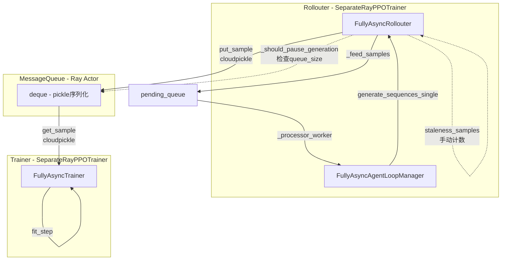
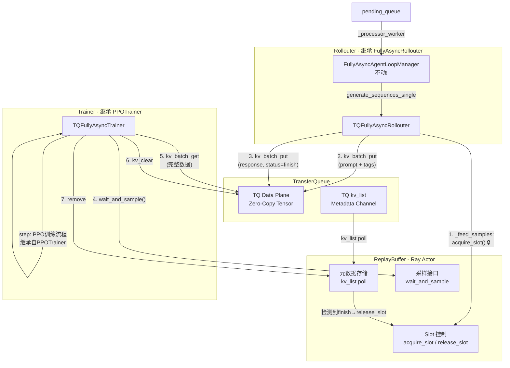
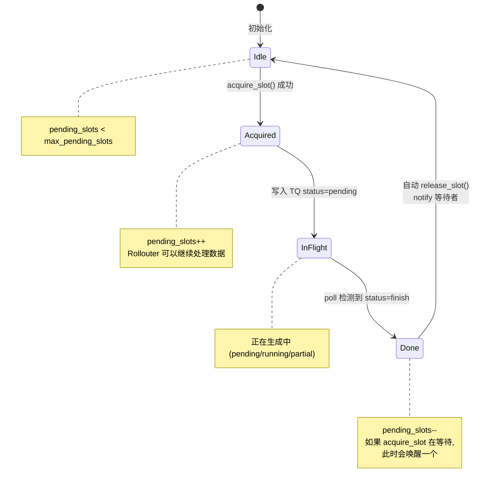
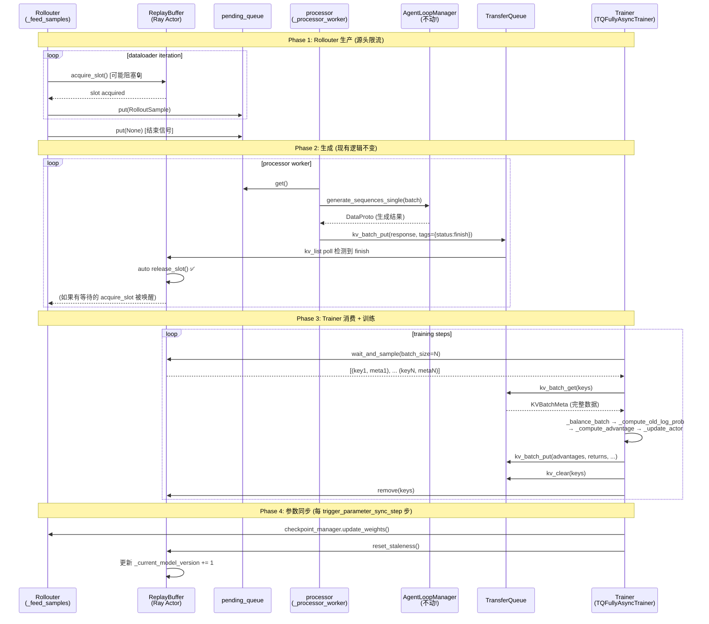

# Fully Async Policy with TransferQueue

## 概述

本方案在 `fully_async_policy` 基础上，将数据传输通道从 Ray MessageQueue 迁移到 TransferQueue (TQ)，
同时训练侧继承 `main_ppo_sync.py` 的 `PPOTrainer` 以复用 TQ 训练流程。

### 核心设计原则

1. **最小改动**: `FullyAsyncAgentLoopManager` 整体不动，保持现有推理生成逻辑
2. **ReplayBuffer 控制流速**: 用 ReplayBuffer (Ray Actor) 的 slot 机制替代原 `_should_pause_generation`
3. **TQ 替换 MessageQueue**: 数据走 TQ 零拷贝通道，元数据走 ReplayBuffer
4. **Trainer 继承 PPOTrainer**: 复用 `main_ppo_sync.py` 中成熟的 TQ 训练流程（_compute_old_log_prob, _compute_advantage 等）

### 核心目标

1. **零拷贝传输**: 使用 TQ 替代 MessageQueue，避免 `ray.cloudpickle` 序列化开销
2. **源头限流**: 在 dataloader 数据获取处 (`_feed_samples`) 通过 `acquire_slot` 控制生产速度
3. **背压控制**: slot 机制限制 in-flight 请求数，无需额外的暂停/恢复逻辑
4. **复用成熟代码**: Trainer 侧继承 PPOTrainer，直接使用 TQ 原生的 batch 训练流程

## 架构对比

### 现有架构 (MessageQueue + SeparateRayPPOTrainer)



**问题**:
- 数据完整 `ray.cloudpickle` 序列化/反序列化开销大
- Ray Actor 单点瓶颈 (MessageQueue)
- `_should_pause_generation` 暂停逻辑复杂 (drain → resume)
- Trainer (`SeparateRayPPOTrainer`) 与 colocate 训练流程差异大，维护两套代码

### 新架构 (TQ + ReplayBuffer + PPOTrainer)



**核心变化**:

| 维度 | 现有架构 | 新架构 |
|------|---------|--------|
| **数据通道** | MessageQueue (pickle) | TransferQueue (zero-copy) |
| **元数据通道** | 无 (混在数据里) | ReplayBuffer (Ray Actor) |
| **流速控制** | `_should_pause_generation` + staleness_samples | `acquire_slot` 在 `_feed_samples` 源头控制 |
| **Trainer 基类** | `SeparateRayPPOTrainer` | `PPOTrainer` (from main_ppo_sync.py) |
| **AgentLoopManager** | `FullyAsyncAgentLoopManager` | **不变** |
| **暂停/恢复逻辑** | paused + drain + resume | **不需要** (slot 阻塞即限流) |

## 核心组件

### 1. ReplayBuffer (Ray Actor)

轻量级元数据通道 + Slot 流速控制。作为 Ray Actor 跨进程共享。

```python
@ray.remote
class ReplayBuffer:
    """Ray Actor: 元数据通道 + Slot 流速控制"""

    def __init__(self, max_pending_slots: int = 256, poll_interval: float = 1.0):
        self.partitions: dict[str, dict[str, dict]] = defaultdict(dict)
        self.lock = threading.Lock()
        self.poll_interval = poll_interval
        self._finished = False

        # Slot 控制 (替代 MessageQueue 的 queue_size 限流)
        self.max_pending_slots = max_pending_slots
        self._pending_slots = 0  # 已获取但未 finish 的 slot 数
        self._slot_available = threading.Condition(self.lock)

        # 版本追踪 (替代 staleness_samples)
        self._current_model_version = 0
        self._staleness_samples = 0

        # 后台线程: 轮询 TQ kv_list 同步状态
        self._poll_thread = threading.Thread(target=self._poll_from_tq, daemon=True)
        self._poll_thread.start()

    # ===== Rollouter 接口 =====

    def acquire_slot(self, timeout: float | None = None) -> bool:
        """获取写入 slot (阻塞)。

        在 _feed_samples (dataloader) 中调用。
        当 pending_slots >= max_pending_slots 时阻塞，
        实现"源头限流"，不需要额外的暂停/恢复逻辑。

        Returns:
            True: 获取成功; False: timeout 或已 finished
        """
        with self._slot_available:
            while self._pending_slots >= self.max_pending_slots:
                if self._finished:
                    return False
                if timeout is not None:
                    if not self._slot_available.wait(timeout):
                        return False
                else:
                    self._slot_available.wait()
                    if self._finished:
                        return False
            self._pending_slots += 1
            return True

    def release_slot(self):
        """手动释放 slot (异常场景)。正常情况下由 poll 线程自动释放。"""
        with self._slot_available:
            self._pending_slots = max(0, self._pending_slots - 1)
            self._slot_available.notify()

    # ===== Trainer 接口 =====

    def wait_and_sample(
        self, partition_id: str, batch_size: int
    ) -> list[tuple[str, dict]] | None:
        """阻塞等待足够数量的 finish 样本。

        由 Trainer 在每个 training step 开始时调用。
        """
        ...

    def remove(self, partition_id: str, keys: list[str]):
        """移除已消费的样本元数据。"""
        ...

    def reset_staleness(self, active_task_count: int = 0) -> dict:
        """参数同步后重置 staleness 计数。

        由 Trainer 在 _fit_update_weights 后调用。
        """
        ...

    # ===== 控制信号 =====

    def signal_finish(self):
        """通知生产结束 (所有样本已喂入)。"""
        ...
```

#### Slot 控制机制



#### 调用方式

直接使用 Ray Actor handle 调用（无需 Client 封装）：

```python
# Rollouter 侧 (在 Ray Actor 内部)
acquired = await asyncio.wrap_future(self.replay_buffer.acquire_slot.remote(timeout=None).future())

# Trainer 侧 (在 Ray Actor 内部)
sampled = await asyncio.wrap_future(
    self.replay_buffer.wait_and_sample.remote(partition_id="train", batch_size=N).future()
)
```

或者使用 `ray.get()` 同步调用：

```python
# fully_async_main.py 中 (Driver 过程)
ray.get(rollouter.set_replay_buffer.remote(replay_buffer))
staleness_stats = ray.get(replay_buffer.reset_staleness.remote())
```

### 2. TQFullyAsyncRollouter

基于现有 `FullyAsyncRollouter` 修改，核心变化：

**不改动的部分**:
- ✅ `FullyAsyncAgentLoopManager` — 完全不动
- ✅ `FullyAsyncLLMServerClient` (partial rollout) — 不动
- ✅ `FullyAsyncLLMServerManager` (hybrid replica) — 不动
- ✅ `pending_queue` + `_processor_worker` 核心循环结构 — 基本不动
- ✅ `fit()` 主循环 — 不动
- ✅ `checkpoint_manager` 参数同步 — 不动
- ✅ 验证逻辑 — 不动

**改动的部分**:

#### 2.1 `_feed_samples` — 加 `acquire_slot` (源头限流)

```python
async def _feed_samples(self):
    continuous_iterator = self._create_continuous_iterator()

    for epoch, batch_dict in continuous_iterator:
        # ★ 核心改动: 在 dataloader 获取数据后、放入 pending_queue 前
        #   阻塞获取 slot (源头限流，替代原来的 _should_pause_generation)
        acquired = await asyncio.wrap_future(self.replay_buffer.acquire_slot.remote(timeout=None).future())
        if not acquired:
            print("[Feed] ReplayBuffer finished or timed out, stop feeding")
            break

        full_batch = prepare_single_generation_data(batch_dict, self.config)
        sample_id = f"sample_{epoch}_{self.global_steps}"

        rollout_sample = RolloutSample(
            full_batch=full_batch,
            sample_id=sample_id,
            epoch=epoch,
            rollout_status={},
        )

        await self.pending_queue.put(rollout_sample)

        if self.global_steps >= self.total_rollout_steps:
            break
        self.global_steps += 1

    # End signal
    await self.pending_queue.put(None)
```

#### 2.2 `_process_single_sample_streaming` — MQ → TQ

```python
async def _process_single_sample_streaming(self, rollout_sample: RolloutSample):
    # AgentLoop 生成 (不变)
    ret = await self.async_rollout_manager.generate_sequences_single(rollout_sample.full_batch)
    rollout_sample.full_batch = ret
    rollout_sample.full_batch.non_tensor_batch["uid"] = np.array(
        [f"uid_{rollout_sample.sample_id}"] * len(rollout_sample.full_batch), dtype=object
    )

    # ★ 改动: 不再 put 到 MessageQueue，改为写入 TQ
    key = rollout_sample.sample_id  # e.g. "sample_0_42"

    tq.kv_batch_put(
        keys=[key],
        partition_id="train",
        fields=[rollout_sample],           # 完整数据 (或按字段拆分)
        tags=[{
            "current_status": "finish",    # 生成完成
            "uid": key,
            "start_model_version": self.current_param_version,
            "end_model_version": self.current_param_version,
            "prompt_len": ...,              # 从 ret 中提取
            "response_len": ...,
        }],
    )
    # RB 的后台 poll 线程会检测到 status=finish，自动 release_slot()

    self.total_generated_samples += 1
    self.processed_sample_count += 1
```

#### 2.3 `_processor_worker` — 删除 `_should_pause_generation`

```python
async def _processor_worker(self):
    while True:
        # ★ 删除: `await self._should_pause_generation()` 检查
        # 只保留 paused (用于参数同步时的 drain)
        if self.paused:
            print("[Processor] Paused for param sync, draining...")
            # drain 逻辑保留 (等 active_tasks 完成，用于参数同步)
            async with self.lock:
                self.paused = True
                self._resume_event.clear()
            # ... drain 代码不变 (等 active_tasks 或 resume 信号) ...
            continue

        # 取 sample
        rollout_sample = await self.pending_queue.get()
        self.pending_queue.task_done()

        # ★ 删除: self.staleness_samples += 1 (由 RB slot 管理)

        if rollout_sample is None:
            # 结束信号处理不变
            ...
            break

        # GPU 并发度限制保留 (max_concurrent_samples)
        while len(self.active_tasks) >= self.max_concurrent_samples:
            ...

        # 提交任务
        task = safe_create_task(
            self._process_single_sample_streaming(rollout_sample),
            name=rollout_sample.sample_id,
            task_set=self.active_tasks,
        )
```

#### 2.4 删除的方法

- ❌ `_should_pause_generation()` — **整个删除**，由 `acquire_slot` 替代

#### 2.5 修改的方法

| 方法 | 变化 |
|------|------|
| `__init__` | `message_queue_client` → `replay_buffer` (Ray Actor handle); 删除 `max_queue_size`, `staleness_samples` 相关字段 |
| `set_message_queue_client()` | → `set_replay_buffer(rb_handle)` |
| `reset_staleness()` | 内部改为调用 `self.replay_buffer.reset_staleness.remote()` |
| `get_statistics()` | 统计来源从 MQ 改为 RB |

### 3. TQFullyAsyncTrainer (继承 PPOTrainer)

**关键决策**: 继承 `main_ppo_sync.py` 的 `PPOTrainer`，而非现有的 `FullyAsyncTrainer`(SeparateRayPPOTrainer)。

这样做的好处：
- 直接复用 `PPOTrainer` 中成熟的 TQ 训练流程：
  - `_compute_old_log_prob()` — 从 TQ 读写 log_prob
  - `_compute_advantage()` — GRPO/GAE advantage 计算
  - `_update_actor()` / `_update_critic()` — mini-batch 更新
  - `_balance_batch()` — 序列长度均衡
- 数据格式统一为 `KVBatchMeta` (TQ 原生格式)，无需 `assemble_batch_from_rollout_samples` 转换
- 与 colocate 训练共享核心训练逻辑，减少维护成本

```python
class TQFullyAsyncTrainer(PPOTrainer):
    """Fully Async Trainer based on PPOTrainer + TQ + ReplayBuffer.

    继承 PPOTrainer (main_ppo_sync.py)，复用其 TQ 训练流程。
    通过 ReplayBuffer 获取样本，通过 TQ 读写数据。
    """

    def __init__(
        self,
        config: DictConfig,
        role_worker_mapping: dict[Role, WorkerType],
        resource_pool_manager: ResourcePoolManager,
        replay_buffer_handle: ray.actor.ActorHandle,
        rollouter_handle: ray.actor.ActorHandle | None = None,
        **kwargs,
    ):
        # 先调用 PPOTrainer.__init__ 完成基础初始化
        # (tokenizer, dataloader, worker groups, agent loop manager, etc.)
        super().__init__(config, role_worker_mapping, resource_pool_manager, **kwargs)

        # Fully Async 特有配置
        self.replay_buffer = replay_buffer_handle  # Ray Actor handle，直接调用
        self.rollouter = rollouter_handle

        # 参数版本追踪
        self.current_param_version = 0
        self.local_trigger_step = 1
        self.trigger_parameter_sync_step = config.async_training.trigger_parameter_sync_step

        # 训练配置
        self.require_batches = config.async_training.require_batches
        self.required_samples = config.actor_rollout_ref.actor.ppo_mini_batch_size * self.require_batches

        # 替换默认的 ReplayBuffer 为共享的 Ray Actor
        # (PPOTrainer.__init__ 会创建本地 ReplayBuffer，这里替换为远程引用)
        # 注意: PPOTrainer 的 step() 方法中使用 self.replay_buffer.sample()
        # 我们需要覆盖 fit() 和 step() 来适配 fully_async 模式

    # ======== 核心改动: fit() 和 step() ========

    def fit(self):
        """覆盖 PPOTrainer.fit()，适配 fully异步模式。

        关键区别:
        - PPOTrainer.fit(): 同步 for-loop over dataloader，每步 dispatch+sample+train
        - TQFullyAsyncTrainer.fit(): 异步循环，从 ReplayBuffer 获取样本，不依赖本地 dataloader
        """
        # 加载 checkpoint
        self._load_checkpoint()
        self.checkpoint_manager.update_weights()

        # 验证
        if self.config.trainer.get("val_before_train", True):
            val_metrics = self._validate()
            self.logger.log(data=val_metrics, step=self.current_param_version)

        progress_bar = tqdm(total=self.total_training_steps, initial=0, desc="Training Progress")
        self.global_steps += 1

        while True:
            try:
                self.step_fully_async()
            except TrainingStopException:
                break

            progress_bar.update(1)
            self.global_steps += 1

        progress_bar.close()

    def step_fully_async(self):
        """单个训练步骤: 从 ReplayBuffer 获取样本 → PPO 训练流程。

        复用 PPOTrainer 的 _compute_* / _update_* 方法，
        但数据获取方式从 replay_buffer.sample(global_steps) 改为
        replay_buffer.wait_and_sample(batch_size).
        """
        metrics, timing_raw = {}, {}

        # 1. 从 ReplayBuffer 获取样本 (替代 dataloader iteration)
        with marked_timer("gen", timing_raw, color="red"):
            batch = self._get_samples_from_rb()
            if batch is None:
                raise TrainingStopException("No more samples")

        self.checkpoint_manager.sleep_replicas()

        # 2-10. 复用 PPOTrainer 的标准训练流程
        # (这些方法操作 TQ + KVBatchMeta，与 main_ppo_sync.py 完全一致)

        # 3. balance batch
        batch = self._balance_batch(batch, metrics)

        # 4. compute old_log_prob (从 TQ 读/写)
        with marked_timer("old_log_prob", timing_raw, color="blue"):
            batch = self._compute_old_log_prob(batch, metrics)

        # 5. compute ref_log_prob
        if self.use_reference_policy:
            with marked_timer("ref", timing_raw, color="olive"):
                batch = self._compute_ref_log_prob(batch, metrics)

        # 6. compute critic values
        if self.use_critic:
            with marked_timer("values", timing_raw, color="cyan"):
                batch = self._compute_values(batch, metrics)

        # 7. compute advantage
        with marked_timer("adv", timing_raw, color="brown"):
            batch = self._compute_advantage(batch, metrics)

        # 8. update critic
        if self.use_critic:
            with marked_timer("update_critic", timing_raw, color="pink"):
                batch = self._update_critic(batch, metrics)

        # 9. update actor
        if self.config.trainer.critic_warmup <= self.global_steps:
            with marked_timer("update_actor", timing_raw, color="red"):
                batch = self._update_actor(batch, metrics)

        # 10. update weights to rollouter
        self._fit_update_local_step()
        with marked_timer("update_weights", timing_raw, color="red"):
            self.checkpoint_manager.update_weights(global_steps=self.current_param_version)
            # 通过 RB 重置 staleness
            timing_rb = ray.get(self.rollouter.reset_staleness.remote())
            timing_raw.update(timing_rb)

        # 11. cleanup
        tq.kv_clear(keys=batch.keys, partition_id=batch.partition_id)
        ray.get(self.replay_buffer.remove.remote(batch.partition_id, batch.keys))

        # 12. validate & checkpoint
        self._maybe_validate()
        self._maybe_save_checkpoint()

        # 13. metrics
        self._compute_metrics(batch, metrics, timing_raw)
        self.logger.log(data=metrics, step=self.global_steps)

    def _get_samples_from_rb(self) -> KVBatchMeta | None:
        """从 ReplayBuffer + TQ 获取训练样本。

        Returns:
            KVBatchMeta: 可直接传给 _compute_* 方法的 batch
            None: 没有更多样本 (结束信号)
        """
        # 1. 阻塞等待足够数量的 finish 样本
        sampled = await asyncio.wrap_future(
            self.replay_buffer.wait_and_sample.remote(
                partition_id="train",
                batch_size=self.required_samples,
            ).future()
        )
        if not sampled:
            return None

        keys = [k for k, _ in sampled]

        # 2. 从 TQ 获取完整数据 (返回 KVBatchMeta)
        batch = tq.kv_batch_get(keys=keys, partition_id="train")

        return batch
```

### 4. 不改动的组件

以下组件 **完全不动**，直接复用:

| 组件 | 文件 | 说明 |
|------|------|------|
| `FullyAsyncAgentLoopManager` | `fully_async_policy/fully_async_rollouter.py` | AgentLoop Worker 管理，round-robin 调度 |
| `FullyAsyncLLMServerClient` | `fully_async_policy/fully_async_rollouter.py` | 支持 partial rollout 的 generate |
| `FullyAsyncLLMServerManager` | `fully_async_policy/fully_async_rollouter.py` | hybrid + standalone replica 管理 |
| `GlobalRequestLoadBalancer` | `workers/rollout/` | Server 负载均衡 |
| `CheckpointEngineManager` | `checkpoint_engine/` | NCCL 参数同步 |
| PPOTrainer 的 `_compute_*` 方法 | `trainer/main_ppo_sync.py` | old_log_prob, ref_log_prob, values, advantage, update |
| PPOTrainer 的 `_balance_batch` | `trainer/main_ppo_sync.py` | 序列长度均衡 |

## 数据流详解

### 完整生命周期时序图



### Staleness 与 Slot 协同

| 原概念 (fully_async_policy) | 新实现 (fully_async_policy_tq) |
|---------------------------|-------------------------------|
| `MessageQueue.queue_size` | `ReplayBuffer._pending_slots` (slot 机制) |
| `max_queue_size` | `max_pending_slots` |
| `_should_pause_generation()` | **删除** — `acquire_slot()` 阻塞即限流 |
| `staleness_samples` (手动计数) | `RB._staleness_samples` (poll 自动统计) |
| `max_required_samples` | `max_pending_slots` (统一为一个维度) |
| `paused` + `drain` + `resume` | **大部分删除** — 仅保留参数同步时的 drain |

**Rollouter 限流变为单维度**:

```
改动前 (双重限流):
  1. _should_pause_generation(): queue_size >= max_queue_size → 暂停
  2. _should_pause_generation(): staleness_samples >= max_required_samples → 暂停
  → 需要 paused/drain/resume 复杂状态机

改动后 (单一限流):
  1. _feed_samples(): acquire_slot() → 阻塞直到有 slot
  → 简洁的令牌桶语义，无需额外状态机
```

**参数同步时的 drain 仍然保留**:
- `reset_staleness()` 时需要等当前 active_tasks 完成
- 这部分 `paused` + drain 逻辑保留在 `_processor_worker` 中

## 文件结构

```
verl/experimental/fully_async_policy_tq/
├── README.md                          # 本文档
├── replay_buffer.py                   # ReplayBuffer (Ray Actor)
├── fully_async_rollouter.py           # TQFullyAsyncRollouter (基于现有版修改)
├── fully_async_trainer.py             # TQFullyAsyncTrainer (继承 PPOTrainer)
├── fully_async_main.py                # 主入口 (创建组件 + 启动)
└── config/
    └── fully_async_ppo_trainer.yaml   # 配置文件
```

**与现有代码的关系**:

```
继承/修改                              不动 (直接 import 使用)
─────────                             ─────────────────────
fully_async_policy/FullyAsyncRollouter  →  fully_async_policy_tq/TQFullyAsyncRollouter
fully_async_policy/FullyAsyncTrainer    →  ❌ 不再使用 (改用 PPOTrainer)
fully_async_policy/MessageQueue         →  ❌ 不再使用 (改用 TQ + ReplayBuffer)
fully_async_policy/FullyAsyncAgentLoopManager → ✅ 完全不动
trainer/main_ppo_sync.py/PPOTrainer    →  fully_async_policy_tq/TQFullyAsyncTrainer
trainer/main_ppo_sync.py/ReplayBuffer   →  ✅ 作为参考 (RB API 不同)
```

## 改动清单汇总

### 新建文件

| 文件 | 说明 |
|------|------|
| `replay_buffer.py` | `@ray.remote class ReplayBuffer` |
| `fully_async_trainer.py` | `class TQFullyAsyncTrainer(PPOTrainer)` |
| `fully_async_main.py` | `class TQFullyAsyncTaskRunner` 入口 |
| `fully_async_rollouter.py` | `class TQFullyAsyncRollouter(FullyAsyncRollouter)` (增量修改) |

### 修改清单 (fully_async_rollouter.py)

| 行为 | 方法/字段 | 说明 |
|------|----------|------|
| **新增** | `_feed_samples`: `acquire_slot()` 调用 | 源头限流 |
| **修改** | `_process_single_sample_streaming`: MQ.put → TQ.kv_batch_put | 数据走 TQ |
| **简化** | `_processor_worker`: 删除 `_should_pause_generation` 检查 | slot 已限流 |
| **删除** | `_should_pause_generation()` 整个方法 | 不再需要 |
| **修改** | `__init__`: client 字段替换 | MQ → RB |
| **新增** | `set_replay_buffer()` | 替代 set_message_queue_client |
| **修改** | `reset_staleness()`: 委托给 RB | 统一版本管理 |
| **删除** | `staleness_samples` 手动计数 | 由 RB 统计 |

### 修改清单 (fully_async_trainer.py — 新文件)

| 行为 | 说明 |
|------|------|
| **继承** | `class TQFullyAsyncTrainer(PPOTrainer)` | 复用 TQ 训练流程 |
| **覆盖** | `fit()`: 异步循环 + RB 采样 | 替代 dataloader for-loop |
| **新增** | `step_fully_async()`: 单步训练 | 组合 PPOTrainer 的 _compute_* 方法 |
| **新增** | `_get_samples_from_rb()`: RB + TQ 获取数据 | 替代 _get_samples_from_queue |
| **修改** | `_fit_update_weights()`: 加 RB.reset_staleness | 参数同步后重置 |

### 修改清单 (fully_async_main.py — 新文件)

| 行为 | 说明 |
|------|------|
| **创建** | `ReplayBuffer.remote(max_pending_slots=N)` | 替代 MessageQueue.remote |
| **注入** | `set_replay_buffer()` 到 Rollouter + Trainer | 替代 set_message_queue_client |
| **删除** | MessageQueue / MessageQueueClient 创建代码 | 不再需要 |

## 性能预期

| 指标 | MessageQueue | TransferQueue | 提升 |
|------|-------------|---------------|------|
| 数据传输延迟 | ~10ms (cloudpickle) | ~1ms (zero-copy) | ~10x |
| 内存占用 | 2x (序列化副本) | 1x (zero-copy) | 2x |
| CPU 开销 | 高 (序列化/反序列化) | 低 (无序列化) | ~5x |
| 限流延迟 | ~100ms (pause→drain→resume) | ~1ms (slot 阻塞/唤醒) | ~100x |
| 代码复杂度 | 高 (暂停状态机) | 低 (令牌桶) | 显著降低 |

## 参考

- [TransferQueue 文档](docs/data/transfer_queue.md)
- [main_ppo_sync.py](verl/trainer/main_ppo_sync.py) — PPOTrainer 基类
- [fully_async_policy 原始实现](verl/experimental/fully_async_policy/) — Rollouter / ALM 基础
- [fully_async_policy/replay_buffer.py](verl/experimental/fully_async_policy_tq/replay_buffer.py) — ReplayBuffer 参考
