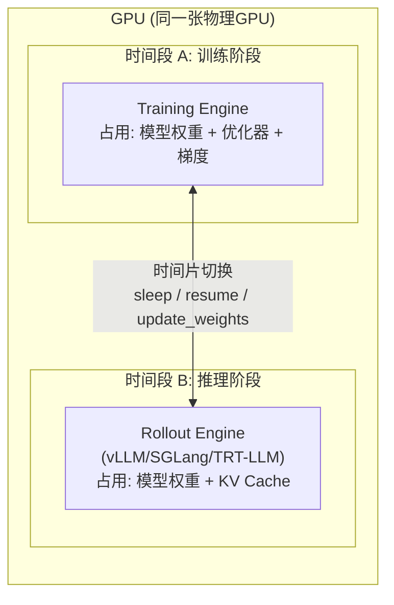
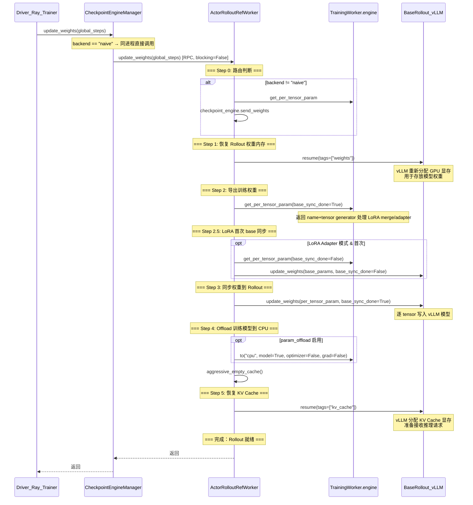
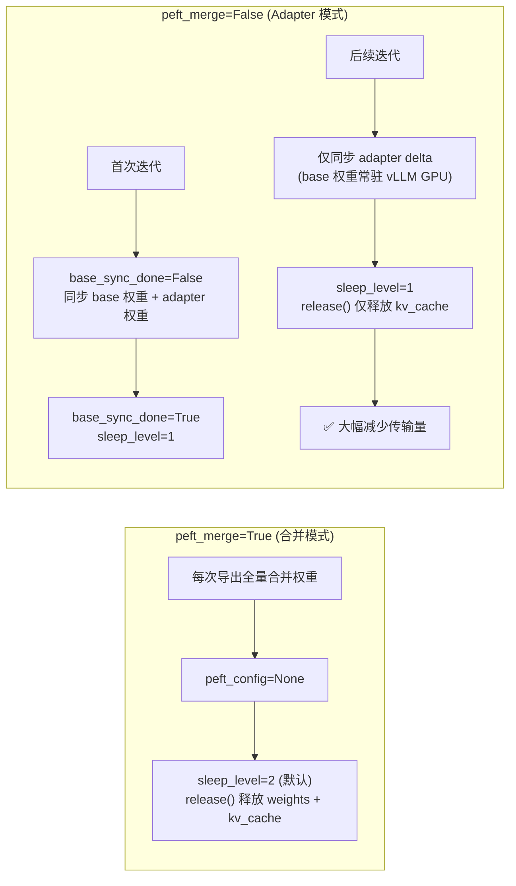

# Hybrid Engine 共置模式：Rollout / Train GPU 资源切换分析

> 聚焦于 `verl/workers/engine_workers.py` 中 `ActorRolloutRefWorker` 的 HYBRID 模式实现。
> （`fsdp_workers.py` / `megatron_workers.py` 中的旧实现已废弃，不再分析。）

---

## 一、整体架构

在 Ray Trainer 中，**rollout（推理）和 train（训练）共享同一组 GPU**，通过时间片轮转的方式交替使用 GPU 资源。

核心类是 `ActorRolloutRefWorker`（`engine_workers.py:435`），它是一个 **Hybrid Worker**，同时持有训练引擎和推理引擎：

```
ActorRolloutRefWorker (engine_workers.py:435)
├── actor: TrainingWorker         # 训练引擎 (FSDP/Megatron/VeOmni/TorchTitan)
├── rollout: BaseRollout          # 推理引擎 (vLLM/SGLang/TRT-LLM)
├── checkpoint_engine             # 权重同步引擎 (naive / NCCL / NIXL)
└── ref: TrainingWorker (可选)    # 参考模型
```



### 三种 RolloutMode

| 模式 | 说明 | 进程关系 |
|------|------|----------|
| **HYBRID** | 训练引擎和推理引擎在**同一个进程**内，通过 sleep/wake 切换 | 同进程 |
| COLOCATED | 训练和推理在**不同进程**但在同一 Placement Group | 跨进程 |
| STANDALONE | 推理有独立 GPU 资源 | 完全分离 |

本文只分析 **HYBRID 模式**。

---

## 二、核心组件详解

### 2.1 ActorRolloutRefWorker 初始化 (`init_model`, 第493行)

初始化按顺序构建四个组件：

```python
# 1. 构建参考模型 (ref)
if "ref" in self.role:
    self.ref = TrainingWorker(config=ref_training_config)
    self.ref.reset()

# 2. 构建训练模型 (actor) — 包含 engine + optimizer + loss_fn
if "actor" in self.role:
    self.actor = TrainingWorker(config=actor_training_config)
    self.actor.reset()
    self.actor.set_loss_fn(self.loss_fn)

# 3. 构建推理引擎 (rollout) — vLLM/SGLang/TRT-LLM ServerAdapter
if "rollout" in self.role:
    rollout_cls = get_rollout_class(rollout_config.name, rollout_config.mode)
    self.rollout = rollout_cls(config=rollout_config, model_config=model_config, device_mesh=rollout_device_mesh)

    # LoRA 相关状态
    self.base_sync_done: bool = "dummy" not in self.config.rollout.load_format
    self.layered_summon = self.config.rollout.get("layered_summon", False)
    self.peft_merge: bool = model_config.lora.get("merge", False)

# 4. 构建 checkpoint engine — 权重同步通道
if "actor" in self.role:
    self.checkpoint_engine = CheckpointEngineRegistry.new(backend, ...)

# 初始化结束时清空缓存，让 colocated 的 vLLM 进程能看到可用显存
aggressive_empty_cache(force_sync=True)
```

**关键点**：初始化后 GPU 上持有的是**训练引擎的模型权重**，rollout 引擎处于 sleep 状态（不占 GPU 显存）。

### 2.2 BaseRollout 抽象接口 (`rollout/base.py`, 第29行)

`rollout` 组件遵循统一抽象：

```python
class BaseRollout(ABC):
    async def resume(self, tags: list[str])       # 恢复 weights 或 kv_cache 到 GPU
        async def update_weights(self, weights, ...)   # 逐 tensor 更新模型权重
        async def release(self)                         # 释放 weights + kv_cache
        def generate_sequences(self, prompts) -> DataProto  # 执行推理生成
```

注册表支持四种 rollout 后端：

```python
_ROLLOUT_REGISTRY = {
    ("vllm", "async"):      "ServerAdapter (vllm_rollout)",
    ("vllm_omni", "async"): "ServerAdapter (vllm_rollout)",
    ("sglang", "async"):    "ServerAdapter (sglang_rollout)",
    ("trtllm", "async"):   "ServerAdapter (trtllm_rollout)",
}
```

### 2.3 CheckpointEngineManager 协调者 (`checkpoint_engine/base.py`, 第308行)

`CheckpointEngineManager` 是 Driver 端的协调者，管理所有 rollout replica 的生命周期：

| 方法 | 作用 |
|------|------|
| `sleep_replicas()` | 释放所有 replica 的 weights + kv_cache |
| `wake_up_replicas()` | 恢复所有 replica 的 weights + kv_cache |
| `release_kv_cache_replicas()` | 仅释放 kv_cache（保留权重缓冲区） |
| `resume_kv_cache_replicas()` | 仅恢复 kv_cache |
| `update_weights(global_steps)` | 触发 trainer → rollout 权重同步 |

---

## 三、核心方法：`update_weights` — 权重同步与角色切换

这是整个资源切换的**核心方法**，定义在 `engine_workers.py:656`。

### 3.1 完整流程图



### 3.2 逐行代码解析 (`engine_workers.py:656-720`)

```python
@register(dispatch_mode=Dispatch.ONE_TO_ALL, blocking=False)
async def update_weights(self, global_steps: int = None):
    """Update weights from trainer to rollout.

    1. For sync training with colocated trainer and rollout, update rollout directly from model engine.
       - before update_weights: rollout should be in sleep mode.
       - after update_weights: rollout should be in wake_up mode.
    2. For async training with disaggregated trainer and rollout, send_weights only by checkpoint engine.

    LoRA handling: when model.lora.merge=True (peft_merge), LoRA is merged into
    base weights before sync. The engine returns full HF-keyed params with
    peft_config=None, so the rollout receives a standard weight update.
    """

    # ═════════════════ Step 0: 路由判断 ═════════════════
    # 如果是非 naive backend（如 NCCL/NIXL），走跨进程权重发送路径
    if self.config.rollout.checkpoint_engine.backend != "naive":
        per_tensor_param, _ = self.actor.engine.get_per_tensor_param()
        await self.checkpoint_engine.send_weights(per_tensor_param)
        return  # 跨进程模式到此结束

    # ═════════════════ 以下为 naive backend（同进程共置） ═════════════════

    set_expandable_segments(False)
    log_gpu_memory_usage("Before resume weights", logger=logger)

    # ═════════════════ Step 1: 恢复 Rollout 权重内存 ═════════════════
    # rollout 在上轮 release() 后已释放了 GPU 内存，这里让它重新分配
    if self.config.rollout.free_cache_engine:
        await self.rollout.resume(tags=["weights"])
    log_gpu_memory_usage("After resume weights", logger=logger)

    # ═════════════════ Step 2: 从训练引擎导出权重 ═════════════════
    # base_sync_done=True 表示获取 adapter/merged 权重（非首次则跳过 base）
    per_tensor_param, peft_config = self.actor.engine.get_per_tensor_param(
        layered_summon=self.layered_summon, base_sync_done=True
    )
    
    # ═════════════════ Step 2.5: LoRA 首次 base 权重同步 ═════════════════
    do_lora_base_sync = False
    if not self.peft_merge and peft_config is not None:
        # LoRA adapter 模式（非 merge）：设置 sleep_level=1（后续只释放 kv_cache）
        self.rollout.sleep_level = 1
        do_lora_base_sync = not self.base_sync_done  # 首次需要同步 base 权重
    
    if do_lora_base_sync:
        # 首次：导出并同步完整的 base 模型权重
        per_tensor_param_base, peft_config = self.actor.engine.get_per_tensor_param(
            layered_summon=self.layered_summon, base_sync_done=False
        )
        await self.rollout.update_weights(
            per_tensor_param_base, peft_config=peft_config,
            base_sync_done=False, global_steps=global_steps
        )

    # ═════════════════ Step 3: 同步权重到 Rollout ═════════════════
    # 将训练引擎的最新权重逐 tensor 写入 rollout 引擎
    await self.rollout.update_weights(
        per_tensor_param, peft_config=peft_config,
        base_sync_done=True, global_steps=global_steps
    )

    log_gpu_memory_usage("After update_weights", logger=logger)

    # ═════════════════ Step 4: Offload 训练模型到 CPU ═════════════════
    # 释放训练引擎占用的 GPU 显存，让给 rollout 使用
    if self.actor.engine.is_param_offload_enabled:
        self.actor.engine.to("cpu", model=True, optimizer=False, grad=False)
    aggressive_empty_cache(force_sync=True)

    # ═════════════════ Step 5: 恢复 KV Cache ═════════════════
    # 此时 rollout 已有最新权重，再分配 KV Cache 即可开始推理
    if self.config.rollout.free_cache_engine:
        await self.rollout.resume(tags=["kv_cache"])
    log_gpu_memory_usage("After resume kv_cache", logger=logger)

    self.base_sync_done = True
    set_expandable_segments(True)
```

---

## 四、每步训练循环中的完整时序

在 `ray_trainer.fit()` 的每个 training step 中，资源切换时序如下：

```mermaid
gantt
    title 每个 Training Step 的 GPU 资源切换时序 (HYBRID mode)
    dateFormat X
    axisFormat %s
    
    section Driver (Ray Trainer)
    准备数据 batch           : done, d1, 0, 1
    
    section GPU → Rollout 占用
    sleep_replicas            : active, r1, 1, 2
    generate_sequences (推理) : crit, r2, 2, 5
    
    section GPU → Train 占用
    sleep_replicas            : active, s1, 5, 6
    reward / log_prob / values : active, c1, 6, 10
    update_actor (PPO更新)    : active, u1, 10, 13
    save_checkpoint (可选)     : active, u2, 13, 14
    
    section GPU → Rollout 占用 (为下步准备)
    update_weights (权重同步)  : crit, w1, 14, 16
```



对应 `ray_trainer.py` fit() 方法中的关键调用点：

```python
# ① Sleep 所有 rollout replicas（释放上轮的 KV cache + 权重）
#     → 调用每个 replica 的 release() → GPU 归 training engine
self.checkpoint_manager.sleep_replicas()

# ② 生成序列（内部完成 Train→Rollout→Train 的完整切换）
#     → generate_sequences() 内部:
#         a. rollout_mode()  [导出权重 → resume(weights) → update_weights → offload actor → resume(kv_cache)]
#         b. rollout.generate_sequences()  [执行推理]
#         c. trainer_mode()  [release(rollout) → 恢复 train 模式]
gen_batch_output = self.async_rollout_manager.generate_sequences(gen_batch_output)

# ③ 再次 sleep rollout，腾出 GPU 给后续计算
self.checkpoint_manager.sleep_replicas()

# ④ 在 Training Engine 上执行各类计算
#    compute_reward → compute_old_log_prob → compute_ref_log_prob
#    → compute_values → compute_advantage

# ⑤ Actor 参数更新 (PPO mini-batch training)
actor_output = self._update_actor(batch)

# ⑥ 将更新后的权重同步回 rollout（为下一步推理做准备）
#     → 调用 ActorRolloutRefWorker.update_weights()
#     → 完成后 GPU 上 rollout 处于 wake_up 状态
self.checkpoint_manager.update_weights(self.global_steps)
```

---

## 五、LoRA 场景的特殊优化

LoRA 训练通过 `sleep_level` 和 `base_sync_done` 实现增量同步优化：



对应代码逻辑 (`engine_workers.py:689-701`)：

```python
do_lora_base_sync = False
if not self.peft_merge and peft_config is not None:
    self.rollout.sleep_level = 1              # 后续 release() 只释放 kv_cache
    do_lora_base_sync = not self.base_sync_done  # 首次需要同步 base
    
if do_lora_base_sync:
    # 首次：同步完整的 base 模型权重
    per_tensor_param_base, peft_config = self.actor.engine.get_per_tensor_param(
        layered_summon=self.layered_summon, base_sync_done=False
    )
    await self.rollout.update_weights(
        per_tensor_param_base, peft_config=peft_config,
        base_sync_done=False, global_steps=global_steps
    )
    
# 始终同步 adapter（或 merged）权重
await self.rollout.update_weights(
    per_tensor_param, peft_config=peft_config,
    base_sync_done=True, global_steps=global_steps
)
```

**`sleep_level` 对 `release()` 行为的影响**：

| sleep_level | `release()` 释放的内容 | GPU 保留 |
|-------------|---------------------|---------|
| **1** (LoRA adapter) | 仅 `kv_cache` | base 模型权重常驻 |
| **2** (默认/merge) | `kv_cache` + `weights` | 无（完全释放） |

---

## 六、两种 Backend 的权重同步路径

### Path 1: Naive Backend（同进程共置，HYBRID 主流）

`backend == "naive"` 时，trainer 和 rollout 在**同一进程**内：

- **通信方式**：直接内存引用 / CUDA 共享上下文，无需 IPC
- **触发方**：`CheckpointEngineManager.update_weights()` 直接 RPC 到 `ActorRolloutRefWorker.update_weights()`
- **流程**：resume(weights) → 导出权重 → update_weights → offload actor → resume(kv_cache)

### Path 2: NCCL/NIXL Backend（跨进程分离）

`backend == "nccl"/"nixl"` 时，trainer 和 rollout 在**不同进程**：

- **通信方式**：NCCL / NIXL 跨节点传输
- **触发方**：`CheckpointEngineManager.update_weights()` 协调两端
- **流程**：
    1. `abort_all_requests()` — 中断未完成的推理请求（partial rollout）
    2. `release_kv_cache_replicas()` — 仅释放 KV cache（保留权重缓冲区）
    3. `build_process_group()` — 建立 NCCL 通信拓扑
    4. 同时调用 trainer `send_weights()` + rollout `receive_weights()`
    5. `finalize()` — 释放通信资源
    6. `resume_kv_cache_replicas()` — 恢复 KV cache
    7. `resume_generation()` — 恢复被中断的推理请求

## 七、总结

Hybrid Engine 共置模式的资源切换本质：

> **同一组 GPU 上，Training Engine 和 Rollout Engine 分时复用，通过三个原语完成角色切换：**
>
> 1. **`release()`** — Rollout 释放 GPU 内存（weights + kv_cache）
> 2. **`resume(tags)`** — Rollout 恢复 GPU 内存（按需恢复 weights 或 kv_cache）
> 3. **`update_weights()`** — Training Engine 导出权重 → 写入 Rollout Engine

**关键设计决策**：

| 设计点 | 策略 | 原因 |
|--------|------|------|
| 初始模式 | Trainer Mode | 需要加载 checkpoint 做训练 |
| 权重方向 | Train → Rollout（单向） | Rollout 只做推理，不需要回传梯度 |
| 内存互斥 | 任一时刻一方占用 | 单卡显存有限，无法同时容纳两个完整模型 |
| LoRA 优化 | sleep_level=1, base 常驻 | adapter delta 远小于全量权重 |
| Offload | 可选 CPU 卸载 | 大模型场景下进一步节省 GPU 显存 |
