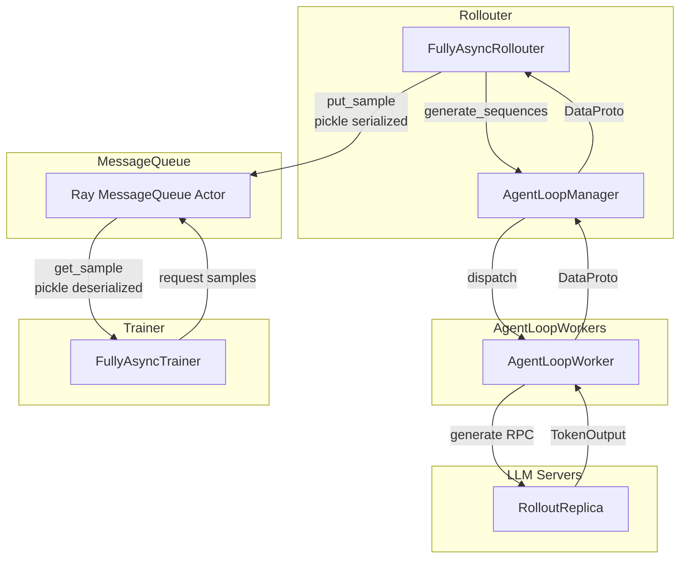
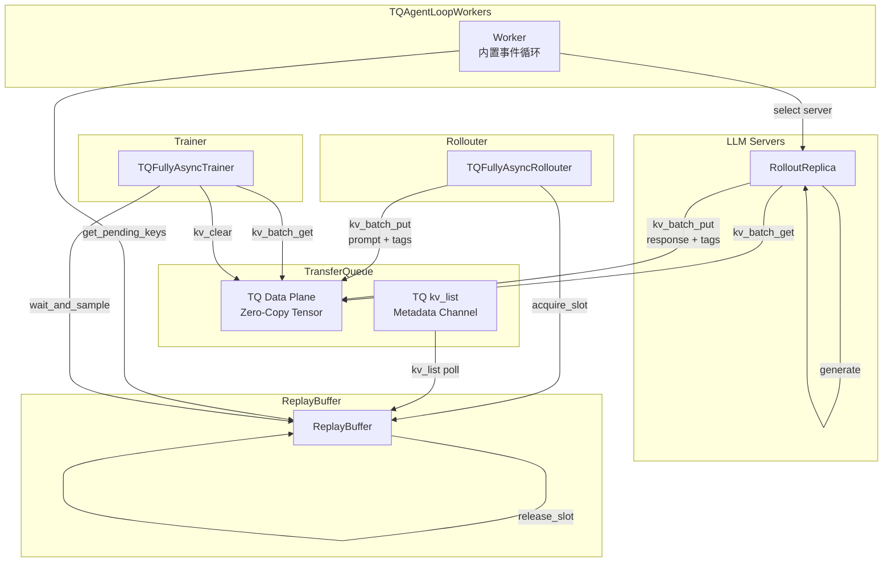
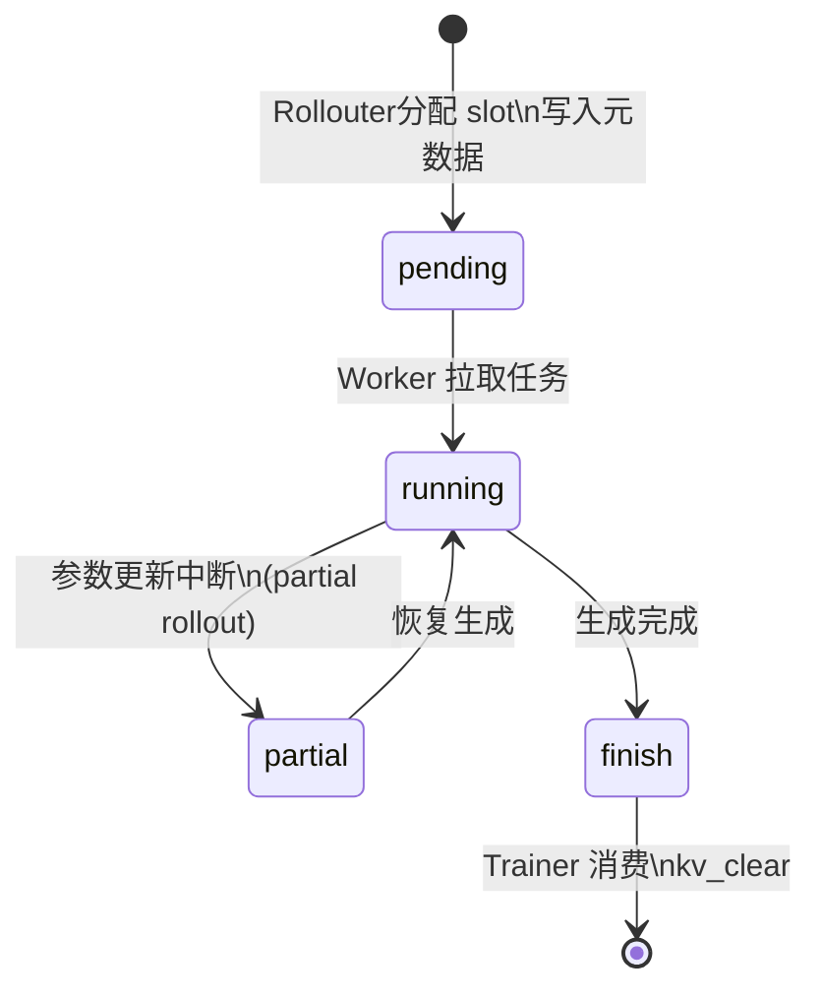
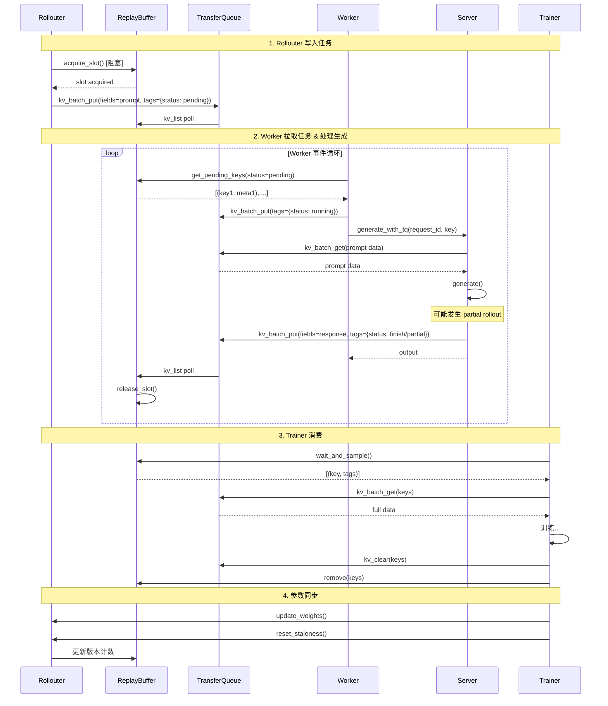

# Fully Async Policy with TransferQueue

## 概述

本方案旨在将 `fully_async_policy` 的数据传输通道从 Ray MessageQueue 迁移到 TransferQueue (TQ)，实现零拷贝、高性能的异步 PPO 训练。

### 核心目标

1. **零拷贝传输**: 使用 TQ 替代 MessageQueue，避免数据序列化开销
2. **元数据与数据分离**: Tensor 数据走 TQ 数据平面，元数据走 TQ kv_list 元数据通道
3. **背压控制**: 通过 slot 机制限制 in-flight 请求数量
4. **完全异步**: Rollouter 和 Trainer 完全解耦，独立运行


## 架构对比

### 现有架构 (MessageQueue)



**核心流程**:
1. **Rollouter** 从 dataloader 读取数据
2. **Rollouter** 调用 `AgentLoopManager.generate_sequences()`
3. **AgentLoopManager** 分发任务到 **AgentLoopWorker**
4. **AgentLoopWorker** 调用 **LLM Server** 执行生成
5. **LLM Server** 返回 `TokenOutput` 给 Worker
6. **Worker** 返回 `DataProto` 给 AgentLoopManager
7. **AgentLoopManager** 返回 `DataProto` 给 Rollouter
8. **Rollouter** 将样本序列化后写入 **MessageQueue**
9. **Trainer** 从 MessageQueue 获取样本，执行训练

**问题**:

- 数据完整序列化/反序列化开销大
- Ray Actor 单点瓶颈
- 无背压机制，可能 OOM

### 新架构 (TransferQueue)



**核心流程**:
1. **Rollouter** 从 dataloader 读取数据，获取 slot，写入 prompt 到 **TQ**
2. **Worker** 从 **ReplayBuffer** 拉取 pending 任务
3. **Worker** 选择 **LLM Server**，调用 `generate_with_tq`
4. **Server** 从 TQ 获取 prompt，执行生成，将 response 写回 TQ
5. **Trainer** 从 ReplayBuffer 获取 finish 样本，从 TQ 获取完整数据

**关键变化**:

| 现有架构 | 新架构 |
|---------|--------|
| Rollouter 调用 `generate_sequences` 并等待返回 | Rollouter 仅写入 TQ，不等待生成 |
| Rollouter 将结果写入 MessageQueue | Server 直接写入 TQ |
| Worker 被 AgentLoopManager 调用 | Worker 主动从 ReplayBuffer 拉取任务 |
| MessageQueue 存储完整样本 (pickle) | TQ 存储零拷贝 Tensor + 元数据分离 |

**优势**:

- ✅ Tensor 数据零拷贝传输
- ✅ 元数据轻量级同步 (kv_list)
- ✅ slot 机制实现背压控制
- ✅ 分布式存储，无单点瓶颈
- ✅ Server 直接读写 TQ，减少数据拷贝

## 数据结构

### Tags 元数据

每条样本在 TQ 中的元数据结构：

```python
tags = {
    # ===状态===
    "current_status": "pending" | "running" | "partial" | "finish",
    # pending:   已分配 slot，等待 Worker 拉取
    # running:   Worker 正在处理
    # partial:   running 的子状态，发生 partial rollout
    # finish:    生成完成，等待 Trainer 消费

    # ===身份标识===
    "uid": str,  # 原始 prompt 的 uid
    "session_id": int,  # 单个 prompt n 次采样，每个采样对应一个 AgentLoop
    "trajectory_id": int,  # 每次 AgentLoop 可能有多个输出（prefix 切换）

    # ===版本追踪===
    "start_model_version": int,  # 生成开始时的模型版本
    "end_model_version": int,  # 生成结束时的模型版本
    "min_global_steps": int,  # partial rollout 最小版本
    "max_global_steps": int,  # partial rollout 最大版本

    # ===长度信息===
    "prompt_len": int,
    "response_len": int,
    "seq_len": int,
}
```

### 状态机



### TQ Fields 数据字段

```python
fields = {
    # ===输入数据 (Rollouter 写入)===
    "input_ids": Tensor,  # prompt input ids
    "attention_mask": Tensor,
    "position_ids": Tensor,

    # ===多模态数据 (可选)===
    "multi_modal_inputs": dict,

    # ===原始数据字段===
    "raw_prompt": str,
    "data_source": str,
    "reward_model": dict,
    # ... 其他 dataset 字段

    # ===输出数据 (Server 写入)===
    "response_ids": Tensor,  # generated response ids
    "response_mask": Tensor,  # 1 for LLM tokens, 0 for tool tokens
    "rollout_log_probs": Tensor,  # for PPO
    "rm_scores": Tensor,  # reward scores

    # ===训练字段 (Trainer 写入)===
    "old_log_probs": Tensor,
    "ref_log_prob": Tensor,
    "values": Tensor,
    "advantages": Tensor,
    "returns": Tensor,
}
```

### Key 命名规范

```python
key = f"{partition_id}_{uid}_{session_id}_{trajectory_id}"
# 示例: "train_42_0_0", "val_100_3_1"
```

**字段说明**:
- `partition_id`: 分区标识，如 "train" 或 "val"
- `uid`: 原始 prompt 的唯一标识
- `session_id`: 同一 prompt 的第 n 次采样 (0 到 n-1)
- `trajectory_id`: 同一 session 的第 m 个输出 (用于 multi-output agent loop)

## 核心组件

### ReplayBuffer

轻量级元数据通道，替代 MessageQueue + 原 ReplayBuffer。

**初始化位置**: 在 `fully_async_main.py` 中创建，传递给 Rollouter 和 Trainer。

```python
@ray.remote(num_cpus=1)
class ReplayBuffer:
    def __init__(self, max_pending_slots=256, poll_interval=1.0):
        self.partitions: dict[str, dict[str, dict]] = defaultdict(dict)
        self._finished = False
        # Slot 控制
        self.max_pending_slots = max_pending_slots
        self._pending_slots = 0
        # 后台线程: 轮询 TQ kv_list
        self._poll_thread = threading.Thread(target=self._poll_from_tq, daemon=True)
        self._poll_thread.start()

    # === Slot 控制 (Rollouter) ===
    def acquire_slot(self, timeout=None) -> bool: ...
    def release_slot(self): ...

    # === Worker 拉取接口 ===
    def get_pending_keys(self, partition_id=None, limit=0, timeout=None) -> list[tuple[str, dict]]: ...

    # === Trainer 消费接口 ===
    def wait_and_sample(self, partition_id, batch_size) -> list[tuple[str, dict]] | None: ...
    def remove(self, partition_id, keys): ...

    # === 统计接口 ===
    def total_in_flight(self) -> int: ...
    def get_staleness_statistics(self, current_version, partition_id="train") -> dict: ...
```

#### Slot 控制机制


### TQFullyAsyncRollouter

分配 prompt 到 TQ，控制生成速率。

**职责**:
1. 从 dataloader 读取数据
2. 调用 `prepare_single_generation_data` 处理数据
3. 获取 slot，写入 TQ
4. 管理 checkpoint（通过 CheckpointEngineManager）

```python
class TQFullyAsyncRollouter:
    def __init__(self, config, tokenizer, replay_buffer_handle, ...):
        self.replay_buffer = replay_buffer_handle
        self.current_model_version = 0
        self.partition_id = "train"
        # ...

    async def generate_sequences(self, batch_dict: dict):
        """处理单个 batch，写入 TQ"""
        # 1. 准备数据 (参考 prepare_single_generation_data)
        full_batch = DataProto.from_single_dict(batch_dict)

        # 设置 agent_name
        if not self.config.actor_rollout_ref.rollout.multi_turn.enable:
            full_batch.non_tensor_batch["agent_name"] = np.array(
                ["single_turn_agent"] * len(full_batch), dtype=object
            )

        # 2. 为每个 prompt 分配 slot 并写入 TQ
        for i in range(len(full_batch)):
            uid = full_batch.non_tensor_batch["uid"][i]

            # 阻塞获取 slot (背压控制)
            acquired = await self.replay_buffer.acquire_slot.remote(timeout=60.0)
            if not acquired:
                logger.warning("Failed to acquire slot, stopping...")
                break

            # 写入 TQ (n 次采样由 Worker 处理，这里只写一次)
            key = f"{self.partition_id}_{uid}"

            # 提取单个样本的字段
            fields = self._extract_fields(full_batch, i)

            tq.kv_batch_put(
                keys=[key],
                fields=fields,
                tags={
                    "current_status": "pending",
                    "uid": uid,
                    "session_id": 0,  # 占位，Worker 会处理 n 次采样
                    "trajectory_id": 0,
                    "start_model_version": self.current_model_version,
                    "end_model_version": self.current_model_version,
                    "prompt_len": fields["input_ids"].shape[0],
                },
                partition_id=self.partition_id,
            )
```

### TQAgentLoopWorker

独立实现的 Worker，内置事件循环，主动拉取任务。

**职责**:
1. 主动从 ReplayBuffer 拉取 pending 任务
2. 处理 n 次采样（每个 prompt 生成 n 个 session）
3. 调用 AgentLoop 执行生成
4. 不直接写 TQ，由 Server 侧处理

**实现**:

```python
@ray.remote(num_cpus=1)
class TQAgentLoopWorker:
    def __init__(
        self,
        config: DictConfig,
        replay_buffer_handle: ray.actor.ActorHandle,
        servers: list[tuple[str, ray.actor.ActorHandle]],
        load_balancer_handle: ray.actor.ActorHandle,
        tokenizer,
        processor=None,
    ):
        self.config = config
        self.replay_buffer = replay_buffer_handle
        self.tokenizer = tokenizer
        self.processor = processor

        # LoadBalancer 仅负责调度
        self.load_balancer = load_balancer_handle
        self.servers = dict(servers)

        # AgentLoop 配置
        self.rollout_config = config.actor_rollout_ref.rollout
        self.n = self.rollout_config.n  # 每个prompt 的采样次数
        self.partition_id = config.trainer.get("partition_id", "train")

        # 状态
        self.finished = False
        self.active_tasks: set[asyncio.Task] = set()

        # 初始化 TQ
        tq.init()

        # 启动内置事件循环
        self._loop_task = asyncio.create_task(self._run_loop())

    async def _run_loop(self):
        """主动拉取任务的主循环"""
        while not self.finished:
            try:
                # 1. 从 ReplayBuffer 获取 pending 任务
                pending_tasks = await self.replay_buffer.get_pending_keys.remote(
                    partition_id=self.partition_id,
                    limit=self.rollout_config.batch_size,
                    timeout=1.0,
                )

                if not pending_tasks:
                    continue

                # 2. 为每个任务创建处理任务
                for key, meta in pending_tasks:
                    task = asyncio.create_task(
                        self._process_single_prompt(key, meta)
                    )
                    self.active_tasks.add(task)
                    task.add_done_callback(self.active_tasks.discard)

                # 3. 等待部分任务完成，控制并发
                if len(self.active_tasks) >= self.rollout_config.max_concurrent:
                    done, _ = await asyncio.wait(
                        self.active_tasks,
                        return_when=asyncio.FIRST_COMPLETED,
                    )

            except Exception as e:
                logger.exception(f"Error in _run_loop: {e}")

        # 等待所有活跃任务完成
        if self.active_tasks:
            await asyncio.gather(*self.active_tasks, return_exceptions=True)

    async def _process_single_prompt(self, key: str, meta: dict):
        """处理单个 prompt，包括 n 次采样"""
        uid = meta["uid"]

        try:
            # 1. 更新状态为 running
            tq.kv_batch_put(
                keys=[key],
                tags={"current_status": "running"},
                partition_id=self.partition_id,
            )

            # 2. n 次采样
            tasks = []
            for session_id in range(self.n):
                session_key = f"{self.partition_id}_{uid}_{session_id}_0"
                task = asyncio.create_task(
                    self._run_session(session_key, key, session_id, meta)
                )
                tasks.append(task)

            # 3. 等待所有 session 完成
            await asyncio.gather(*tasks, return_exceptions=True)

            # 4. 更新原 key 状态为 finish (标记 prompt 处理完成)
            tq.kv_batch_put(
                keys=[key],
                tags={"current_status": "finish"},
                partition_id=self.partition_id,
            )

        except Exception as e:
            logger.exception(f"Error processing {key}: {e}")
            # 标记失败
            tq.kv_batch_put(
                keys=[key],
                tags={"current_status": "error", "error": str(e)},
                partition_id=self.partition_id,
            )

    async def _run_session(
        self,
        session_key: str,
        parent_key: str,
        session_id: int,
        parent_meta: dict,
    ):
        """执行单次采样 (一个 AgentLoop)"""
        # 1. 创建 AgentLoop 实例
        agent_loop = self._create_agent_loop()

        # 2. 准备采样参数
        sampling_params = {
            "temperature": self.rollout_config.temperature,
            "top_p": self.rollout_config.top_p,
            "top_k": self.rollout_config.top_k,
            "logprobs": self.rollout_config.calculate_log_probs,
        }

        # 3. 执行 AgentLoop
        # 注意：实际的数据获取和结果写入在 Server 侧完成
        output = await agent_loop.run(
            sampling_params=sampling_params,
            session_key=session_key,
            parent_key=parent_key,
            partition_id=self.partition_id,
            **parent_meta,
        )

        return output

    def _create_agent_loop(self):
        """创建 AgentLoop 实例"""
        agent_name = self.rollout_config.agent.default_agent_loop
        agent_loop_config = _agent_loop_registry[agent_name]
        return hydra.utils.instantiate(
            config=agent_loop_config,
            trainer_config=DictConfigWrap(self.config),
            server_manager=self,  # Worker 自己作为 server_manager
            tokenizer=self.tokenizer,
            processor=self.processor,
            dataset_cls=get_dataset_class(self.config.data),
            data_config=DictConfigWrap(self.config.data),
        )

    async def generate(self, request_id, prompt_ids, sampling_params, **kwargs):
        """调用 Server 执行生成 (AgentLoop 通过此方法调用)"""
        # 1. 通过 LoadBalancer 选择 Server
        server_address = await self.load_balancer.acquire_server.remote(request_id)
        server_handle = self.servers[server_address]

        try:
            # 2. 调用 Server 的 generate 方法
            # Server 会从 TQ 获取数据，生成后写回 TQ
            output = await server_handle.generate_with_tq.remote(
                request_id=request_id,
                prompt_ids=prompt_ids,
                sampling_params=sampling_params,
                partition_id=kwargs.get("partition_id", self.partition_id),
                session_key=kwargs.get("session_key"),
                **kwargs,
            )
            return output
        finally:
            self.load_balancer.release_server.remote(server_address)

    def signal_finish(self):
        """通知 Worker 停止"""
        self.finished = True
```

### TQLLMServer (Server 侧扩展)

Server 侧直接读写 TQ，处理 partial rollout。

```python
class TQLLMServer:
    """LLM Server 的 TQ 扩展，处理数据读写"""

    async def generate_with_tq(
        self,
        request_id: str,
        prompt_ids: list[int],
        sampling_params: dict,
        partition_id: str,
        session_key: str,
        **kwargs,
    ) -> TokenOutput:
        """执行生成并处理 TQ 数据读写"""
        final_output = TokenOutput(token_ids=[], log_probs=[], num_preempted=0)
        min_global_steps = None
        max_global_steps = None

        while True:
            # 1. 执行生成
            output = await self._generate_internal(
                request_id=request_id,
                prompt_ids=prompt_ids + final_output.token_ids,
                sampling_params=sampling_params,
            )

            # 2. 合并输出
            final_output.token_ids.extend(output.token_ids)
            if output.log_probs is not None:
                final_output.log_probs.extend(output.log_probs)
            final_output.stop_reason = output.stop_reason

            # 3. 更新版本追踪
            global_steps = output.extra_fields.get("global_steps")
            if min_global_steps is None:
                min_global_steps = global_steps
            max_global_steps = global_steps

            # 4. 更新 max_new_tokens
            if "max_tokens" in sampling_params:
                remaining = sampling_params["max_tokens"] - len(final_output.token_ids)
                if remaining <= 0:
                    final_output.stop_reason = "length"
                    break
                sampling_params["max_tokens"] = remaining

            # 5. 检查是否 partial rollout
            if output.stop_reason in ("aborted", "abort"):
                # 写入 partial 状态
                tq.kv_batch_put(
                    keys=[session_key],
                    tags={
                        "current_status": "partial",
                        "min_global_steps": min_global_steps,
                        "max_global_steps": max_global_steps,
                    },
                    partition_id=partition_id,
                )
                # 继续循环，恢复生成
                await asyncio.sleep(1)
            else:
                # 正常结束
                break

        # 6. 写入最终结果到 TQ
        response_mask = [1] * len(final_output.token_ids)  # 简化示例
        rm_scores = self._compute_reward(final_output)

        tq.kv_batch_put(
            keys=[session_key],
            fields={
                "response_ids": torch.tensor(final_output.token_ids),
                "response_mask": torch.tensor(response_mask),
                "rollout_log_probs": torch.tensor(final_output.log_probs),
                "rm_scores": rm_scores,
            },
            tags={
                "current_status": "finish",
                "start_model_version": min_global_steps,
                "end_model_version": max_global_steps,
                "min_global_steps": min_global_steps,
                "max_global_steps": max_global_steps,
                "response_len": len(final_output.token_ids),
                "seq_len": len(prompt_ids) + len(final_output.token_ids),
            },
            partition_id=partition_id,
        )

        final_output.extra_fields["global_steps"] = max_global_steps
        final_output.extra_fields["min_global_steps"] = min_global_steps
        final_output.extra_fields["max_global_steps"] = max_global_steps

        return final_output
```

### TQFullyAsyncTrainer

消费完成样本，执行 PPO 训练。

**职责**:
1. 从 ReplayBuffer 获取 finish 状态的样本
2. 从 TQ 获取完整数据
3. 执行 PPO 训练步骤
4. 持有 Rollouter 引用，通过 CheckpointEngineManager 同步参数

```python
class TQFullyAsyncTrainer(PPOTrainer):
    def __init__(
        self,
        config: DictConfig,
        role_worker_mapping: dict[Role, WorkerType],
        resource_pool_manager: ResourcePoolManager,
        replay_buffer_handle: ray.actor.ActorHandle,
        rollouter_handle: ray.actor.ActorHandle,
        **kwargs,
    ):
        super().__init__(config, role_worker_mapping, resource_pool_manager, **kwargs)
        self.replay_buffer = replay_buffer_handle
        self.rollouter = rollouter_handle
        self.current_param_version = 0

    async def _get_samples_from_queue(self, batch_size: int) -> DataProto | None:
        """从 TQ 获取训练样本"""
        # 1. 等待足够样本
        samples = await self.replay_buffer.wait_and_sample.remote(
            partition_id="train",
            batch_size=batch_size,
        )

        if samples is None:
            return None

        keys = [k for k, _ in samples]
        metas = [v for _, v in samples]

        # 2. 从 TQ 获取完整数据
        fields = [
            "input_ids", "response_ids", "response_mask",
            "rollout_log_probs", "rm_scores",
            # ... 其他训练所需字段
        ]
        data = tq.kv_batch_get(
            keys=keys,
            select_fields=fields,
            partition_id="train",
        )

        # 3. 计算 staleness
        staleness_stats = {
            "staleness/mean": np.mean([
                self.current_param_version - m["start_model_version"]
                for m in metas
            ]),
            "staleness/max": max([
                self.current_param_version - m["start_model_version"]
                for m in metas
            ]),
        }

        # 4. 构建DataProto
        batch = self._build_data_proto(data, metas)
        batch.meta_info.update(staleness_stats)

        return batch

    async def _fit_update_weights(self):
        """更新参数到 Rollouter"""
        if self.local_trigger_step != 1:
            return

        # 1. 通过 CheckpointEngineManager 同步参数
        await self.checkpoint_manager.update_weights(
            global_steps=self.current_param_version
        )

        # 2. 通知 Rollouter 重置 staleness
        timing_raw = await self.rollouter.reset_staleness.remote()
        self.logger.log(data=timing_raw, step=self.current_param_version)

        # 3. 更新版本号
        self.current_param_version += 1
```

## 数据流详解

### 完整生命周期时序图



### Staleness 与 Slot 协同

| 原概念                 | TQ 方案对应                                           |
| ---------------------- | ----------------------------------------------------- |
| `staleness_samples`    | `pending_slots` (正在生成) + `ready_count` (等待消费) |
| `max_required_samples` | `max_pending_slots`                                   |
| 参数更新后 reset       | `reset_staleness()` → 重置计数                       |

**Rollouter 暂停条件**:

- `max_pending_slots`: 控制写入速率 (防止 TQ 积压)
- `max_required_samples`: 控制版本跨度 (数据新鲜度)

## 文件结构

```
verl/experimental/fully_async_policy_tq/
├── README.md                    # 本文档
├── replay_buffer.py             # ReplayBuffer Actor ✅
├── agent_loop/
│   ├── __init__.py
│   └── agent_loop.py            # TQAgentLoopWorker
├── fully_async_rollouter.py     # TQFullyAsyncRollouter
├── fully_async_trainer.py       # TQFullyAsyncTrainer
├── fully_async_main.py          # 主入口
└── config/
    └── fully_async_ppo_trainer.yaml
```


## 性能预期

| 指标         | MessageQueue    | TransferQueue  | 提升 |
| ------------ | --------------- | -------------- | ---- |
| 数据传输延迟 | ~10ms (序列化)  | ~1ms (零拷贝)  | 10x  |
| 内存占用     | 2x (序列化副本) | 1x (零拷贝)    | 2x   |
| 吞吐量       | ~1K samples/s   | ~10K samples/s | 10x  |
| CPU 开销     | 高 (序列化)     | 低 (无序列化)  | 5x   |

## 参考

- [TransferQueue 文档](docs/data/transfer_queue.md)
- [main_ppo_sync.py](verl/trainer/main_ppo_sync.py)
- [fully_async_policy 原始实现](verl/experimental/fully_async_policy/)