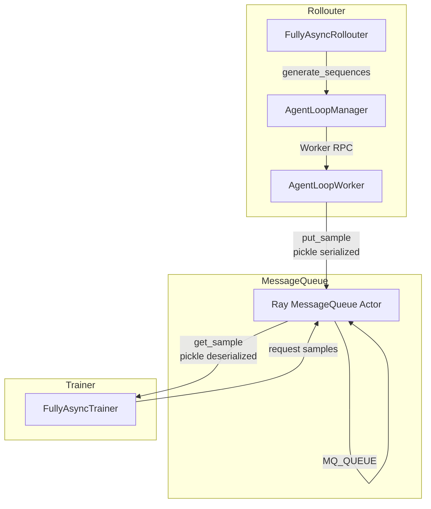
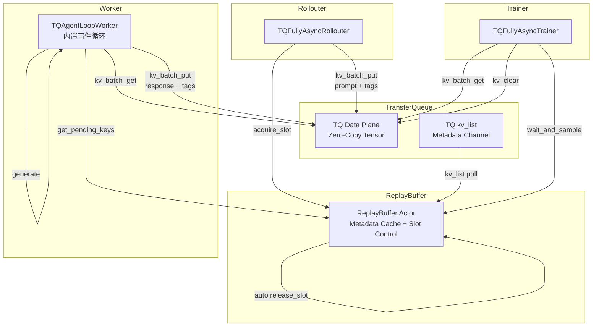
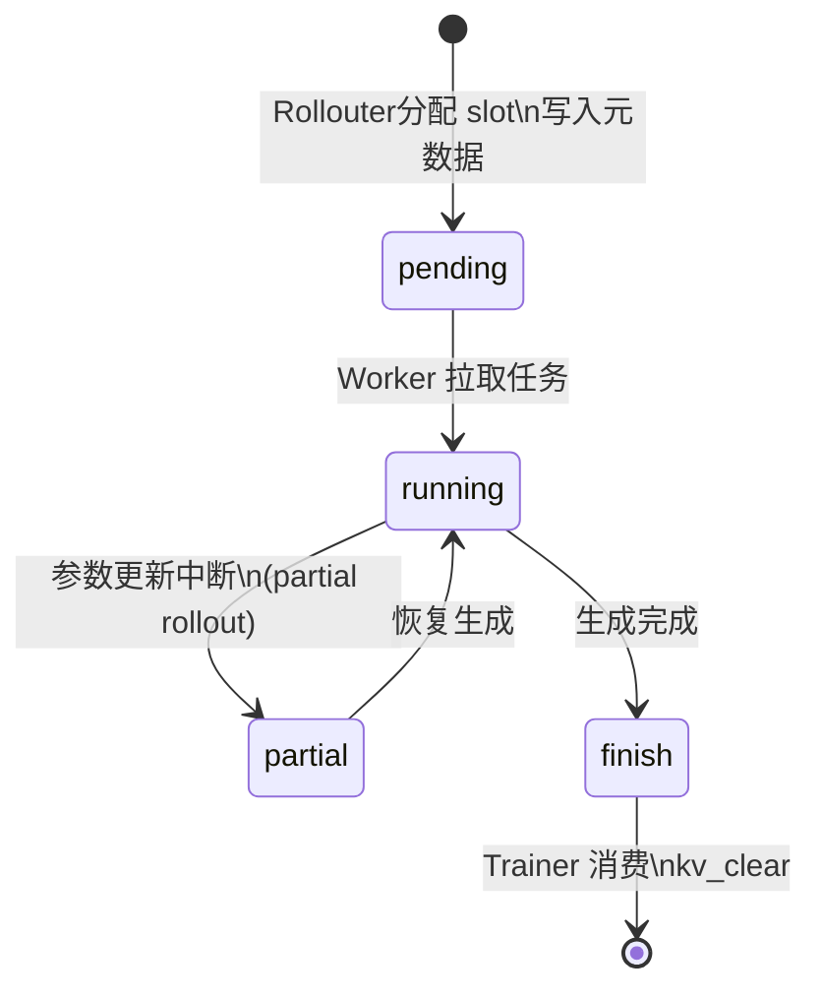
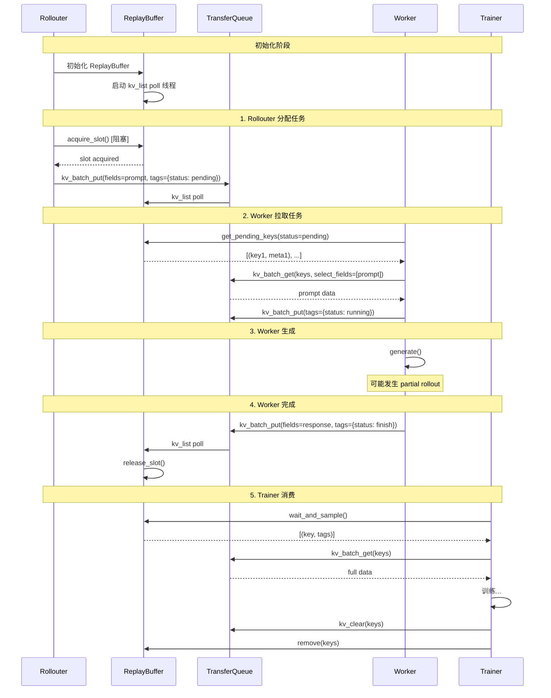
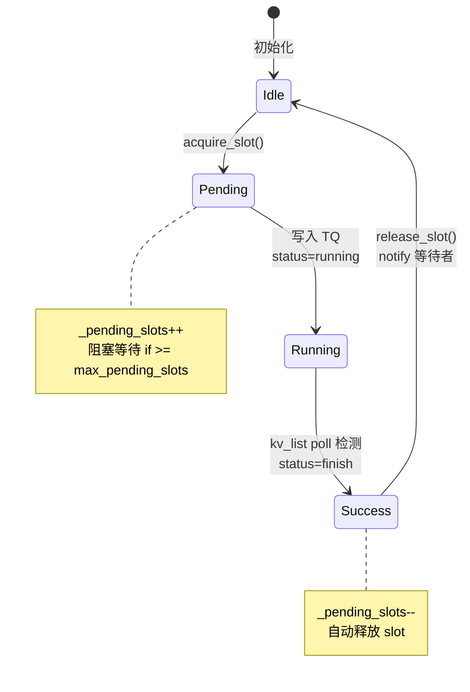
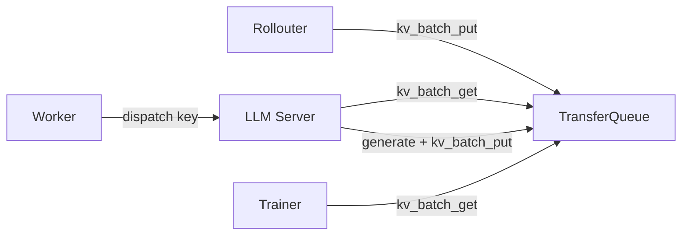

~~# Fully Async Policy with TransferQueue (TQ)

## 概述

本方案旨在将 `fully_async_policy` 的数据传输通道从 Ray MessageQueue 迁移到 TransferQueue (TQ)，实现零拷贝、高性能的异步 PPO 训练。

### 核心目标

1. **零拷贝传输**: 使用 TQ 替代 MessageQueue，避免数据序列化开销
2. **元数据与数据分离**: Tensor 数据走 TQ 数据平面，元数据走 TQ kv_list 元数据通道
3. **背压控制**: 通过 slot 机制限制 in-flight 请求数量
4. **完全异步**: Rollouter 和 Trainer 完全解耦，独立运行

## 架构对比

### 现有架构 (MessageQueue)



**问题**:

- 数据完整序列化/反序列化开销大
- Ray Actor 单点瓶颈
- 无背压机制，可能 OOM

### 新架构 (TransferQueue)



**优势**:

- ✅ Tensor 数据零拷贝传输
- ✅ 元数据轻量级同步 (kv_list)
- ✅ slot 机制实现背压控制
- ✅ 分布式存储，无单点瓶颈

## 数据结构

### Tags 元数据

每条样本在 TQ 中的元数据结构：

```python
tags = {
    # ===状态===
    "current_status": "pending" | "running" | "partial" | "finish",
    # pending:   已分配 slot，等待 Worker 拉取
    # running:   Worker 正在处理
    # partial:   running 的子状态，发生 partial rollout
    # finish:    生成完成，等待 Trainer 消费

    # ===身份标识===
    "uid": str,  # 原始 prompt 的 uid
    "session_id": int,  # 单个 prompt n 次采样，每个采样对应一个 AgentLoop
    "trajectory_id": int,  # 每次 AgentLoop 可能有多个输出（prefix 切换）

    # ===版本追踪===
    "start_model_version": int,  # 生成开始时的模型版本
    "end_model_version": int,  # 生成结束时的模型版本

    # ===长度信息===
    "prompt_len": int,
    "response_len": int,
    "seq_len": int,
}
```

### 状态机



### TQ Fields 数据字段

```python
fields = {
    "input_ids": Tensor,  # prompt input ids
    "response_ids": Tensor,  # generated response ids
    # 可选：其他训练所需字段
    "attention_mask": Tensor,
    "position_ids": Tensor,
    "log_probs": Tensor,  # for PPO
    "values": Tensor,  # for PPO
}
```

### Key 命名规范

```python
key = f"{partition_id}_{uid}_{session_id}_{trajectory_id}"
# 示例: "train_42_0_0", "val_100_3_1"
```

## 核心组件

### ReplayBuffer

轻量级元数据通道，替代 MessageQueue + 原 ReplayBuffer。

```python
@ray.remote(num_cpus=1)
class ReplayBuffer:
    def __init__(self, max_pending_slots=256, poll_interval=1.0):
        self.partitions: dict[str, dict[str, dict]] = defaultdict(dict)
        self._finished = False
        # Slot 控制
        self.max_pending_slots = max_pending_slots
        self._pending_slots = 0
        # 后台线程: 轮询 TQ kv_list
        self._poll_thread = threading.Thread(target=self._poll_from_tq, daemon=True)
        self._poll_thread.start()

    # === Slot 控制 (Rollouter) ===
    def acquire_slot(self, timeout=None) -> bool: ...
    def release_slot(self): ...

    # === Worker 拉取接口 ===
    def get_pending_keys(self, partition_id=None, limit=0, timeout=None) -> list[tuple[str, dict]]: ...

    # === Trainer 消费接口 ===
    def wait_and_sample(self, partition_id, batch_size) -> list[tuple[str, dict]] | None: ...
    def remove(self, partition_id, keys): ...

    # === 统计接口 ===
    def total_in_flight(self) -> int: ...
    def get_staleness_statistics(self, current_version, partition_id="train") -> dict: ...
```

### TQFullyAsyncRollouter

分配 prompt 到 TQ，控制生成速率。

```python
class TQFullyAsyncRollouter:
    async def generate_sequences(self, prompts: DataProto):
        for uid, prompt in enumerate(prompts):
            # 1. 阻塞获取 slot (背压控制)
            acquired = await self.replay_buffer.acquire_slot.remote()
            if not acquired:
                break

            # 2. 生成唯一 key
            key = f"{self.partition_id}_{uid}_{session_id}"

            # 3. 写入 prompt 数据到 TQ
            tq.kv_batch_put(
                keys=[key],
                fields={"input_ids": prompt.input_ids},
                tags={
                    "current_status": "pending",
                    "uid": uid,
                    "session_id": session_id,
                    "trajectory_id": 0,
                    "start_model_version": self.current_model_version,
                    "end_model_version": self.current_model_version,
                    "prompt_len": len(prompt.input_ids),
                }
            )
```

### TQAgentLoopWorker

内置事件循环，主动拉取待生成任务，执行生成，写入结果。


| 特性     | 原AgentLoopWorker                                 | TQAgentLoopWorker               |
| -------- | ------------------------------------------------- | ------------------------------- |
| 触发方式 | 被动：Rollouter 调用`generate_sequences(prompts)` | 主动：内置循环拉取 pending 任务 |
| 数据来源 | RPC参数传递                                       | TQ`kv_batch_get` 按需获取       |
| 结果写入 | MessageQueue`put_sample`                          | TQ`kv_batch_put` 更新 tags      |
| 生命周期 | 单次调用                                          | 持续运行直到`signal_finish`     |

```python
@ray.remote(num_cpus=1)
class TQAgentLoopWorker:
    def __init__(self, config, replay_buffer_handle, servers, load_balancer_handle):
        self.replay_buffer = replay_buffer_handle
        self.server_manager = FullyAsyncLLMServerManager(config, servers, load_balancer_handle)
        self.finished = False
        self.partition_id = config.trainer.partition_id
        # 启动内置事件循环
        self._task = asyncio.create_task(self._run_loop())

    async def _run_loop(self):
        while not self.finished:
            tasks = await self.replay_buffer.get_pending_keys.remote(
                partition_id=self.partition_id,
                limit=self.config.rollout.batch_size,
                timeout=1.0
            )
            if tasks:
                await asyncio.gather(*[self._process_single_task(k, m) for k, m in tasks])

    async def _process_single_task(self, key: str, meta: dict):
        # 1. 从 TQ 获取 prompt
        data = tq.kv_batch_get(keys=[key], select_fields=["input_ids"])
        # 2. 更新状态为 running
        tq.kv_batch_put(keys=[key], tags={"current_status": "running"})
        # 3. 执行生成
        output = await self.server_manager.generate(request_id=key, prompt_ids=data["input_ids"], ...)
        # 4. 写入结果
        tq.kv_batch_put(keys=[key], fields={"response_ids": output.token_ids, ...},
                        tags={"current_status": "finish", ...})

    def signal_finish(self):
        self.finished = True
```

### TQFullyAsyncTrainer

消费完成样本，执行 PPO 训练。

```python
class TQFullyAsyncTrainer(PPOTrainer):
    def _get_samples_from_queue(self, batch_size: int) -> DataProto | None:
        samples = self.replay_buffer.wait_and_sample.remote(partition_id="train", batch_size=batch_size)
        if samples is None:
            return None
        keys = [k for k, _ in samples]
        metas = [v for _, v in samples]
        # 从 TQ 获取完整数据
        data = tq.kv_batch_get(keys=keys, select_fields=["input_ids", "response_ids"])
        # 计算 staleness
        staleness = [self.global_steps - m["start_model_version"] for m in metas]
        # 清理
        tq.kv_clear(keys)
        self.replay_buffer.remove.remote("train", keys)
        return self._build_data_proto(data, staleness)
```

## 数据流详解

### 完整生命周期时序图



### Slot 控制机制



### Staleness 与 Slot 协同


| 原概念                 | TQ 方案对应                                           |
| ---------------------- | ----------------------------------------------------- |
| `staleness_samples`    | `pending_slots` (正在生成) + `ready_count` (等待消费) |
| `max_required_samples` | `max_pending_slots`                                   |
| 参数更新后 reset       | `reset_staleness()` → 重置计数                       |

**Rollouter 暂停条件**:

- `max_pending_slots`: 控制写入速率 (防止 TQ 积压)
- `max_required_samples`: 控制版本跨度 (数据新鲜度)

## Server 侧数据获取

**目标**: Server 直接从 TQ 获取数据



**数据流**: Rollouter → TQ → Server → TQ → Trainer (1次拷贝)

### 性能对比


| 方案             | 数据拷贝次数                 | Worker开销 |
| ---------------- | ---------------------------- | ---------- |
| 当前 (Phase 1-5) | 3次 (TQ→Worker→Server→TQ) | 中         |
| 未来 (Phase 6)   | 1次 (TQ→Server)             | 低         |

## ## 参考

- [TransferQueue 文档](docs/data/transfer_queue.md)
- [main_ppo_sync.py](verl/trainer/main_ppo_sync.py)
- [fully_async_policy 原始实现](verl/experimental/fully_async_policy/)
