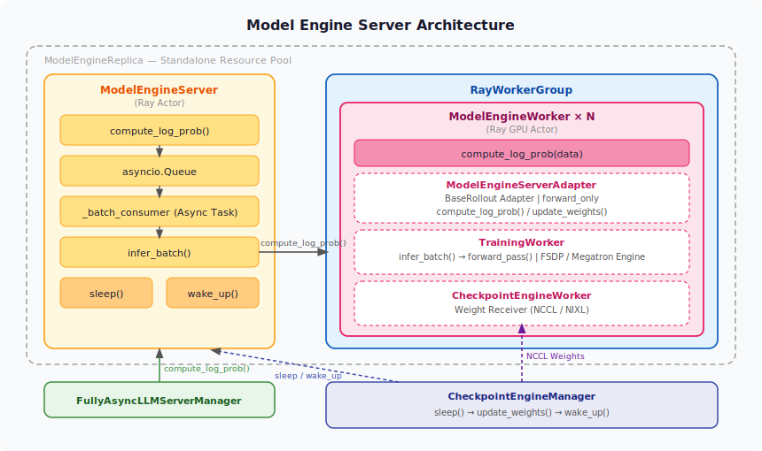

# Model Engine Server 架构说明

## 概述

当前 fully_async 通过在 trainer 侧 CPU 中暂存一版参数，每次训练时加载回 GPU 执行前向推理来计算 old_log_prob。该方案存在两个问题：

1. **训练性能下降**：在 trainer 侧额外执行 old_log_prob 的前向计算，实测会显著拖慢训练速度。
2. **staleness 版本错误**：开启 staleness 后，过期样本的 old_log_prob 应使用生成该样本时的参数版本，但 offload 方案始终使用最新版本，导致 importance sampling 计算不一致。

`model_engine_server` 通过独立部署一组持续持有模型权重的 GPU worker 来解决上述问题：log_prob 在 rollout 阶段与 token 生成pipeline完成，trainer 侧无需额外计算；权重更新通过 checkpoint engine 与训练侧同步，保证样本使用正确的参数版本。

---

## 架构层次



`model_engine_server` 在实现上复用了 `TrainingWorker`（ModelEngine）作为 log_prob 的计算引擎，并通过 `BaseRollout` 接口适配，使其在与 `CheckpointEngine` 集成时与标准 `RolloutReplica` 保持一致的接口和行为。

整体分为三层嵌套结构：

**ModelEngineReplica**  
独立的部署单元，持有自己的 Ray resource pool，与 trainer 和 vLLM/SGLang 完全隔离，不共享 GPU 资源。由 `init_standalone()` 负责资源申请和组件启动。

**RayWorkerGroup → ModelEngineWorker × N**  
`RayWorkerGroup` 管理 N 个 `ModelEngineWorker` Ray GPU actor，负责将 batch 数据按 DP 维度分发到各 worker 并收集结果。每个 `ModelEngineWorker` 持有完整的模型权重副本，运行在独立 GPU 上。

**ModelEngineServer**  
请求入口和调度核心。接收来自 `FullyAsyncLLMServerManager` 的单条请求，通过异步队列聚合成 batch 后调用 `RayWorkerGroup`，并在权重更新期间通过 `sleep()`/`wake_up()` 门控保证版本一致性。

---

## 核心组件

### ModelEngineServer

**文件**：[model_engine_server.py:230](model_engine_server.py#L230)  
**角色**：请求聚合与调度的核心 Ray actor。

持有一个 `asyncio.Queue` 接收外部请求，后台常驻 `_batch_consumer` task 负责凑批。凑满 `batch_size` 或超过 `timeout` 后，调用 `infer_batch()` 将数据 padding 到 `_min_dispatch_unit`（= `dp_size × micro_batch_size_per_gpu`）的整数倍，再通过 `RayWorkerGroup.compute_log_prob()` 分发给各 GPU worker。

权重更新时执行严格的门控协议：
- `sleep()`（[L493](model_engine_server.py#L493)）：清除 `_serving` event 阻塞新请求 → 等待 `_infer_lock` 确认当前 batch 完成 → 用旧权重 flush 队列剩余请求
- `wake_up()`（[L527](model_engine_server.py#L527)）：重新 set `_serving` event，恢复服务

---

### RayWorkerGroup

**来源**：`verl.single_controller.ray.RayWorkerGroup`  
**角色**：管理 N 个 `ModelEngineWorker` 的 Ray actor 组，封装 dispatch/collect 逻辑。

`ModelEngineServer.infer_batch()` 调用 `model_engine_worker_group.compute_log_prob(data)`，`RayWorkerGroup` 按 DP 维度将数据切分并并行分发到各 worker，收集结果后合并返回。worker 数量由 `n_gpus_per_node × nnodes` 决定。

---

### ModelEngineWorker

**文件**：[model_engine_server.py:174](model_engine_server.py#L174)  
**角色**：运行在 GPU 上的 Ray remote actor，是实际持有模型权重的执行单元。

继承自 `CheckpointEngineWorker`，使权重更新可通过 checkpoint engine（NCCL/NIXL）完成，无需重启 worker。内部组合了 `ModelEngineServerAdapter` 和 `DistProfilerExtension`（支持 nsys/torch 性能分析）。

`init_model()`（[L217](model_engine_server.py#L217)）在启动时调用，初始化内部 `TrainingWorker` 并向 `RayWorkerGroup` 注册 dispatch 信息。

---

### ModelEngineServerAdapter

**文件**：[model_engine_server.py:47](model_engine_server.py#L47)  
**角色**：将 `TrainingWorker` 包装为 `BaseRollout` 接口的适配层。

`init_model()`（[L73](model_engine_server.py#L73)）负责将 `model_engine_server` 配置重映射为 PPO 兼容格式（字段名对齐），构造 `TrainingWorkerConfig` 并初始化 `TrainingWorker`。

`compute_log_prob()`（[L162](model_engine_server.py#L162)）以 `forward_only=True` 模式调用 `TrainingWorker.infer_batch()`，返回 CPU tensor，不产生梯度。

`update_weights()`（[L136](model_engine_server.py#L136)）通过 `engine.set_param_from_async_generator()` 接收 checkpoint engine 推送的新参数。

---

### TrainingWorker / CheckpointEngineWorker

**TrainingWorker**（`verl.workers.engine_workers`）：封装底层 FSDP / Megatron 引擎，提供 `infer_batch()` → `forward_pass()` 的推理接口。  
**CheckpointEngineWorker**（`verl.checkpoint_engine.base`）：`ModelEngineWorker` 的父类，提供通过 NCCL/NIXL 接收权重的能力，由 `CheckpointEngineManager` 在训练步边界触发。

---

### ModelEngineReplica

**文件**：[model_engine_server.py:533](model_engine_server.py#L533)  
**角色**：`RolloutReplica` 的实现，负责整个 model engine server 的生命周期管理。

`init_standalone()`（[L584](model_engine_server.py#L584)）：创建独立 Ray resource pool → 构建 `RayWorkerGroup` → 调用 `launch_servers()`。  
`launch_servers()`（[L608](model_engine_server.py#L608)）：广播 `init_model()` 到所有 worker，然后创建 `ModelEngineServer` Ray actor 并存入 `self.servers`。

---

## 关键调用链

### Log Prob 计算路径

```
FullyAsyncLLMServerManager._compute_old_log_prob()
  → ModelEngineServer.compute_log_prob.remote(prompt_ids, response_ids, temperature)
    → asyncio.Queue  →  _batch_consumer 聚合
      → _execute_batch()  →  infer_batch()
        → RayWorkerGroup.compute_log_prob(data)   # dispatch to N workers
          → ModelEngineWorker.compute_log_prob()
            → ModelEngineServerAdapter.compute_log_prob()
              → TrainingWorker.infer_batch()  →  forward_pass()
                → { log_probs, entropy }
  → 结果写入 output.extra_fields["engine_server_logprobs/entropys"]
```

### 权重同步路径（每个 training step 边界）

```
CheckpointEngineManager.update_weights()
  1. ModelEngineServer.sleep()       # 阻塞新请求，排干队列
  2. NCCL/NIXL 传输新权重 → CheckpointEngineWorker
  3. ModelEngineWorker.update_weights()
     → ModelEngineServerAdapter.update_weights()
       → TrainingWorker.engine.set_param_from_async_generator()
  4. ModelEngineServer.wake_up()     # 恢复服务
```

---

## 关键配置项

**model_engine_server 配置**（前缀 `model_engine_server.*`）：

| 参数 | 说明 |
|---|---|
| `enable_standalone` | 是否启用独立 server |
| `nnodes` / `n_gpus_per_node` | server 独占资源 |
| `batch_size` | 最大聚合批次大小 |
| `timeout` | 等待凑批的最长时间（秒） |
| `micro_batch_size_per_gpu` | 每 GPU 的本地 batch size |
| `use_dynamic_bsz` | 启用 sequence packing |
| `forward_only: true` | 推理模式，无梯度 |

**算法配置**（前缀 `algorithm.rollout_correction.*`）：

| 参数 | 说明 |
|---|---|
| `bypass_mode` | 设为 `True` 时跳过 model_engine_server 计算的 log_prob，回退到 reference policy；设为 `False`（默认）时实际使用 model_engine_server 的结果参与训练 |

配置文件：[verl/trainer/config/model_engine_server/](../../../../trainer/config/model_engine_server/)
